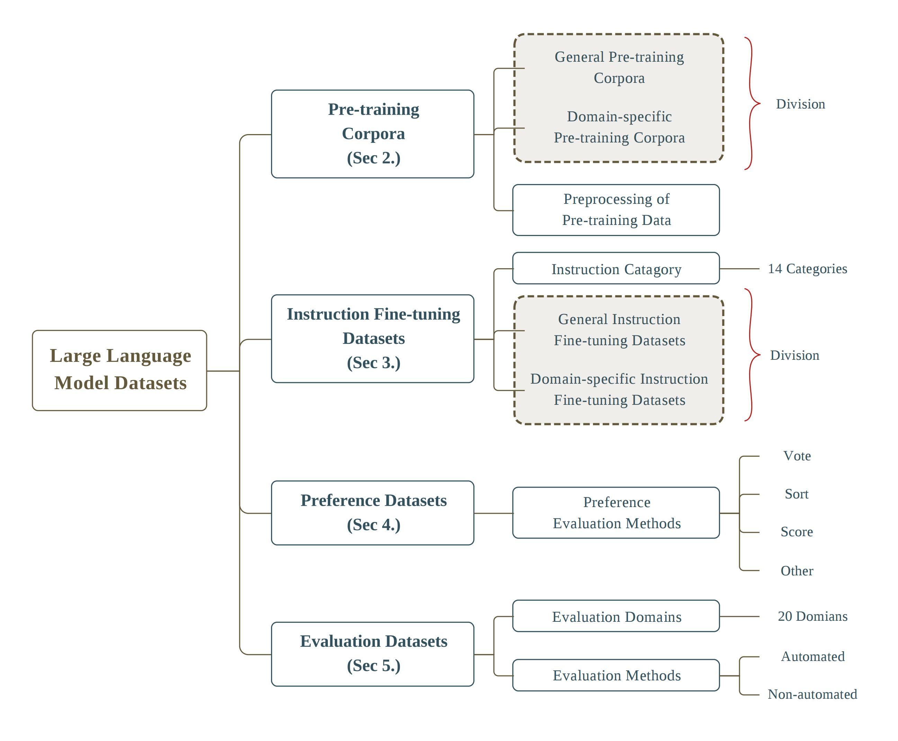

# Awesome-LLMs-Datasets
- Summarize existing representative LLMs text datasets across five dimensions: **Pre-training Corpora, Fine-tuning Instruction Datasets, Preference Datasets, Evaluation Datasets, and Traditional NLP Datasets**. (Regular updates)
- New dataset sections have been added: **Multi-modal Large Language Models (MLLMs) Datasets, Retrieval Augmented Generation (RAG) Datasets**. (Gradual updates)

## Paper
The paper **["Datasets for Large Language Models: A Comprehensive Survey"](https://arxiv.org/abs/2402.18041)** has been released.（2024/2）

**Abstract:**

This paper embarks on an exploration into the Large Language Model (LLM) datasets, which play a crucial role in the remarkable advancements of LLMs. The datasets serve as the foundational infrastructure analogous to a root system that sustains and nurtures the development of LLMs. Consequently, examination of these datasets emerges as a critical topic in research. In order to address the current lack of a comprehensive overview and thorough analysis of LLM datasets, and to gain insights into their current status and future trends, this survey consolidates and categorizes the fundamental aspects of LLM datasets from five perspectives: (1) Pre-training Corpora; (2) Instruction Fine-tuning Datasets; (3) Preference Datasets; (4) Evaluation Datasets; (5) Traditional Natural Language Processing (NLP) Datasets. The survey sheds light on the prevailing challenges and points out potential avenues for future investigation. Additionally, a comprehensive review of the existing available dataset resources is also provided, including statistics from 444 datasets, covering 8 language categories and spanning 32 domains. Information from 20 dimensions is incorporated into the dataset statistics. The total data size surveyed surpasses 774.5 TB for pre-training corpora and 700M instances for other datasets. We aim to present the entire landscape of LLM text datasets, serving as a comprehensive reference for researchers in this field and contributing to future studies.

<p align="center">
    
<p>

<p align="center">
    <strong>Fig 1. The overall architecture of the survey. Zoom in for better view</strong>
<p>

## Dataset Information Module
The following is a summary of the dataset information module.

- Corpus/Dataset name
- Publisher
- Release Time
  - “X” indicates unknown month. 
- Size
- Public or Not
  - “All” indicates full open source; 
  - “Partial” indicates partially open source; 
  - “Not” indicates not open source. 
- License
- Language
  - “EN” indicates English;
  - “ZH” indicates Chinese;
  - “AR” indicates Arabic;
  - “ES” indicates Spanish;
  - “RU” indicates Russian;
  - “DE” indicates German;
  - “PL” indicates Programming Language;
  - “Multi” indicates Multilingual, and the number in parentheses indicates the number of languages included. 
- Construction Method
  - “HG” indicates Human Generated Corpus/Dataset;
  - “MC” indicates Model Constructed Corpus/Dataset;
  - “CI” indicates Collection and Improvement of Existing Corpus/Dataset.
- Category
- Source
- Domain
- Instruction Category
- Preference Evaluation Method
  - “VO” indicates Vote;
  - “SO” indicates Sort;
  - “SC” indicates Score;
  - “-H” indicates Conducted by Humans;
  - “-M” indicates Conducted by Models.
- Question Type
  - “SQ” indicates Subjective Questions;
  - “OQ” indicates Objective Questions;
  - “Multi” indicates Multiple Question Types.
- Evaluation Method
  - “CE” indicates Code Evaluation;
  - “HE” indicates Human Evaluation;
  - “ME” indicates Model Evaluation.
- Focus
- Numbers of Evaluation Categories/Subcategories
- Evaluation Category
- Number of Entity Categories (NER Task)
- Number of Relationship Categories (RE Task)

## Changelog
- （2024/01/17）Create the **Awesome-LLMs-Datasets** dataset repository.
- （2024/02/02）Revise information for some datasets; add **[Dolma](https://browse.arxiv.org/abs/2402.00159)** (Pre-training Corpora | General Pre-training Corpora | Multi-category).
- （2024/02/15）Add **[Aya Collection](https://arxiv.org/abs/2402.06619)** (Instruction Fine-tuning Datasets | General Instruction Fine-tuning Datasets | HG & CI & MC); **[Aya Dataset](https://arxiv.org/abs/2402.06619)** (Instruction Fine-tuning Datasets | General Instruction Fine-tuning Datasets | HG).
- （2024/02/22）Add **[OpenMathInstruct-1](https://arxiv.org/abs/2402.10176)** (Instruction Fine-tuning Datasets | Domain-specific Instruction Fine-tuning Datasets | Math); **[FinBen](https://arxiv.org/abs/2402.12659)** (Evaluation Datasets | Financial).
- （2024/04/05）
  - Add new dataset sections: **(1) Multi-modal Large Language Models (MLLMs) Datasets; (2) Retrieval Augmented Generation (RAG) Datasets**.
  - Add **[MMRS-1M](https://arxiv.org/abs/2401.16822)** (MLLMs Datasets | Instruction Fine-tuning Datasets); **[VideoChat2-IT](https://arxiv.org/abs/2311.17005)** (MLLMs Datasets | Instruction Fine-tuning Datasets); **[InstructDoc](https://arxiv.org/abs/2401.13313)** (MLLMs Datasets | Instruction Fine-tuning Datasets); **[ALLaVA-4V Data](https://arxiv.org/abs/2402.11684)** (MLLMs Datasets | Instruction Fine-tuning Datasets); **[MVBench](https://arxiv.org/abs/2311.17005)** (MLLMs Datasets | Evaluation Datasets); **[OlympiadBench](https://arxiv.org/abs/2402.14008)** (MLLMs Datasets | Evaluation Datasets); **[MMMU](https://arxiv.org/abs/2311.16502)** (MLLMs Datasets | Evaluation Datasets).
  - Add **[CLUE Benchmark Series](https://github.com/CLUEbenchmark)** (Evaluation Datasets | Evaluation Platform); **[OpenLLM Leaderboard](https://huggingface.co/spaces/HuggingFaceH4/open_llm_leaderboard)** (Evaluation Datasets | Evaluation Platform); **[OpenCompass](https://opencompass.org.cn/home)** (Evaluation Datasets | Evaluation Platform); **[MTEB Leaderboard](https://huggingface.co/spaces/mteb/leaderboard)** (Evaluation Datasets | Evaluation Platform); **[C-MTEB Leaderboard](https://github.com/FlagOpen/FlagEmbedding/tree/master/C_MTEB)** (Evaluation Datasets | Evaluation Platform).
  - Add **[NAH (Needle-in-a-Haystack)](https://github.com/gkamradt/LLMTest_NeedleInAHaystack)** (Evaluation Datasets | Long Text); **[ToolEyes](https://arxiv.org/abs/2401.00741)** (Evaluation Datasets | Tool); **[UHGEval](https://arxiv.org/abs/2311.15296)** (Evaluation Datasets | Factuality); **[CLongEval](https://arxiv.org/abs/2403.03514)** (Evaluation Datasets | Long Text).
  - Add **[MathPile](https://arxiv.org/abs/2312.17120)** (Pre-training Corpora | Domain-specific Pre-training Corpora | Math); **[WanJuan-CC](https://arxiv.org/abs/2402.19282)** (Pre-training Corpora | General Pre-training Corpora | Webpages).
  - Add **[IEPile](https://arxiv.org/abs/2402.14710)** (Instruction Fine-tuning Datasets | General Instruction Fine-tuning Datasets | CI); **[InstructIE](https://arxiv.org/abs/2305.11527)** (Instruction Fine-tuning Datasets | General Instruction Fine-tuning Datasets | HG).
  - Add **[CRUD-RAG](https://arxiv.org/abs/2401.17043)** (RAG Datasets); **[WikiEval](https://arxiv.org/abs/2309.15217)** (RAG Datasets); **[RGB](https://arxiv.org/abs/2309.01431)** (RAG Datasets); **[RAG-Instruct-Benchmark-Tester](https://huggingface.co/datasets/llmware/rag_instruct_benchmark_tester)** (RAG Datasets); **[ARES](https://arxiv.org/abs/2311.09476)** (RAG Datasets).
- （2024/04/06）
  - Add **[GPQA](https://arxiv.org/abs/2311.12022)** (Evaluation Datasets | Subject); **[MGSM](https://arxiv.org/abs/2210.03057)** (Evaluation Datasets | Multilingual); **[HaluEval-Wild](https://arxiv.org/abs/2403.04307)** (Evaluation Datasets | Factuality); **[CMATH](https://arxiv.org/abs/2306.16636)** (Evaluation Datasets | Subject); **[FineMath](https://arxiv.org/abs/2403.07747)** (Evaluation Datasets | Subject); **[RealTime QA](https://arxiv.org/abs/2207.13332)** (Evaluation Datasets | Factuality); **[WYWEB](https://aclanthology.org/2023.findings-acl.204/)** (Evaluation Datasets | Subject); **[ChineseFactEval](https://gair-nlp.github.io/ChineseFactEval/)** (Evaluation Datasets | Factuality); **[Counting-Stars](https://arxiv.org/abs/2403.11802)** (Evaluation Datasets | Long Text).
  - Add **[SlimPajama](https://www.cerebras.net/blog/slimpajama-a-627b-token-cleaned-and-deduplicated-version-of-redpajama)** (Pre-training Corpora | General Pre-training Corpora | Multi-category); **[MassiveText](https://arxiv.org/abs/2112.11446)** (Pre-training Corpora | General Pre-training Corpora | Multi-category); **[MADLAD-400](https://arxiv.org/abs/2309.04662)** (Pre-training Corpora | General Pre-training Corpora | Webpages); **[Minerva](https://arxiv.org/abs/2206.14858)** (Pre-training Corpora | General Pre-training Corpora | Multi-category); **[CCAligned](https://aclanthology.org/2020.emnlp-main.480/)** (Pre-training Corpora | General Pre-training Corpora | Parallel Corpus); **[WikiMatrix](https://aclanthology.org/2021.eacl-main.115/)** (Pre-training Corpora | General Pre-training Corpora | Parallel Corpus); **[OpenWebMath](https://arxiv.org/abs/2310.06786)** (Pre-training Corpora | Domain-specific Pre-training Corpora | Math).
  - Add **[WebQuestions](https://aclanthology.org/D13-1160.pdf)** (Traditional NLP Datasets | Question Answering | Knowledge QA).
  - Add **[ALCE](https://aclanthology.org/2023.emnlp-main.398/)** (RAG Datasets).
  - Add **[AlphaFin](https://arxiv.org/abs/2403.12582)** (Instruction Fine-tuning Datasets | Domain-specific Instruction Fine-tuning Datasets | Other); **[COIG-CQIA](https://arxiv.org/abs/2403.18058)** (Instruction Fine-tuning Datasets | General Instruction Fine-tuning Datasets | HG & CI).

## Table of Contents
- **[Pre-training Corpora](#pre-training-corpora)**
  - [General Pre-training Corpora](#general-pre-training-corpora)
    - [Webpages](#webpages)
    - [Language Texts](#language-texts)
    - [Books](#books)
    - [Academic Materials](#academic-materials)
    - [Code](#code01)
    - [Parallel Corpus](#parallel-corpus)
    - [Social Media](#social-media)
    - [Encyclopedia](#encyclopedia)
    - [Multi-category](#multi-category)
  - [Domain-specific Pre-training Corpora](#domain-specific-pre-training-corpora)
    - [Financial](#financial01)
    - [Medical](#medical01)
    - [Math](#math03)
    - [Other](#other01)
- **[Instruction Fine-tuning Datasets](#instruction-fine-tuning-datasets)**
  - [General Instruction Fine-tuning Datasets](#general-instruction-fine-tuning-datasets)
    - [Human Generated Datasets (HG)](#human-generated-datasets-hg)
    - [Model Constructed Datasets (MC)](#model-constructed-datasets-mc)
    - [Collection and Improvement of Existing Datasets (CI)](#collection-and-improvement-of-existing-datasets-ci)
    - [HG & CI](#hg--ci)
    - [HG & MC](#hg--mc)
    - [CI & MC](#ci--mc)
    - [HG & CI & MC](#hg--ci--mc)
  - [Domain-specific Instruction Fine-tuning Datasets](#domain-specific-instruction-fine-tuning-datasets)
    - [Medical](#medical02)
    - [Code](#code02)
    - [Legal](#legal)
    - [Math](#math01)
    - [Education](#education)
    - [Other](#other02)
- **[Preference Datasets](#preference-datasets)**
  - [Preference Evaluation Methods](#preference-evaluation-methods)
    - [Vote](#vote)
    - [Sort](#sort)
    - [Score](#score)
    - [Other](#other03)
- **[Evaluation Datasets](#evaluation-datasets)**
  - [General](#general)
  - [Exam](#exam)
  - [Subject](#subject)
  - [NLU](#nlu)
  - [Reasoning](#reasoning)
  - [Knowledge](#knowledge)
  - [Long Text](#long-text)
  - [Tool](#tool)
  - [Agent](#agent)
  - [Code](#code03)
  - [OOD](#ood)
  - [Law](#law)
  - [Medical](#medical03)
  - [Financial](#financial02)
  - [Social Norms](#social-norms)
  - [Factuality](#factuality)
  - [Evaluation](#evaluation)
  - [Multitask](#multitask01)
  - [Multilingual](#multilingual)
  - [Other](#other04)
  - [Evaluation Platform](#evaluation-platform)
- **[Traditional NLP Datasets](#traditional-nlp-datasets)**
  - [Question Answering](#question-answering)
    - [Reading Comprehension](#reading-comprehension)
      - [Selection & Judgment](#selection--judgment)
      - [Cloze Test](#cloze-test)
      - [Answer Extraction](#answer-extraction)
      - [Unrestricted QA](#unrestricted-qa)
    - [Knowledge QA](#knowledge-qa)
    - [Reasoning QA](#reasoning-qa)
  - [Recognizing Textual Entailment](#recognizing-textual-entailment)
  - [Math](#math02)
  - [Coreference Resolution](#coreference-resolution)
  - [Sentiment Analysis](#sentiment-analysis)
  - [Semantic Matching](#semantic-matching)
  - [Text Generation](#text-generation)
  - [Text Translation](#text-translation)
  - [Text Summarization](#text-summarization)
  - [Text Classification](#text-classification)
  - [Text Quality Evaluation](#text-quality-evaluation)
  - [Text-to-Code](#text-to-code)
  - [Named Entity Recognition](#named-entity-recognition)
  - [Relation Extraction](#relation-extraction)
  - [Multitask](#multitask02)
- **[Multi-modal Large Language Models (MLLMs) Datasets](#multi-modal-large-language-models-mllms-datasets)**
  - [Instruction Fine-tuning Datasets](#instruction02)
  - [Evaluation Datasets](#evaluation02)
- **[Retrieval Augmented Generation (RAG) Datasets](#retrieval-augmented-generation-rag-datasets)**

## Pre-training Corpora
The pre-training corpora are large collections of text data used during the pre-training process of LLMs.

### General Pre-training Corpora
The general pre-training corpora are large-scale datasets composed of extensive text from diverse domains and sources. Their primary characteristic is that the text content is not confined to a single domain, making them more suitable for training general foundational models. **Corpora are classified based on data categories.**

**Dataset information format：**

```
- Dataset name  Release Time | Public or Not | Language | Construction Method | Paper | Github | Dataset | Website
  - Publisher:
  - Size:
  - License:
  - Source:
```

#### Webpages

- **CC-Stories  2018-6 | Not | EN | CI | [Paper](https://arxiv.org/pdf/1806.02847.pdf) | [Github](https://github.com/tensorflow/models/tree/archive/research/lm_commonsense) | [Dataset](https://huggingface.co/datasets/spacemanidol/cc-stories)**
  - Publisher: Google Brain
  - Size: 31 GB
  - License: -
  - Source: Common Crawl

- **CC100  2020-7 | All | Multi (100) | CI | [Paper](https://aclanthology.org/2020.acl-main.747.pdf) | [Dataset](https://huggingface.co/datasets/cc100)**
  - Publisher: Facebook AI
  - Size: 2.5 TB
  - License: Common Crawl Terms of Use
  - Source: Common Crawl

- **CLUECorpus2020  2020-3 | All | ZH | CI | [Paper](https://arxiv.org/pdf/2003.01355.pdf) | [Dataset](https://github.com/CLUEbenchmark/CLUECorpus2020)**
  - Publisher: CLUE Organization
  - Size: 100 GB
  - License: MIT
  - Source: Common Crawl

- **Common Crawl  2007-X | All | Multi | HG | [Website](https://commoncrawl.org/)**
  - Publisher: Common Crawl
  - Size: -
  - License: Common Crawl Terms of Use
  - Source: Web crawler data

- **CulturaX  2023-9 | All | Multi (167) | CI | [Paper](https://arxiv.org/pdf/2309.09400.pdf) | [Dataset](https://huggingface.co/datasets/uonlp/CulturaX)**
  - Publisher: University of Oregon et al.
  - Size: 27 TB
  - License: mC4 & OSCAR license
  - Source: mC4, OSCAR

- **C4  2019-10 | All | EN | CI | [Paper](https://arxiv.org/pdf/1910.10683.pdf) | [Dataset](https://huggingface.co/datasets/allenai/c4)**
  - Publisher: Google Research
  - Size: 12.68 TB
  - License: ODC-BY & Common Crawl Terms of Use
  - Source: Common Crawl

- **mC4  2021-6 | All | Multi (108) | CI | [Paper](https://aclanthology.org/2021.naacl-main.41.pdf) | [Dataset](https://huggingface.co/datasets/mc4)**
  - Publisher: Google Research
  - Size: 251 GB
  - License: ODC-BY & Common Crawl Terms of Use
  - Source: Common Crawl

- **OSCAR 22.01  2022-1 | All | Multi (151) | CI | [Paper](https://arxiv.org/pdf/2201.06642.pdf) | [Dataset](https://huggingface.co/datasets/oscar-corpus/OSCAR-2201) | [Website](https://oscar-project.org/)**
  - Publisher: Inria
  - Size: 8.41 TB
  - License: CC0
  - Source: Common Crawl

- **RealNews  2019-5 | All | EN | CI | [Paper](https://arxiv.org/abs/1905.12616) | [Github](https://github.com/rowanz/grover)**
  - Publisher: University of Washington et al.
  - Size: 120 GB
  - License: Apache-2.0
  - Source: Common Crawl

- **RedPajama-V2  2023-10 | All | Multi (5) | CI | [Github](https://github.com/togethercomputer/RedPajama-Data) | [Dataset](https://huggingface.co/datasets/togethercomputer/RedPajama-Data-V2) | [Website](https://together.ai/blog/redpajama-data-v2)**
  - Publisher: Together Computer
  - Size: 30.4 T Tokens
  - License: Common Crawl Terms of Use
  - Source: Common Crawl, C4, etc.

- **RefinedWeb  2023-6 | Partial | EN | CI | [Paper](https://arxiv.org/pdf/2306.01116.pdf) | [Dataset](https://huggingface.co/datasets/tiiuae/falcon-refinedweb)**
  - Publisher: The Falcon LLM team
  - Size: 5000 GB
  - License: ODC-BY-1.0
  - Source: Common Crawl

- **WuDaoCorpora-Text  2021-6 | Partial | ZH | HG | [Paper](https://www.sciencedirect.com/science/article/pii/S2666651021000152) | [Dataset](https://data.baai.ac.cn/details/WuDaoCorporaText)**
  - Publisher: BAAI et al.
  - Size: 200 GB
  - License: MIT
  - Source: Chinese webpages

- **WanJuan-CC  2024-2 | Partial | EN | HG | [Paper](https://arxiv.org/abs/2402.19282) | [Dataset](https://opendatalab.org.cn/OpenDataLab/WanJuanCC)**
  - Publisher: Shanghai Artifcial Intelligence Laboratory
  - Size: 1 T Tokens
  - License: CC-BY-4.0
  - Source: Common Crawl

- **MADLAD-400  2023-9 | All | Multi (419) | HG | [Paper](https://arxiv.org/abs/2309.04662) | [Github](https://github.com/google-research/google-research/tree/master/madlad_400) | [Dataset](https://huggingface.co/datasets/allenai/MADLAD-400)**
  - Publisher: Google DeepMind et al.
  - Size: 2.8 T Tokens
  - License: ODL-BY
  - Source: Common Crawl

#### Language Texts

- **ANC  2003-X | All | EN | HG | [Website](https://anc.org/)**
  - Publisher: The US National Science Foundation et al.
  - Size: -
  - License: -
  - Source: American English texts

- **BNC  1994-X | All | EN | HG | [Website](http://www.natcorp.ox.ac.uk/)**
  - Publisher: Oxford University Press et al.
  - Size: 4124 Texts
  - License: -
  - Source: British English texts

- **News-crawl  2019-1 | All | Multi (59) | HG | [Dataset](https://data.statmt.org/news-crawl/)**
  - Publisher: UKRI et al.
  - Size: 110 GB
  - License: CC0
  - Source: Newspapers


#### Books

- **Anna’s Archive  2023-X | All | Multi | HG | [Website](https://annas-archive.org/datasets)**
  - Publisher: Anna
  - Size: 586.3 TB
  - License: -
  - Source: Sci-Hub, Library Genesis, Z-Library, etc.

- **BookCorpusOpen  2021-5 | All | EN | CI | [Paper](https://arxiv.org/pdf/2105.05241.pdf) | [Github](https://github.com/jackbandy/bookcorpus-datasheet) | [Dataset](https://huggingface.co/datasets/bookcorpusopen)**
  - Publisher: Jack Bandy et al.
  - Size: 17,868 Books
  - License: Smashwords Terms of Service
  - Source: Toronto Book Corpus

- **PG-19  2019-11 | All | EN | HG | [Paper](https://arxiv.org/pdf/1911.05507.pdf) | [Github](https://github.com/google-deepmind/pg19) | [Dataset](https://huggingface.co/datasets/pg19)**
  - Publisher: DeepMind
  - Size: 11.74 GB
  - License: Apache-2.0
  - Source: Project Gutenberg

- **Project Gutenberg  1971-X | All | Multi | HG | [Website](https://www.gutenberg.org/)**
  - Publisher: Ibiblio et al.
  - Size: -
  - License: The Project Gutenberg
  - Source: Ebook data

- **Smashwords  2008-X | All | Multi | HG | [Website](https://www.smashwords.com/)**
  - Publisher: Draft2Digital et al.
  - Size: -
  - License: Smashwords Terms of Service
  - Source: Ebook data

- **Toronto Book Corpus  2015-6 | Not | EN | HG | [Paper](https://arxiv.org/pdf/1506.06724.pdf) | [Website](https://yknzhu.wixsite.com/mbweb)**
  - Publisher: University of Toronto et al.
  - Size: 11,038 Books
  - License: MIT & Smashwords Terms of Service
  - Source: Smashwords


#### Academic Materials

- **arXiv  1991-X | All | EN | HG | [Website](https://arxiv.org/)**
  - Publisher: Paul Ginsparg et al.
  - Size: -
  - License: Terms of Use for arXiv APIs
  - Source: arXiv preprint

- **S2ORC  2020-6 | All | EN | CI | [Paper](https://aclanthology.org/2020.acl-main.447.pdf) | [Github](https://github.com/allenai/s2orc)**
  - Publisher: AI2 et al.
  - Size: 81.1 MB
  - License: ODC-BY-1.0
  - Source: MAG, arXiv, PubMed, etc.

#### Code <a id="code01"></a>

- **BIGQUERY  2022-3 | Not | PL | CI | [Paper](https://arxiv.org/pdf/2203.13474.pdf) | [Github](https://github.com/salesforce/CodeGen)**
  - Publisher: Salesforce Research
  - Size: 341.1 GB
  - License: Apache-2.0
  - Source: BigQuery

- **Github  2008-4 | All | PL | HG | [Website](https://github.com/)**
  - Publisher: Microsoft
  - Size: -
  - License: -
  - Source: Various code projects

- **phi-1  2023-6 | Not | EN & PL | HG & MC | [Paper](https://arxiv.org/pdf/2306.11644.pdf) | [Dataset](https://huggingface.co/datasets/teleprint-me/phi-1)**
  - Publisher: Microsoft Research
  - Size: 7 B Tokens
  - License: CC-BY-NC-SA-3.0
  - Source: The Stack, StackOverflow, GPT-3.5 Generation

- **The Stack  2022-11 | All | PL (358) | HG | [Paper](https://arxiv.org/pdf/2211.15533.pdf) | [Dataset](https://huggingface.co/datasets/bigcode/the-stack)**
  - Publisher: ServiceNow Research et al.
  - Size: 6 TB
  - License: The Terms of the Original Licenses
  - Source: Permissively-licensed source code files


#### Parallel Corpus

- **MTP  2023-9 | All | EN & ZH | HG & CI | [Dataset](https://data.baai.ac.cn/details/BAAI-MTP)**
  - Publisher: BAAI
  - Size: 1.3 TB
  - License: BAAI Data Usage Protocol
  - Source: Chinese-English parallel text pairs on the web

- **MultiUN  2010-5 | All | Multi (7) | HG | [Paper](http://www.lrec-conf.org/proceedings/lrec2010/pdf/686_Paper.pdf) | [Website](https://www.euromatrixplus.net/multi-un/)**
  - Publisher: German Research Center for Artificial Intelligence (DFKI) GmbH
  - Size: 4353 MB
  - License: -
  - Source: United Nations documents

- **ParaCrawl  2020-7 | All | Multi (42) | HG | [Paper](https://aclanthology.org/2020.acl-main.417.pdf) | [Website](https://paracrawl.eu/)**
  - Publisher: Prompsit et al.
  - Size: 59996 Files
  - License: CC0
  - Source: Web crawler data

- **UNCorpus v1.0  2016-5 | All | Multi (6) | HG | [Paper](https://conferences.unite.un.org/UNCorpus/Content/Doc/un.pdf) | [Website](https://conferences.unite.un.org/UNCorpus)**
  - Publisher: United Nations et al.
  - Size: 799276 Files
  - License: -
  - Source: United Nations documents

- **CCAligned  2020-11 | All | Multi (138) | HG | [Paper](https://aclanthology.org/2020.emnlp-main.480/) | [Dataset](https://huggingface.co/datasets/ccaligned_multilingual)**
  - Publisher: Facebook AI et al.
  - Size: 392 M URL pairs
  - License: -
  - Source: Common Crawl

- **WikiMatrix  2021-4 | All | Multi (85) | HG | [Paper](https://aclanthology.org/2021.eacl-main.115/) | [Github](https://github.com/facebookresearch/LASER/tree/main/tasks/WikiMatrix) | [Dataset](https://github.com/facebookresearch/LASER/tree/main/tasks/WikiMatrix)**
  - Publisher: Facebook AI et al.
  - Size: 134 M parallel sentences
  - License: CC-BY-SA
  - Source: Wikipedia

#### Social Media

- **OpenWebText  2019-4 | All | EN | HG | [Website](https://skylion007.github.io/OpenWebTextCorpus/)**
  - Publisher: Brown University
  - Size: 38 GB
  - License: CC0
  - Source: Reddit

- **Pushshift Reddit  2020-1 | All | EN | CI | [Paper](https://arxiv.org/pdf/2001.08435.pdf) | [Website](https://files.pushshift.io/reddit/)**
  - Publisher: Pushshift.io et al.
  - Size: 2 TB
  - License: -
  - Source: Reddit

- **Reddit  2005-6 | All | EN | HG | [Website](www.reddit.com)**
  - Publisher: Condé Nast Digital et al.
  - Size: -
  - License: -
  - Source: Social media posts

- **StackExchange  2008-9 | All | EN | HG | [Dataset](https://archive.org/download/stackexchange) | [Website](https://stackexchange.com/)**
  - Publisher: Stack Exchange
  - Size: -
  - License: CC-BY-SA-4.0
  - Source: Community question and answer data

- **WebText  2019-2 | Partial | EN | HG | [Paper](https://insightcivic.s3.us-east-1.amazonaws.com/language-models.pdf) | [Github](https://github.com/openai/gpt-2) | [Dataset](https://github.com/openai/gpt-2-output-dataset)**
  - Publisher: OpenAI
  - Size: 40 GB
  - License: MIT
  - Source: Reddit

- **Zhihu  2011-1 | All | ZH | HG | [Website](https://www.zhihu.com/)**
  - Publisher: Beijing Zhizhe Tianxia Technology Co., Ltd
  - Size: -
  - License: Zhihu User Agreement
  - Source: Social media posts


#### Encyclopedia

- **Baidu baike  2008-4 | All | ZH | HG | [Website](https://baike.baidu.com/)**
  - Publisher: Baidu
  - Size: -
  - License: Baidu baike User Agreement
  - Source: Encyclopedic content data

- **TigerBot-wiki  2023-5 | All | ZH | HG | [Paper](https://arxiv.org/abs/2312.08688) | [Github](https://github.com/TigerResearch/TigerBot) | [Dataset](https://huggingface.co/datasets/TigerResearch/tigerbot-wiki-plugin)**
  - Publisher: TigerBot
  - Size: 205 MB
  - License: Apache-2.0
  - Source: Baidu baike

- **Wikipedia  2001-1 | All | Multi | HG | [Dataset](https://huggingface.co/datasets/wikipedia) | [Website](https://dumps.wikimedia.org/)**
  - Publisher: Wikimedia Foundation
  - Size: -
  - License: CC-BY-SA-3.0 & GFDL
  - Source: Encyclopedic content data


#### Multi-category

- **ArabicText 2022  2022-12 | All | AR | HG & CI | [Dataset](https://data.baai.ac.cn/details/ArabicText-2022)**
  - Publisher: BAAI et al.
  - Size: 201.9 GB
  - License: CC-BY-SA-4.0
  - Source: ArabicWeb, OSCAR, CC100, etc.

- **MNBVC  2023-1 | All | ZH | HG & CI | [Github](https://github.com/esbatmop/MNBVC) | [Dataset](https://huggingface.co/datasets/liwu/MNBVC)**
  - Publisher: Liwu Community
  - Size: 20811 GB
  - License: MIT
  - Source: Chinese books, webpages, theses, etc.

- **RedPajama-V1  2023-4 | All | Multi | HG & CI | [Github](https://github.com/togethercomputer/RedPajama-Data) | [Dataset](https://huggingface.co/datasets/togethercomputer/RedPajama-Data-1T)**
  - Publisher: Together Computer
  - Size: 1.2 T Tokens
  - License: -
  - Source: Common Crawl, Github, books, etc.

- **ROOTS  2023-3 | Partial | Multi (59) | HG & CI | [Paper](https://arxiv.org/pdf/2303.03915.pdf) | [Dataset](https://huggingface.co/bigscience-data)**
  - Publisher: Hugging Face et al.
  - Size: 1.61 TB
  - License: BLOOM Open-RAIL-M
  - Source: OSCAR, Github, etc.

- **The Pile  2021-1 | All | EN | HG & CI | [Paper](https://arxiv.org/pdf/2101.00027.pdf) | [Github](https://github.com/EleutherAI/the-pile) | [Dataset](https://pile.eleuther.ai/)**
  - Publisher: EleutherAI
  - Size: 825.18 GB
  - License: MIT
  - Source: Books, arXiv, Github, etc.

- **TigerBot_pretrain_en  2023-5 | Partial | EN | CI | [Paper](https://arxiv.org/abs/2312.08688) | [Github](https://github.com/TigerResearch/TigerBot) | [Dataset](https://huggingface.co/datasets/TigerResearch/pretrain_en)**
  - Publisher: TigerBot
  - Size: 51 GB
  - License: Apache-2.0
  - Source: English books, webpages, en-wiki, etc

- **TigerBot_pretrain_zh  2023-5 | Partial | ZH | HG | [Paper](https://arxiv.org/abs/2312.08688) | [Github](https://github.com/TigerResearch/TigerBot) | [Dataset](https://huggingface.co/datasets/TigerResearch/pretrain_zh)**
  - Publisher: TigerBot
  - Size: 55 GB
  - License: Apache-2.0
  - Source: Chinese books, webpages, zh-wiki, etc.

- **WanJuanText-1.0  2023-8 | All | ZH | HG | [Paper](https://arxiv.org/pdf/2308.10755.pdf) | [Github](https://github.com/opendatalab/WanJuan1.0) | [Dataset](https://opendatalab.org.cn/WanJuan1.0)**
  - Publisher: Shanghai AI Laboratory
  - Size: 1094 GB
  - License: CC-BY-4.0
  - Source: Webpages, Encyclopedia, Books, etc

- **Dolma  2024-1 | All | EN | HG & CI | [Paper](https://browse.arxiv.org/abs/2402.00159) | [Github](https://github.com/allenai/dolma) | [Dataset](https://huggingface.co/datasets/allenai/dolma)**
  - Publisher: AI2 et al.
  - Size: 11519 GB
  - License: MR Agreement
  - Source: Project Gutenberg, C4, Reddit, etc.

- **SlimPajama  2023-6 | All | EN | HG & CI | [Github](https://github.com/Cerebras/modelzoo/tree/main/modelzoo/transformers/data_processing/slimpajama) | [Dataset](https://huggingface.co/datasets/cerebras/SlimPajama-627B) | [Website](https://www.cerebras.net/blog/slimpajama-a-627b-token-cleaned-and-deduplicated-version-of-redpajama)**
  - Publisher: Cerebras et al.
  - Size: 627 B Tokens
  - License: -
  - Source: Common Crawl, C4, Github, etc.

- **MassiveText  2021-12 | Not | Multi | HG & CI | [Paper](https://arxiv.org/abs/2112.11446)**
  - Publisher: Google DeepMind
  - Size: 10.5 TB
  - License: -
  - Source: MassiveWeb, C4, books, etc.

- **Minerva  2022-6 | Not | EN | HG | [Paper](https://arxiv.org/abs/2206.14858)**
  - Publisher: Google Research
  - Size: 38.5 B Tokens
  - License: -
  - Source: arXiv, Webpages, etc.

### Domain-specific Pre-training Corpora
Domain-specific pre-training corpora are LLM datasets customized for specific fields or topics. The type of corpus is typically employed in the incremental pre-training phase of LLMs. **Corpora are classified based on data domains.**

**Dataset information format：**

```
- Dataset name  Release Time | Public or Not | Language | Construction Method | Paper | Github | Dataset | Website
  - Publisher:
  - Size:
  - License:
  - Source:
  - Category:
  - Domain:
```

#### Financial <a id="financial01"></a>

- **BBT-FinCorpus  2023-2 | Partial | ZH | HG | [Paper](https://arxiv.org/pdf/2302.09432.pdf) | [Github](https://github.com/ssymmetry/BBT-FinCUGE-Applications) | [Website](https://bbt.ssymmetry.com/index.html)**
  - Publisher: Fudan University et al.
  - Size: 256 GB
  - License: -
  - Source: Company announcements, research reports, financial 
  - Category: Multi
  - Domain: Finance

- **FinCorpus  2023-9 | All | ZH | HG | [Paper](https://arxiv.org/pdf/2305.12002.pdf) | [Github](https://github.com/Duxiaoman-DI/XuanYuan) | [Dataset](https://huggingface.co/datasets/Duxiaoman-DI/FinCorpus)**
  - Publisher: Du Xiaoman
  - Size: 60.36 GB
  - License: Apache-2.0
  - Source: Company announcements, financial news, financial exam questions
  - Category: Multi
  - Domain: Finance

- **FinGLM  2023-7 | All | ZH | HG | [Github](https://github.com/MetaGLM/FinGLM)**
  - Publisher: Knowledge Atlas et al.
  - Size: 69 GB
  - License: Apache-2.0
  - Source: Annual Reports of Listed Companies
  - Category: Language Texts
  - Domain: Finance

- **TigerBot-earning  2023-5 | All | ZH | HG | [Paper](https://arxiv.org/abs/2312.08688) | [Github](https://github.com/TigerResearch/TigerBot) | [Dataset](https://huggingface.co/datasets/TigerResearch/tigerbot-earning-plugin)**
  - Publisher: TigerBot
  - Size: 488 MB
  - License: Apache-2.0
  - Source: Financial reports
  - Category: Language Texts
  - Domain: Finance

- **TigerBot-research  2023-5 | All | ZH | HG | [Paper](https://arxiv.org/abs/2312.08688) | [Github](https://github.com/TigerResearch/TigerBot) | [Dataset](https://huggingface.co/datasets/TigerResearch/tigerbot-research-plugin)**
  - Publisher: TigerBot
  - Size: 696 MB
  - License: Apache-2.0
  - Source: Research reports
  - Category: Language Texts
  - Domain: Finance

#### Medical <a id="medical01"></a>

- **Medical-pt  2023-5 | All | ZH | CI | [Github](https://github.com/shibing624/MedicalGPT) | [Dataset](https://huggingface.co/datasets/shibing624/medical)**
  - Publisher: Ming Xu
  - Size: 632.78 MB
  - License: Apache-2.0
  - Source: Medical encyclopedia data, medical textbooks
  - Category: Multi
  - Domain: Medical

- **PubMed Central  2000-2 | All | EN | HG | [Website](https://www.ncbi.nlm.nih.gov/pmc/)**
  - Publisher: NCBI
  - Size: -
  - License: PMC Copyright Notice
  - Source: Biomedical scientific literature
  - Category: Academic Materials
  - Domain: Medical

#### Math <a id="math03"></a>

- **Proof-Pile-2  2023-10 | All | EN | HG & CI | [Paper](https://arxiv.org/pdf/2310.10631.pdf) | [Github](https://github.com/EleutherAI/math-lm) | [Dataset](https://huggingface.co/datasets/EleutherAI/proof-pile-2) | [Website](https://blog.eleuther.ai/llemma/)**
  - Publisher: Princeton University et al.
  - Size: 55 B Tokens
  - License: -
  - Source: ArXiv, OpenWebMath, AlgebraicStack
  - Category: Multi
  - Domain: Mathematics

- **MathPile  2023-12 | All | EN | HG | [Paper](https://arxiv.org/abs/2312.17120) | [Github](https://github.com/GAIR-NLP/MathPile) | [Dataset](https://huggingface.co/datasets/GAIR/MathPile)**
  - Publisher: Shanghai Jiao Tong University et al.
  - Size: 9.5 B Tokens
  - License: CC-BY-NC-SA-4.0
  - Source: Textbooks, Wikipedia, ProofWiki, CommonCrawl, StackExchange, arXiv
  - Category: Multi
  - Domain: Mathematics

- **OpenWebMath  2023-10 | All | EN | HG | [Paper](https://arxiv.org/abs/2310.06786) | [Github](https://github.com/keirp/OpenWebMath) | [Dataset](https://huggingface.co/datasets/open-web-math/open-web-math)**
  - Publisher: University of Toronto et al.
  - Size: 14.7 B Tokens
  - License: ODC-BY-1.0
  - Source: Common Crawl
  - Category: Webpages
  - Domain: Mathematics

#### Other <a id="other01"></a>

- **TigerBot-law  2023-5 | All | ZH | HG | [Paper](https://arxiv.org/abs/2312.08688) | [Github](https://github.com/TigerResearch/TigerBot) | [Dataset](https://huggingface.co/datasets/TigerResearch/tigerbot-law-plugin)**
  - Publisher: TigerBot
  - Size: 29.9 MB
  - License: Apache-2.0
  - Source: Legal clauses
  - Category: Language Texts
  - Domain: Law

- **TransGPT-pt  2023-7 | All | ZH | HG | [Github](https://github.com/DUOMO/TransGPT) | [Dataset](https://huggingface.co/datasets/DUOMO-Lab/TransGPT-pt)**
  - Publisher: Beijing Jiaotong University
  - Size: 35.8 MB
  - License: Apache-2.0
  - Source: Technology documents, engineering construction information, statistical data, etc.
  - Category: Multi
  - Domain: Transportation

## Instruction Fine-tuning Datasets
The instruction fine-tuning datasets consists of a series of text pairs comprising “instruction inputs” and “answer outputs.” “Instruction inputs” represent requests made by humans to the model. There are various types of instructions, such as classification, summarization, paraphrasing, etc. “Answer outputs” are the responses generated by the model following the instruction and aligning with human expectations.

### General Instruction Fine-tuning Datasets
General instruction fine-tuning datasets contain one or more instruction categories with no domain restrictions, primarily aiming to enhance the instruction-following capability of LLMs in general tasks. **Datasets are classified based on construction methods.**

**Dataset information format：**

```
- Dataset name  Release Time | Public or Not | Language | Construction Method | Paper | Github | Dataset | Website
  - Publisher:
  - Size:
  - License:
  - Source:
  - Instruction Category:
```

#### Human Generated Datasets (HG)

- **databricks-dolly-15K  2023-4 | All | EN | HG | [Dataset](https://huggingface.co/datasets/databricks/databricks-dolly-15k) | [Website](https://www.databricks.com/blog/2023/04/12/dolly-first-open-commercially-viable-instruction-tuned-llm)**
  - Publisher: Databricks
  - Size: 15011 instances
  - License: CC-BY-SA-3.0
  - Source: Manually generated based on different instruction categories
  - Instruction Category: Multi

- **InstructionWild_v2  2023-6 | All | EN & ZH | HG | [Github](https://github.com/XueFuzhao/InstructionWild)**
  - Publisher: National University of Singapore
  - Size: 110K instances
  - License: -
  - Source: Collected on the web
  - Instruction Category: Multi

- **LCCC  2020-8 | All | ZH | HG | [Paper](https://arxiv.org/pdf/2008.03946.pdf) | [Github](https://github.com/thu-coai/CDial-GPT)**
  - Publisher: Tsinghua University et al.
  - Size: 12M instances
  - License: MIT
  - Source: Crawl user interactions on social media
  - Instruction Category: Multi

- **OASST1  2023-4 | All | Multi (35) | HG | [Paper](https://arxiv.org/pdf/2309.11235.pdf) | [Github](https://github.com/imoneoi/openchat) | [Dataset](https://huggingface.co/openchat)**
  - Publisher: OpenAssistant
  - Size: 161443 instances
  - License: Apache-2.0
  - Source: Generated and annotated by humans
  - Instruction Category: Multi

- **OL-CC  2023-6 | All | ZH | HG | [Dataset](https://data.baai.ac.cn/details/OL-CC)**
  - Publisher: BAAI
  - Size: 11655 instances
  - License: Apache-2.0
  - Source: Generated and annotated by humans
  - Instruction Category: Multi

- **Zhihu-KOL  2023-3 | All | ZH | HG | [Github](https://github.com/wangrui6/Zhihu-KOL) | [Dataset](https://huggingface.co/datasets/wangrui6/Zhihu-KOL)**
  - Publisher: wangrui6
  - Size: 1006218 instances
  - License: MIT
  - Source: Crawl from Zhihu
  - Instruction Category: Multi

- **Aya Dataset  2024-2 | All | Multi (65) | HG | [Paper](https://arxiv.org/abs/2402.06619) | [Dataset](https://hf.co/datasets/CohereForAI/aya_dataset) | [Website](https://aya.for.ai)**
  - Publisher:  Cohere For AI Community et al.
  - Size: 204K instances
  - License: Apache-2.0
  - Source: Manually collected and annotated via the Aya Annotation Platform
  - Instruction Category: Multi

- **InstructIE  2023-5 | All | EN & ZH | HG | [Paper](https://arxiv.org/abs/2305.11527) | [Github](https://github.com/zjunlp/KnowLM) | [Dataset](https://huggingface.co/datasets/zjunlp/InstructIE)**
  - Publisher: Zhejiang University et al.
  - Size: 371700 instances
  - License: MIT
  - Source: Baidu baike, Wikipedia
  - Instruction Category: Extraction

#### Model Constructed Datasets (MC)

- **Alpaca_data  2023-3 | All | EN | MC | [Github](https://github.com/tatsu-lab/stanford_alpaca#data-release)**
  - Publisher: Stanford Alpaca
  - Size: 52K instances
  - License: Apache-2.0
  - Source: Generated by Text-Davinci-003 with Aplaca_data prompts
  - Instruction Category: Multi

- **BELLE_Generated_Chat  2023-5 | All | ZH | MC | [Github](https://github.com/LianjiaTech/BELLE/tree/main/data/10M) | [Dataset](https://huggingface.co/datasets/BelleGroup/generated_chat_0.4M)**
  - Publisher: BELLE
  - Size: 396004 instances
  - License: GPL-3.0
  - Source: Generated by ChatGPT
  - Instruction Category: Generation

- **BELLE_Multiturn_Chat  2023-5 | All | ZH | MC | [Github](https://github.com/LianjiaTech/BELLE/tree/main/data/10M) | [Dataset](https://huggingface.co/datasets/BelleGroup/multiturn_chat_0.8M)**
  - Publisher: BELLE
  - Size: 831036 instances
  - License: GPL-3.0
  - Source: Generated by ChatGPT
  - Instruction Category: Multi

- **BELLE_train_0.5M_CN  2023-4 | All | ZH | MC | [Github](https://github.com/LianjiaTech/BELLE/tree/main/data/1.5M) | [Dataset](https://huggingface.co/datasets/BelleGroup/train_0.5M_CN)**
  - Publisher: BELLE
  - Size: 519255 instances
  - License: GPL-3.0
  - Source: Generated by Text-Davinci-003
  - Instruction Category: Multi

- **BELLE_train_1M_CN  2023-4 | All | ZH | MC | [Github](https://github.com/LianjiaTech/BELLE/tree/main/data/1.5M) | [Dataset](https://huggingface.co/datasets/BelleGroup/train_1M_CN)**
  - Publisher: BELLE
  - Size: 917424 instances
  - License: GPL-3.0
  - Source: Generated by Text-Davinci-003
  - Instruction Category: Multi

- **BELLE_train_2M_CN  2023-5 | All | ZH | MC | [Github](https://github.com/LianjiaTech/BELLE/tree/main/data/10M) | [Dataset](https://huggingface.co/datasets/BelleGroup/train_2M_CN)**
  - Publisher: BELLE
  - Size: 2M instances
  - License: GPL-3.0
  - Source: Generated by ChatGPT
  - Instruction Category: Multi

- **BELLE_train_3.5M_CN  2023-5 | All | ZH | MC | [Github](https://github.com/LianjiaTech/BELLE/tree/main/data/10M) | [Dataset](https://huggingface.co/datasets/BelleGroup/train_3.5M_CN)**
  - Publisher: BELLE
  - Size: 3606402 instances
  - License: GPL-3.0
  - Source: Generated by ChatGPT
  - Instruction Category: Multi

- **CAMEL  2023-3 | All | Multi & PL | MC | [Paper](https://arxiv.org/pdf/2303.17760.pdf) | [Github](https://github.com/camel-ai/camel) | [Dataset](https://huggingface.co/camel-ai) | [Website](https://www.camel-ai.org/)**
  - Publisher: KAUST
  - Size: 1659328 instances
  - License: CC-BY-NC-4.0
  - Source: Dialogue generated by two GPT-3.5-Turbo agents
  - Instruction Category: Multi

- **Chatgpt_corpus  2023-6 | All | ZH | MC | [Github](https://github.com/PlexPt/chatgpt-corpus/releases/tag/3)**
  - Publisher: PlexPt
  - Size: 3270K instances
  - License: GPL-3.0
  - Source: Generated by GPT-3.5-Turbo
  - Instruction Category: Multi

- **InstructionWild_v1  2023-3 | All | EN & ZH | MC | [Github](https://github.com/XueFuzhao/InstructionWild)**
  - Publisher: National University of Singapore
  - Size: 104K instances
  - License: -
  - Source: Generated by OpenAI API
  - Instruction Category: Multi

- **LMSYS-Chat-1M  2023-9 | All | Multi | MC | [Paper](https://arxiv.org/pdf/2309.11998.pdf) | [Dataset](https://huggingface.co/datasets/lmsys/lmsys-chat-1m)**
  - Publisher: UC Berkeley et al.
  - Size: 1M instances
  - License: LMSYS-Chat-1M license
  - Source: Generated by multiple LLMs
  - Instruction Category: Multi

- **MOSS_002_sft_data  2023-4 | All | EN & ZH | MC | [Github](https://github.com/OpenLMLab/MOSS) | [Dataset](https://huggingface.co/datasets/fnlp/moss-002-sft-data)**
  - Publisher: Fudan University
  - Size: 1161137 instances
  - License: CC-BY-NC-4.0
  - Source: Generated by Text-Davinci-003
  - Instruction Category: Multi

- **MOSS_003_sft_data  2023-4 | All | EN & ZH | MC | [Github](https://github.com/OpenLMLab/MOSS) | [Dataset](https://github.com/OpenLMLab/MOSS/tree/main/SFT_data)**
  - Publisher: Fudan University
  - Size: 1074551 instances
  - License: CC-BY-NC-4.0
  - Source: Conversation data from MOSS-002 and generated by GPT-3.5-Turbo
  - Instruction Category: Multi

- **MOSS_003_sft_plugin_data  2023-4 | Partial | EN & ZH | MC | [Github](https://github.com/OpenLMLab/MOSS) | [Dataset](https://github.com/OpenLMLab/MOSS/tree/main/SFT_data/conversations/conversation_with_plugins)**
  - Publisher: Fudan University
  - Size: 300K instances
  - License: CC-BY-NC-4.0
  - Source: Generated by plugins and LLMs
  - Instruction Category: Multi

- **OpenChat  2023-7 | All | EN | MC | [Paper](https://arxiv.org/pdf/2309.11235.pdf) | [Github](https://github.com/imoneoi/openchat) | [Dataset](https://huggingface.co/openchat)**
  - Publisher: Tsinghua University et al.
  - Size: 70K instances
  - License: MIT
  - Source: ShareGPT
  - Instruction Category: Multi

- **RedGPT-Dataset-V1-CN  2023-4 | Partial | ZH | MC | [Github](https://github.com/DA-southampton/RedGPT)**
  - Publisher: DA-southampton
  - Size: 50K instances
  - License: Apache-2.0
  - Source: Generated by LLMs
  - Instruction Category: Multi

- **Self-Instruct  2022-12 | All | EN | MC | [Paper](https://aclanthology.org/2023.acl-long.754.pdf) | [Github](https://github.com/yizhongw/self-instruct)**
  - Publisher: University of Washington et al.
  - Size: 52445 instances
  - License: Apache-2.0
  - Source: Generated by GPT-3
  - Instruction Category: Multi

- **ShareChat  2023-4 | All | Multi | MC | [Website](https://paratranz.cn/projects/6725)**
  - Publisher: Sharechat
  - Size: 90K instances
  - License: CC0
  - Source: ShareGPT
  - Instruction Category: Multi

- **ShareGPT-Chinese-English-90k  2023-7 | All | EN & ZH | MC | [Github](https://github.com/CrazyBoyM/llama2-Chinese-chat) | [Dataset](https://huggingface.co/datasets/shareAI/ShareGPT-Chinese-English-90k)**
  - Publisher: shareAI
  - Size: 90K instances
  - License: Apache-2.0
  - Source: ShareGPT
  - Instruction Category: Multi

- **ShareGPT90K  2023-4 | All | EN | MC | [Dataset](https://huggingface.co/datasets/RyokoAI/ShareGPT52K)**
  - Publisher: RyokoAI
  - Size: 90K instances
  - License: CC0
  - Source: ShareGPT
  - Instruction Category: Multi

- **UltraChat  2023-5 | All | EN | MC | [Paper](https://arxiv.org/pdf/2305.14233.pdf) | [Github](https://github.com/thunlp/UltraChat#UltraLM)**
  - Publisher: Tsinghua University
  - Size: 1468352 instances
  - License: CC-BY-NC-4.0
  - Source: Dialogue generated by two ChatGPT agents
  - Instruction Category: Multi

- **Unnatural Instructions  2022-12 | All | EN | MC | [Paper](https://aclanthology.org/2023.acl-long.806.pdf) | [Github](https://github.com/orhonovich/unnatural-instructions)**
  - Publisher: Tel Aviv University et al.
  - Size: 240670 instances
  - License: MIT
  - Source: Generated by LLMs
  - Instruction Category: Multi

- **WebGLM-QA  2023-6 | All | EN | MC | [Paper](https://arxiv.org/pdf/2306.07906.pdf) | [Github](https://github.com/THUDM/WebGLM) | [Dataset](https://huggingface.co/datasets/THUDM/webglm-qa)**
  - Publisher: Tsinghua University et al.
  - Size: 44979 instances
  - License: Apache-2.0
  - Source: Construct WebGLM-QA via LLM in-context bootstrapping
  - Instruction Category: Open QA

- **Wizard_evol_instruct_196K  2023-6 | All | EN | MC | [Paper](https://arxiv.org/pdf/2304.12244.pdf) | [Github](https://github.com/nlpxucan/WizardLM) | [Dataset](https://huggingface.co/datasets/WizardLM/WizardLM_evol_instruct_V2_196k)**
  - Publisher: Microsoft et al.
  - Size: 196K instances
  - License: -
  - Source: Evolve instructions through the Evol-Instruct method
  - Instruction Category: Multi

- **Wizard_evol_instruct_70K  2023-5 | All | EN | MC | [Paper](https://arxiv.org/pdf/2304.12244.pdf) | [Github](https://github.com/nlpxucan/WizardLM) | [Dataset](https://huggingface.co/datasets/WizardLM/WizardLM_evol_instruct_70k)**
  - Publisher: Microsoft et al.
  - Size: 70K instances
  - License: -
  - Source: Evolve instructions through the Evol-Instruct method
  - Instruction Category: Multi


#### Collection and Improvement of Existing Datasets (CI)

- **CrossFit  2021-4 | All | EN | CI | [Paper](https://arxiv.org/pdf/2104.08835.pdf) | [Github](https://github.com/INK-USC/CrossFit)**
  - Publisher: University of Southern California
  - Size: 269 datasets
  - License: -
  - Source: Collection and improvement of various NLP datasets
  - Instruction Category: Multi

- **DialogStudio  2023-7 | All | EN | CI | [Paper](https://arxiv.org/pdf/2307.10172.pdf) | [Github](https://github.com/salesforce/DialogStudio) | [Dataset](https://huggingface.co/datasets/Salesforce/dialogstudio)**
  - Publisher: Salesforce AI et al.
  - Size: 87 datasets
  - License: Apache-2.0
  - Source: Collection and improvement of various NLP datasets
  - Instruction Category: Multi

- **Dynosaur  2023-5 | All | EN | CI | [Paper](https://arxiv.org/pdf/2305.14327.pdf) | [Github](https://github.com/WadeYin9712/Dynosaur) | [Dataset](https://huggingface.co/datasets?search=dynosaur) | [Website](https://dynosaur-it.github.io/)**
  - Publisher: UCLA et al.
  - Size: 801900 instances
  - License: Apache-2.0
  - Source: Collection and improvement of various NLP datasets
  - Instruction Category: Multi

- **Flan-mini  2023-7 | All | EN | CI | [Paper](https://arxiv.org/pdf/2307.02053.pdf) | [Github](https://github.com/declare-lab/flacuna) | [Dataset](https://huggingface.co/datasets/declare-lab/flan-mini)**
  - Publisher: Singapore University of Technology and Design
  - Size: 1.34M instances
  - License: CC
  - Source: Collection and improvement of various instruction fine-tuning datasets
  - Instruction Category: Multi

- **Flan 2021  2021-9 | All | Multi | CI | [Paper](https://arxiv.org/pdf/2109.01652.pdf) | [Github](https://github.com/google-research/flan)**
  - Publisher: Google Research
  - Size: 62 datasets
  - License: Apache-2.0
  - Source: Collection and improvement of various NLP datasets
  - Instruction Category: Multi

- **Flan 2022  2023-1 | Partial | Multi | CI | [Paper](https://arxiv.org/pdf/2301.13688.pdf) | [Github](https://github.com/google-research/FLAN/tree/main/flan/v2) | [Dataset](https://huggingface.co/datasets/SirNeural/flan_v2)**
  - Publisher: Google Research
  - Size: 1836 datasets
  - License: Apache-2.0
  - Source: Collection and improvement of various instruction fine-tuning datasets
  - Instruction Category: Multi

- **InstructDial  2022-5 | All | EN | CI | [Paper](https://arxiv.org/pdf/2205.12673.pdf) | [Github](https://github.com/prakharguptaz/Instructdial)**
  - Publisher: Carnegie Mellon University
  - Size: 59 datasets
  - License: Apache-2.0
  - Source: Collection and improvement of various NLP datasets
  - Instruction Category: Multi

- **NATURAL INSTRUCTIONS  2021-4 | All | EN | CI | [Paper](https://aclanthology.org/2022.acl-long.244.pdf) | [Github](https://github.com/allenai/natural-instructions) | [Dataset](https://instructions.apps.allenai.org/)**
  - Publisher: Allen Institute for AI et al.
  - Size: 61 datasets
  - License: Apache-2.0
  - Source: Collection and improvement of various NLP datasets
  - Instruction Category: Multi

- **OIG  2023-3 | All | EN | CI | [Dataset](https://huggingface.co/datasets/laion/OIG)**
  - Publisher: LAION
  - Size: 3878622 instances
  - License: Apache-2.0
  - Source: Collection and improvement of various datasets
  - Instruction Category: Multi

- **Open-Platypus  2023-8 | All | EN | CI | [Paper](https://arxiv.org/pdf/2308.07317.pdf) | [Github](https://github.com/arielnlee/Platypus) | [Dataset](https://huggingface.co/datasets/garage-bAInd/Open-Platypus) | [Website](https://platypus-llm.github.io/)**
  - Publisher: Boston University
  - Size: 24926 instances
  - License: -
  - Source: Collection and improvement of various datasets
  - Instruction Category: Multi

- **OPT-IML Bench  2022-12 | Not | Multi | CI | [Paper](https://arxiv.org/pdf/2212.12017.pdf) | [Github](https://github.com/facebookresearch/metaseq)**
  - Publisher: Meta AI
  - Size: 2000 datasets
  - License: MIT
  - Source: Collection and improvement of various NLP datasets
  - Instruction Category: Multi

- **PromptSource  2022-2 | All | EN | CI | [Paper](https://aclanthology.org/2022.acl-demo.9.pdf) | [Github](https://github.com/bigscience-workshop/promptsource)**
  - Publisher: Brown University et al.
  - Size: 176 datasets
  - License: Apache-2.0
  - Source: Collection and improvement of various NLP datasets
  - Instruction Category: Multi

- **SUPER-NATURAL INSTRUCTIONS  2022-4 | All | Multi | CI | [Paper](https://arxiv.org/pdf/2204.07705.pdf) | [Github](https://github.com/allenai/natural-instructions)**
  - Publisher: Univ. of Washington et al.
  - Size: 1616 datasets
  - License: Apache-2.0
  - Source: Collection and improvement of various NLP datasets
  - Instruction Category: Multi

- **T0  2021-10 | All | EN | CI | [Paper](https://arxiv.org/pdf/2110.08207.pdf) | [Dataset1](https://huggingface.co/bigscience/T0) | [Dataset2](https://huggingface.co/datasets/bigscience/P3)**
  - Publisher: Hugging Face et al.
  - Size: 62 datasets
  - License: Apache-2.0
  - Source: Collection and improvement of various NLP datasets
  - Instruction Category: Multi

- **UnifiedSKG  2022-3 | All | EN | CI | [Paper](https://arxiv.org/pdf/2201.05966.pdf) | [Github](https://github.com/xlang-ai/UnifiedSKG)**
  - Publisher: The University of Hong Kong et al.
  - Size: 21 datasets
  - License: Apache-2.0
  - Source: Collection and improvement of various NLP datasets
  - Instruction Category: Multi

- **xP3  2022-11 | All | Multi (46) | CI | [Paper](https://aclanthology.org/2023.acl-long.891.pdf) | [Github](https://github.com/bigscience-workshop/xmtf)**
  - Publisher: Hugging Face et al.
  - Size: 82 datasets
  - License: Apache-2.0
  - Source: Collection and improvement of various NLP datasets
  - Instruction Category: Multi

- **IEPile  2024-2 | All | EN & ZH | CI | [Paper](https://arxiv.org/abs/2402.14710) | [Github](https://github.com/zjunlp/IEPile) | [Dataset](https://huggingface.co/datasets/zjunlp/iepile)**
  - Publisher: Zhejiang University et al.
  - Size: 33 datasets
  - License: CC-BY-NC-SA-4.0
  - Source: Collection and improvement of various IE datasets
  - Instruction Category: Extraction

#### HG & CI

- **Firefly  2023-4 | All | ZH | HG & CI | [Github](https://github.com/yangjianxin1/Firefly) | [Dataset](https://huggingface.co/datasets/YeungNLP/firefly-train-1.1M)**
  - Publisher: YeungNLP
  - Size: 1649399 instances
  - License: -
  - Source: Collect Chinese NLP datasets and manually generate data related to Chinese culture
  - Instruction Category: Multi

- **LIMA-sft  2023-5 | All | EN | HG & CI | [Paper](https://arxiv.org/pdf/2305.11206.pdf) | [Dataset](https://huggingface.co/datasets/GAIR/lima)**
  - Publisher: Meta AI et al.
  - Size: 1330 instances
  - License: CC-BY-NC-SA
  - Source: Manually select from various types of data
  - Instruction Category: Multi

- **COIG-CQIA  2024-3 | All | ZH | HG & CI | [Paper](https://arxiv.org/abs/2403.18058) | [Dataset](https://huggingface.co/datasets/m-a-p/COIG-CQIA)**
  - Publisher: Shenzhen Institute of Advanced Technology et al.
  - Size: 48375 instances
  - License: -
  - Source: Q&A communities, Wikipedia, examinations, existing NLP datasets
  - Instruction Category: Multi

#### HG & MC

- **InstructGPT-sft  2022-3 | Not | EN | HG & MC | [Paper](https://arxiv.org/pdf/2203.02155.pdf)**
  - Publisher: OpenAI
  - Size: 14378 instances
  - License: -
  - Source: Platform Q&A data and manual labeling
  - Instruction Category: Multi


#### CI & MC

- **Alpaca_GPT4_data   2023-4 | All | EN | CI & MC | [Paper](https://arxiv.org/pdf/2304.03277.pdf) | [Github](https://github.com/Instruction-Tuning-with-GPT-4/GPT-4-LLM#data-release)**
  - Publisher: Microsoft Research
  - Size: 52K instances
  - License: Apache-2.0
  - Source: Generated by GPT-4 with Aplaca_data prompts
  - Instruction Category: Multi

- **Alpaca_GPT4_data_zh  2023-4 | All | ZH | CI & MC | [Github](https://github.com/Instruction-Tuning-with-GPT-4/GPT-4-LLM#data-release) | [Dataset](https://huggingface.co/datasets/shibing624/alpaca-zh)**
  - Publisher: Microsoft Research
  - Size: 52K instances
  - License: Apache-2.0
  - Source: Generated by GPT-4 with Alpaca_data prompts translated into Chinese by ChatGPT
  - Instruction Category: Multi

- **Bactrain-X  2023-5 | All | Multi (52) | CI & MC | [Paper](https://arxiv.org/pdf/2305.15011.pdf) | [Github](https://github.com/mbzuai-nlp/bactrian-x) | [Dataset](https://huggingface.co/datasets/MBZUAI/Bactrian-X)**
  - Publisher: MBZUAI
  - Size: 3484884 instances
  - License: CC-BY-NC-4.0
  - Source: Generated by GPT-3.5-Turbo with Aplaca_data and databricks-dolly-15K prompts translated into 51 languages by Google Translate API
  - Instruction Category: Multi

- **Baize  2023-3 | Partial | EN | CI & MC | [Paper](https://arxiv.org/pdf/2304.01196.pdf) | [Github](https://github.com/project-baize/baize-chatbot) | [Dataset](https://github.com/project-baize/baize-chatbot/tree/main/data)**
  - Publisher: University of California et al.
  - Size: 210311 instances
  - License: GPL-3.0
  - Source: Sample seeds from specific datasets to create multi-turn dialogues using ChatGPT
  - Instruction Category: Multi

- **GPT4All  2023-3 | All | EN | CI & MC | [Paper](https://gpt4all.io/reports/GPT4All_Technical_Report_3.pdf) | [Github](https://github.com/nomic-ai/gpt4all) | [Dataset](https://huggingface.co/datasets/QingyiSi/Alpaca-CoT/tree/main/GPT4all)**
  - Publisher: nomic-ai
  - Size: 739259 instances
  - License: MIT
  - Source: Generated by GPT-3.5-Turbo with other datasets’ prompts
  - Instruction Category: Multi

- **GuanacoDataset  2023-3 | All | Multi | CI & MC | [Dataset](https://huggingface.co/datasets/JosephusCheung/GuanacoDataset) | [Website](https://guanaco-model.github.io/)**
  - Publisher: JosephusCheung
  - Size: 534530 instances
  - License: GPL-3.0
  - Source: Expand upon the initial 52K dataset from the Alpaca model
  - Instruction Category: Multi

- **LaMini-LM  2023-4 | All | EN | CI & MC | [Paper](https://arxiv.org/pdf/2304.14402.pdf) | [Github](https://github.com/mbzuai-nlp/LaMini-LM) | [Dataset](https://huggingface.co/datasets/MBZUAI/LaMini-instruction)**
  - Publisher: Monash University et al.
  - Size: 2585615 instances
  - License: CC-BY-NC-4.0
  - Source: Generated by ChatGPT with synthetic and existing prompts
  - Instruction Category: Multi

- **LogiCoT  2023-5 | All | EN & ZH | CI & MC | [Paper](https://arxiv.org/pdf/2305.12147.pdf) | [Github](https://github.com/csitfun/logicot) | [Dataset](https://huggingface.co/datasets/csitfun/LogiCoT)**
  - Publisher: Westlake University et al.
  - Size: 604840 instances
  - License: CC-BY-NC-ND-4.0
  - Source: Expand the datasets using GPT-4
  - Instruction Category: Reasoning

- **LongForm  2023-4 | All | EN | CI & MC | [Paper](https://arxiv.org/pdf/2304.08460.pdf) | [Github](https://github.com/akoksal/LongForm) | [Dataset](https://huggingface.co/datasets/akoksal/LongForm)**
  - Publisher: LMU Munich et al.
  - Size: 27739 instances
  - License: MIT
  - Source: Select documents from existing corpora and generating prompts for the documents using LLMs
  - Instruction Category: Multi

- **Luotuo-QA-B  2023-5 | All | EN & ZH | CI & MC | [Github](https://github.com/LC1332/Luotuo-QA) | [Dataset](https://huggingface.co/datasets/Logic123456789/Luotuo-QA-B)**
  - Publisher: Luotuo
  - Size: 157320 instances
  - License: Apache-2.0 & CC0
  - Source: Use LLMs to generate Q&A pairs on CSL, arXiv, and CNN-DM datasets
  - Instruction Category: Multi

- **OpenOrca  2023-6 | All | Multi | CI & MC | [Paper](https://arxiv.org/pdf/2306.02707.pdf) | [Dataset](https://huggingface.co/datasets/Open-Orca/OpenOrca)**
  - Publisher: Microsoft Researc
  - Size: 4233923 instances
  - License: MIT
  - Source: Expand upon the Flan 2022 dataset using GPT-3.5-Turbo and GPT-4
  - Instruction Category: Multi

- **Wizard_evol_instruct_zh  2023-5 | All | ZH | CI & MC | [Github](https://github.com/LC1332/Chinese-alpaca-lora) | [Dataset](https://huggingface.co/datasets/silk-road/Wizard-LM-Chinese-instruct-evol)**
  - Publisher: Central China Normal University et al.
  - Size: 70K instances
  - License: CC-BY-4.0
  - Source: Generated by GPT with Wizard_evol_instruct prompts translated into Chinese 
  - Instruction Category: Multi


#### HG & CI & MC

- **COIG  2023-4 | All | ZH | HG & CI & MC | [Paper](https://arxiv.org/pdf/2304.07987.pdf) | [Github](https://github.com/FlagOpen/FlagInstruct) | [Dataset](https://huggingface.co/datasets/BAAI/COIG)**
  - Publisher: BAAI
  - Size: 191191 instances
  - License: Apache-2.0
  - Source: Translated instructions, Leetcode, Chinese exams, etc.
  - Instruction Category: Multi

- **HC3  2023-1 | All | EN & ZH | HG & CI & MC | [Paper](https://arxiv.org/pdf/2301.07597.pdf) | [Github](https://github.com/Hello-SimpleAI/chatgpt-comparison-detection) | [Dataset1](https://huggingface.co/datasets/Hello-SimpleAI/HC3) | [Dataset2](https://huggingface.co/datasets/Hello-SimpleAI/HC3-Chinese)**
  - Publisher: SimpleAI
  - Size: 37175 instances
  - License: CC-BY-SA-4.0
  - Source: Human-Q&A pairs and ChatGPT-Q&A pairs from Q&A platforms, encyclopedias, etc.
  - Instruction Category: Multi

- **Phoenix-sft-data-v1  2023-5 | All | Multi | HG & CI & MC | [Paper](https://arxiv.org/pdf/2304.10453.pdf) | [Github](https://github.com/FreedomIntelligence/LLMZoo) | [Dataset](https://huggingface.co/datasets/FreedomIntelligence/phoenix-sft-data-v1)**
  - Publisher: The Chinese University of Hong Kong et al.
  - Size: 464510 instances
  - License: CC-BY-4.0
  - Source: Collected multi-lingual instructions, post-translated multi-lingual instructions, self-generated user-centered multi-lingual instructions
  - Instruction Category: Multi

- **TigerBot_sft_en  2023-5 | Partial | EN | HG & CI & MC | [Paper](https://arxiv.org/abs/2312.08688) | [Github](https://github.com/TigerResearch/TigerBot) | [Dataset](https://huggingface.co/datasets/TigerResearch/sft_en)**
  - Publisher: TigerBot
  - Size: 677117 instances
  - License: Apache-2.0
  - Source: Self-instruct, human-labeling, open-source data cleaning
  - Instruction Category: Multi

- **TigerBot_sft_zh  2023-5 | Partial | ZH | HG & CI & MC | [Paper](https://arxiv.org/abs/2312.08688) | [Github](https://github.com/TigerResearch/TigerBot) | [Dataset](https://huggingface.co/datasets/TigerResearch/sft_zh)**
  - Publisher: TigerBot
  - Size: 530705 instances
  - License: Apache-2.0
  - Source: Self-instruct, human-labeling, open-source data cleaning
  - Instruction Category: Multi

- **Aya Collection  2024-2 | All | Multi (114) | HG & CI & MC | [Paper](https://arxiv.org/abs/2402.06619) | [Dataset](https://hf.co/datasets/CohereForAI/aya_collection) | [Website](https://aya.for.ai)**
  - Publisher:  Cohere For AI Community et al.
  - Size: 513M instances
  - License: Apache-2.0
  - Source: Templated data, Translated data and Aya Dataset
  - Instruction Category: Multi


### Domain-specific Instruction Fine-tuning Datasets
The domain-specific instruction fine-tuning datasets are constructed for a particular domain by formulating instructions that encapsulate knowledge and task types closely related to that domain. 

**Dataset information format：**

```
- Dataset name  Release Time | Public or Not | Language | Construction Method | Paper | Github | Dataset | Website
  - Publisher:
  - Size:
  - License:
  - Source:
  - Instruction Category:
  - Domain:
```

#### Medical <a id="medical02"></a>

- **ChatDoctor  2023-3 | All | EN | HG & MC | [Paper](https://arxiv.org/ftp/arxiv/papers/2303/2303.14070.pdf) | [Github](https://github.com/Kent0n-Li/ChatDoctor) | [Dataset](https://github.com/Kent0n-Li/ChatDoctor)**
  - Publisher: University of Texas Southwestern Medical Center et al.
  - Size: 115K instances
  - License: Apache-2.0
  - Source: Real conversations between doctors and patients & Generated by ChatGPT
  - Instruction Category: Multi
  - Domain: Medical

- **ChatMed_Consult_Dataset  2023-5 | All | ZH | MC | [Github](https://github.com/michael-wzhu/ChatMed) | [Dataset](https://huggingface.co/datasets/michaelwzhu/ChatMed_Consult_Dataset)**
  - Publisher: michael-wzhu
  - Size: 549326 instances
  - License: CC-BY-NC-4.0
  - Source: Generated by GPT-3.5-Turbo
  - Instruction Category: Multi
  - Domain: Medical

- **CMtMedQA  2023-8 | All | ZH | HG | [Paper](https://arxiv.org/pdf/2308.03549.pdf) | [Github](https://github.com/SupritYoung/Zhongjing) | [Dataset](https://huggingface.co/datasets/Suprit/CMtMedQA)**
  - Publisher: Zhengzhou University
  - Size: 68023 instances
  - License: MIT
  - Source: Real conversations between doctors and patients
  - Instruction Category: Multi
  - Domain: Medical

- **DISC-Med-SFT  2023-8 | All | ZH | HG & CI | [Paper](https://arxiv.org/pdf/2308.14346.pdf) | [Github](https://github.com/FudanDISC/DISC-MedLLM) | [Dataset](https://huggingface.co/datasets/Flmc/DISC-Med-SFT) | [Website](https://med.fudan-disc.com)**
  - Publisher: Fudan University et al.
  - Size: 464898 instances
  - License: Apache-2.0
  - Source: Open source datasets & Manually selected data
  - Instruction Category: Multi
  - Domain: Medical

- **HuatuoGPT-sft-data-v1  2023-5 | All | ZH | HG & MC | [Paper](https://arxiv.org/pdf/2305.15075.pdf) | [Github](https://github.com/FreedomIntelligence/HuatuoGPT) | [Dataset](https://huggingface.co/datasets/FreedomIntelligence/HuatuoGPT-sft-data-v1)**
  - Publisher: The Chinese University of Hong Kong et al.
  - Size: 226042 instances
  - License: Apache-2.0
  - Source: Real conversations between doctors and patients & Generated by ChatGPT
  - Instruction Category: Multi
  - Domain: Medical

- **Huatuo-26M  2023-5 | Partial | ZH | CI | [Paper](https://arxiv.org/pdf/2305.01526.pdf) | [Github](https://github.com/FreedomIntelligence/Huatuo-26M)**
  - Publisher: The Chinese University of Hong Kong et al.
  - Size: 26504088 instances
  - License: Apache-2.0
  - Source: Collection and improvement of various datasets
  - Instruction Category: Multi
  - Domain: Medical

- **MedDialog  2020-4 | All | EN & ZH | HG | [Paper](https://aclanthology.org/2020.emnlp-main.743.pdf) | [Github](https://github.com/UCSD-AI4H/Medical-Dialogue-System)**
  - Publisher: UC San Diego
  - Size: 3.66M instances
  - License: -
  - Source: Real conversations between doctors and patients
  - Instruction Category: Multi
  - Domain: Medical

- **Medical Meadow  2023-4 | All | EN | HG & CI | [Paper](https://arxiv.org/pdf/2304.08247.pdf) | [Github](https://github.com/kbressem/medAlpaca) | [Dataset](https://huggingface.co/medalpaca)**
  - Publisher: University Hospital Aachen et al.
  - Size: 160076 instances
  - License: GPL-3.0
  - Source: Crawl data from the Internet & Collection and improvement of various NLP datasets
  - Instruction Category: Multi
  - Domain: Medical

- **Medical-sft  2023-5 | All | EN & ZH | CI | [Github](https://github.com/shibing624/MedicalGPT) | [Dataset](https://huggingface.co/datasets/shibing624/medical)**
  - Publisher: Ming Xu
  - Size: 2.07M instances
  - License: Apache-2.0
  - Source: Collection and improvement of various NLP datasets
  - Instruction Category: Multi
  - Domain: Medical

- **QiZhenGPT-sft-20k  2023-5 | Partial | ZH | CI | [Github](https://github.com/CMKRG/QiZhenGPT) | [Dataset](https://github.com/CMKRG/QiZhenGPT/blob/main/data/train/sft-20k.json)**
  - Publisher: Zhejiang University
  - Size: 20K instances
  - License: GPL-3.0
  - Source: Collection and improvement of various datasets
  - Instruction Category: Multi
  - Domain: Medical

- **ShenNong_TCM_Dataset  2023-6 | All | ZH | MC | [Github](https://github.com/michael-wzhu/ShenNong-TCM-LLM) | [Dataset](https://huggingface.co/datasets/michaelwzhu/ShenNong_TCM_Dataset)**
  - Publisher: michael-wzhu
  - Size: 112565 instances
  - License: Apache-2.0
  - Source: Generated by ChatGPT
  - Instruction Category: Multi
  - Domain: Medical


#### Code <a id="code02"></a>

- **Code_Alpaca_20K  2023-3 | All | EN & PL | MC | [Github](https://github.com/sahil280114/codealpaca) | [Dataset](https://github.com/sahil280114/codealpaca)**
  - Publisher: Sahil Chaudhary
  - Size: 20K instances
  - License: Apache-2.0
  - Source: Generated by Text-Davinci-003
  - Instruction Category: Code
  - Domain: Code

- **CodeContest  2022-3 | All | EN & PL | CI | [Paper](https://arxiv.org/pdf/2203.07814.pdf) | [Github](https://github.com/google-deepmind/code_contests)**
  - Publisher: DeepMind
  - Size: 13610 instances
  - License: Apache-2.0
  - Source: Collection and improvement of various datasets
  - Instruction Category: Code
  - Domain: Code

- **CommitPackFT  2023-8 | All | EN & PL (277) | HG | [Paper](https://arxiv.org/pdf/2308.07124.pdf) | [Github](https://github.com/bigcode-project/octopack) | [Dataset](https://huggingface.co/datasets/bigcode/commitpackft)**
  - Publisher: Bigcode
  - Size: 702062 instances
  - License: MIT
  - Source: GitHub Action dump
  - Instruction Category: Code
  - Domain: Code

- **ToolAlpaca  2023-6 | All | EN & PL | HG & MC | [Paper](https://arxiv.org/pdf/2306.05301.pdf) | [Github](https://github.com/tangqiaoyu/ToolAlpaca)**
  - Publisher: Chinese Information Processing Laboratory et al.
  - Size: 3928 instances
  - License: Apache-2.0
  - Source: Manually filter APIs & Generated by ChatGPT
  - Instruction Category: Code
  - Domain: Code

- **ToolBench  2023-7 | All | EN & PL | HG & MC | [Paper](https://arxiv.org/pdf/2307.16789v2.pdf) | [Github](https://github.com/OpenBMB/ToolBench)**
  - Publisher: Tsinghua University et al.
  - Size: 126486 instances
  - License: Apache-2.0
  - Source: Manually filter APIs & Generated by ChatGPT
  - Instruction Category: Code
  - Domain: Code


#### Legal

- **DISC-Law-SFT  2023-9 | Partial | ZH | HG & CI & MC | [Paper](https://arxiv.org/pdf/2309.11325.pdf) | [Github](https://github.com/FudanDISC/DISC-LawLLM) | [Website](https://law.fudan-disc.com)**
  - Publisher: Fudan University et al.
  - Size: 403K instances
  - License: Apache-2.0
  - Source: Open source datasets & Legal-related Text Content & Generated by GPT-3.5-Turbo
  - Instruction Category: Multi
  - Domain: Law

- **HanFei 1.0  2023-5 | All | ZH | - | [Github](https://github.com/siat-nlp/HanFei) | [Dataset](https://github.com/siat-nlp/HanFei)**
  - Publisher: Chinese Academy of Sciences et al.
  - Size: 255K instances
  - License: Apache-2.0
  - Source: Filter legal-related data according to rules
  - Instruction Category: Multi
  - Domain: Law

- **LawGPT_zh  2023-5 | Partial | ZH | CI & MC | [Github](https://github.com/LiuHC0428/LAW-GPT) | [Dataset](https://github.com/LiuHC0428/LAW-GPT#数据集构建)**
  - Publisher: Shanghai Jiao Tong University
  - Size: 200K instances
  - License: -
  - Source: Real conversations & Generated by ChatGPT
  - Instruction Category: Multi
  - Domain: Law

- **Lawyer LLaMA_sft  2023-5 | Partial | ZH | CI & MC | [Paper](https://arxiv.org/pdf/2305.15062.pdf) | [Github](https://github.com/AndrewZhe/lawyer-llama) | [Dataset](https://github.com/AndrewZhe/lawyer-llama/tree/main/data)**
  - Publisher: Peking Universit
  - Size: 21476 instances
  - License: Apache-2.0
  - Source: Generated by ChatGPT with other datasets’ prompts
  - Instruction Category: Multi
  - Domain: Law


#### Math <a id="math01"></a>

- **BELLE_School_Math  2023-5 | All | ZH | MC | [Github](https://github.com/LianjiaTech/BELLE/tree/main/data/10M) | [Dataset](https://huggingface.co/datasets/BelleGroup/school_math_0.25M)**
  - Publisher: BELLE
  - Size: 248481 instances
  - License: GPL-3.0
  - Source: Generated by ChatGPT
  - Instruction Category: Math
  - Domain: Math

- **Goat  2023-5 | All | EN | HG | [Paper](https://arxiv.org/pdf/2305.14201.pdf) | [Github](https://github.com/liutiedong/goat) | [Dataset](https://huggingface.co/datasets/tiedong/goat)**
  - Publisher: National University of Singapore
  - Size: 1746300 instances
  - License: Apache-2.0
  - Source: Artificially synthesized data
  - Instruction Category: Math
  - Domain: Math

- **MWP  2021-9 | All | EN & ZH | CI | [Paper](https://browse.arxiv.org/pdf/2109.00799.pdf) | [Github](https://github.com/LYH-YF/MWPToolkit) | [Dataset](https://huggingface.co/datasets/Macropodus/MWP-Instruct)**
  - Publisher: Xihua University et al.
  - Size: 251598 instances
  - License: MIT
  - Source: Collection and improvement of various datasets
  - Instruction Category: Math
  - Domain: Math

- **OpenMathInstruct-1  2024-2 | All | EN | CI & MC | [Paper](https://arxiv.org/abs/2402.10176) | [Github](https://github.com/Kipok/NeMo-Skills) | [Dataset](https://huggingface.co/datasets/nvidia/OpenMathInstruct-1)**
  - Publisher: NVIDIA
  - Size: 1.8M instances
  - License: NVIDIA License
  - Source: GSM8K and MATH datasets (original questions); Generated using Mixtral-8×7B model
  - Instruction Category: Math
  - Domain: Math

#### Education

- **Child_chat_data  2023-8 | All | ZH | HG & MC | [Github](https://github.com/HIT-SCIR-SC/QiaoBan)**
  - Publisher: Harbin Institute of Technology et al.
  - Size: 5000 instances
  - License: -
  - Source: Real conversations & Generated by GPT-3.5-Turbo
  - Instruction Category: Multi
  - Domain: Education

- **Educhat-sft-002-data-osm  2023-7 | All | EN & ZH | CI | [Paper](https://arxiv.org/pdf/2308.02773.pdf) | [Github](https://github.com/icalk-nlp/EduChat) | [Dataset](https://huggingface.co/datasets/ecnu-icalk/educhat-sft-002-data-osm)**
  - Publisher: East China Normal University et al.
  - Size: 4279419 instances
  - License: CC-BY-NC-4.0
  - Source: Collection and improvement of various datasets
  - Instruction Category: Multi
  - Domain: Education

- **TaoLi_data  2023-X | All | ZH | HG & CI | [Github](https://github.com/blcuicall/taoli) | [Dataset](https://github.com/blcuicall/taoli)**
  - Publisher: Beijing Language and Culture University et al.
  - Size: 88080 instances
  - License: Apache-2.0
  - Source: Collection and improvement of various datasets & Manually extract dictionary data
  - Instruction Category: Multi
  - Domain: Education


#### Other <a id="other02"></a>

- **DISC-Fin-SFT  2023-10 | Partial | ZH | HG & CI & MC | [Paper](http://arxiv.org/abs/2310.15205) | [Github](https://github.com/FudanDISC/DISC-FinLLM) | [Website](https://fin.fudan-disc.com)**
  - Publisher: Fudan University et al.
  - Size: 246K instances
  - License: Apache-2.0
  - Source: Open source datasets & Manually collect financial data & ChatGPT assistance
  - Instruction Category: Multi
  - Domain: Financial

- **AlphaFin  2024-3 | All | EN & ZH | HG & CI & MC | [Paper](https://arxiv.org/abs/2403.12582) | [Github](https://github.com/AlphaFin-proj/AlphaFin) | [Dataset](https://huggingface.co/datasets/AlphaFin/AlphaFin-dataset-v1)**
  - Publisher: South China University of Technology et al.
  - Size: 167362 instances
  - License: Apache-2.0
  - Source: Traditional research datasets, real-time financial data, handwritten CoT data
  - Instruction Category: Multi
  - Domain: Financial

- **GeoSignal  2023-6 | Partial | EN | HG & CI & MC | [Paper](https://arxiv.org/pdf/2306.05064.pdf) | [Github](https://github.com/davendw49/k2) | [Dataset](https://huggingface.co/datasets/daven3/geosignal)**
  - Publisher: Shanghai Jiao Tong University et al.
  - Size: 22627272 instances
  - License: Apache-2.0
  - Source: Open source datasets & Geoscience-related Text Content & Generated by GPT-4
  - Instruction Category: Multi
  - Domain: Geoscience

- **MeChat  2023-4 | All | ZH | CI & MC | [Paper](https://arxiv.org/pdf/2305.00450.pdf) | [Github](https://github.com/qiuhuachuan/smile) | [Dataset](https://github.com/qiuhuachuan/smile/tree/main/data)**
  - Publisher: Zhejiang University et al.
  - Size: 56K instances
  - License: CC0-1.0
  - Source: Based on PsyQA dataset with the proposed SMILE method
  - Instruction Category: Multi
  - Domain: Mental Health

- **Mol-Instructions  2023-6 | All | EN | HG & CI & MC | [Paper](https://arxiv.org/pdf/2306.08018.pdf) | [Github](https://github.com/zjunlp/Mol-Instructions) | [Dataset](https://huggingface.co/datasets/zjunlp/Mol-Instructions)**
  - Publisher: Zhejiang University et al.
  - Size: 2043586 instances
  - License: CC-BY-4.0
  - Source: Molecule-oriented, Protein-oriented, Biomolecular text instructions
  - Instruction Category: Multi
  - Domain: Biology

- **Owl-Instruction  2023-9 | All | EN & ZH | HG & MC | [Paper](https://arxiv.org/pdf/2309.09298.pdf) | [Github](https://github.com/HC-Guo/Owl)**
  - Publisher: Beihang University et al.
  - Size: 17858 instances
  - License: -
  - Source: Generated by GPT-4 & Manual verification
  - Instruction Category: Multi
  - Domain: IT

- **PROSOCIALDIALOG  2022-5 | All | EN | HG & MC | [Paper](https://arxiv.org/pdf/2205.12688.pdf) | [Dataset](https://huggingface.co/datasets/allenai/prosocial-dialog)**
  - Publisher: Allenai
  - Size: 165681 instances
  - License: CC-BY-4.0
  - Source: Generated by humans with GPT-3 created prompts
  - Instruction Category: Social Norms
  - Domain: Social Norms

- **TransGPT-sft  2023-7 | All | ZH | HG | [Github](https://github.com/DUOMO/TransGPT) | [Dataset](https://huggingface.co/datasets/DUOMO-Lab/TransGPT-sft)**
  - Publisher: Beijing Jiaotong University
  - Size: 58057 instances
  - License: Apache-2.0
  - Source: Manually collect traffic-related data
  - Instruction Category: Multi
  - Domain: Transportation


## Preference Datasets
Preference datasets are collections of instructions that provide preference evaluations for multiple responses to the same instruction input.

### Preference Evaluation Methods
The preference evaluation methods for preference datasets can be categorized into voting, sorting, scoring, and other methods. **Datasets are classified based on preference evaluation methods.**

**Dataset information format：**

```
- Dataset name  Release Time | Public or Not | Language | Construction Method | Paper | Github | Dataset | Website
  - Publisher:
  - Size:
  - License:
  - Domain:
  - Instruction Category: 
  - Preference Evaluation Method: 
  - Source: 
```

#### Vote

- **Chatbot_arena_conversations  2023-6 | All | Multi | HG & MC | [Paper](https://browse.arxiv.org/pdf/2306.05685.pdf) | [Dataset](https://huggingface.co/datasets/lmsys/chatbot_arena_conversations)**
  - Publisher: UC Berkeley et al.
  - Size: 33000 instances
  - License: CC-BY-4.0 & CC-BY-NC-4.0
  - Domain: General
  - Instruction Category: Multi
  - Preference Evaluation Method: VO-H
  - Source: Generated by twenty LLMs & Manual judgment

- **hh-rlhf  2022-4 | All | EN | HG & MC | [Paper1](https://browse.arxiv.org/pdf/2204.05862.pdf) | [Paper2](https://browse.arxiv.org/pdf/2209.07858.pdf) | [Github](https://github.com/anthropics/hh-rlhf) | [Dataset](https://huggingface.co/datasets/Anthropic/hh-rlhf)**
  - Publisher: Anthropic
  - Size: 169352 instances
  - License: MIT
  - Domain: General
  - Instruction Category: Multi
  - Preference Evaluation Method: VO-H
  - Source: Generated by LLMs & Manual judgment

- **MT-Bench_human_judgments  2023-6 | All | EN | HG & MC | [Paper](https://browse.arxiv.org/pdf/2306.05685.pdf) | [Github](https://github.com/lm-sys/FastChat/tree/main/fastchat/llm_judge) | [Dataset](https://huggingface.co/datasets/lmsys/mt_bench_human_judgments) | [Website](https://huggingface.co/spaces/lmsys/chatbot-arena-leaderboard)**
  - Publisher: UC Berkeley et al. 
  - Size: 3.3K instances
  - License: CC-BY-4.0
  - Domain: General
  - Instruction Category: Multi
  - Preference Evaluation Method: VO-H
  - Source: Generated by LLMs & Manual judgment

- **PKU-SafeRLHF  2023-7 | Partial | EN | HG & CI & MC | [Paper](https://browse.arxiv.org/pdf/2307.04657.pdf) | [Github](https://github.com/PKU-Alignment/safe-rlhf) | [Dataset](https://huggingface.co/datasets/PKU-Alignment/PKU-SafeRLHF)**
  - Publisher: Peking University
  - Size: 361903 instances
  - License: CC-BY-NC-4.0
  - Domain: Social Norms
  - Instruction Category: Social Norms
  - Preference Evaluation Method: VO-H
  - Source: Generated by LLMs & Manual judgment

- **SHP  2021-10 | All | EN | HG | [Paper](https://browse.arxiv.org/pdf/2110.08420.pdf) | [Github](https://github.com/kawine/dataset_difficulty) | [Dataset](https://huggingface.co/datasets/stanfordnlp/SHP)**
  - Publisher: Stanford 
  - Size: 385563 instances
  - License: -
  - Domain: General
  - Instruction Category: Multi
  - Preference Evaluation Method: VO-H
  - Source: Reddit data & Manual judgment

- **Zhihu_rlhf_3k  2023-4 | All | ZH | HG | [Dataset](https://huggingface.co/datasets/liyucheng/zhihu_rlhf_3k)**
  - Publisher: Liyucheng
  - Size: 3460 instances
  - License: CC-BY-2.0
  - Domain: General
  - Instruction Category: Multi
  - Preference Evaluation Method: VO-H
  - Source: Zhihu data & Manual judgment

- **Summarize_from_Feedback  2020-9 | All | EN | HG & CI | [Paper](https://arxiv.org/pdf/2009.01325.pdf) | [Dataset](https://huggingface.co/datasets/openai/summarize_from_feedback)**
  - Publisher: OpenAI
  - Size: 193841 instances
  - License: -
  - Domain: News
  - Instruction Category: Multi
  - Preference Evaluation Method: VO-H & SC-H
  - Source: Open source datasets & Manual judgment and scoring

- **CValues  2023-7 | All | ZH | MC | [Paper](https://arxiv.org/pdf/2307.09705.pdf) | [Github](https://github.com/X-PLUG/CValues) | [Dataset](https://www.modelscope.cn/datasets/damo/CValues-Comparison/summary)**
  - Publisher: Alibaba Group
  - Size: 145K instances
  - License: Apache-2.0
  - Domain: Social Norms
  - Instruction Category: Social Norms
  - Preference Evaluation Method: VO-M
  - Source: Generated by LLMs & Evaluation by the reward model


#### Sort

- **OASST1_pairwise_rlhf_reward  2023-5 | All | Multi | CI | [Dataset](https://huggingface.co/datasets/tasksource/oasst1_pairwise_rlhf_reward)**
  - Publisher: Tasksource
  - Size: 18918 instances
  - License: Apache-2.0
  - Domain: General
  - Instruction Category: Multi
  - Preference Evaluation Method: SO-H
  - Source: OASST1 datasets & Manual sorting


#### Score

- **Stack-Exchange-Preferences  2021-12 | All | EN | HG | [Paper](https://arxiv.org/pdf/2112.00861.pdf) | [Dataset](https://huggingface.co/datasets/HuggingFaceH4/stack-exchange-preferences)**
  - Publisher: Anthropic
  - Size: 10807695 instances
  - License: CC-BY-SA-4.0
  - Domain: General
  - Instruction Category: Multi
  - Preference Evaluation Method: SC-H
  - Source: Stackexchange data & Manual scoring

- **WebGPT  2021-12 | All | EN | HG & CI | [Paper](https://arxiv.org/pdf/2112.09332.pdf) | [Dataset](https://huggingface.co/datasets/openai/webgpt_comparisons)**
  - Publisher: OpenAI
  - Size: 19578 instances
  - License: -
  - Domain: General
  - Instruction Category: Multi
  - Preference Evaluation Method: SC-H
  - Source: Open source datasets & Manual scoring

- **Alpaca_comparison_data  2023-3 | All | EN | MC | [Github](https://github.com/Instruction-Tuning-with-GPT-4/GPT-4-LLM#data-release)**
  - Publisher: Stanford Alpaca
  - Size: 51K instances
  - License: Apache-2.0
  - Domain: General
  - Instruction Category: Multi
  - Preference Evaluation Method: SC-M
  - Source: Generated by three LLMs & GPT-4 scoring

- **Stable_Alignment  2023-5 | All | EN | MC | [Paper](https://arxiv.org/pdf/2305.16960.pdf) | [Github](https://github.com/agi-templar/Stable-Alignment)**
  - Publisher: Dartmouth College et al.
  - Size: 169K instances
  - License: Apache-2.0
  - Domain: General
  - Instruction Category: Multi
  - Preference Evaluation Method: SC-M
  - Source: Generated by LLMs & Model scoring

- **UltraFeedback  2023-10 | All | EN | CI & MC | [Paper](https://arxiv.org/abs/2310.01377) | [Github](https://github.com/OpenBMB/UltraFeedback) | [Dataset](https://huggingface.co/datasets/openbmb/UltraFeedback)**
  - Publisher: Tsinghua University et al.
  - Size: 63967 instances
  - License: MIT
  - Domain: General
  - Instruction Category: Multi
  - Preference Evaluation Method: SC-M
  - Source: Generated by seventeen LLMs & Model scoring


#### Other <a id="other03"></a>

- **Medical-rlhf  2023-5 | All | ZH | CI & MC | [Github](https://github.com/shibing624/MedicalGPT) | [Dataset](https://huggingface.co/datasets/shibing624/medical)**
  - Publisher: Ming Xu
  - Size: 4K instances
  - License: Apache-2.0
  - Domain: Medical
  - Instruction Category: Multi
  - Preference Evaluation Method: Other
  - Source: Response_chosen comes from the doctor's response & Response_rejected comes from the model's response

- **PRM800K  2023-5 | All | EN | HG & CI & MC | [Paper](https://arxiv.org/pdf/2305.20050.pdf) | [Github](https://github.com/openai/prm800k)**
  - Publisher: OpenAI
  - Size: 800K instances
  - License: MIT
  - Domain: Math
  - Instruction Category: Math
  - Preference Evaluation Method: Other
  - Source: Generated by LLMs & Mathematical reasoning steps are determined manually


## Evaluation Datasets
Evaluation datasets are a carefully curated and annotated set of data samples used to assess the performance of LLMs across various tasks.**Datasets are classified based on evaluation domains.**

**Dataset information format：**

```
- Dataset name  Release Time | Public or Not | Language | Construction Method | Paper | Github | Dataset | Website
  - Publisher:
  - Size:
  - License:
  - Question Type: 
  - Evaluation Method: 
  - Focus: 
  - Numbers of Evaluation Categories/Subcategories: 
  - Evaluation Category: 
```

### General

- **AlpacaEval  2023-5 | All | EN | CI & MC | [Paper](https://arxiv.org/pdf/2305.14387.pdf) | [Github](https://github.com/tatsu-lab/alpaca_eval) | [Dataset](https://huggingface.co/datasets/tatsu-lab/alpaca_eval) | [Website](https://tatsu-lab.github.io/alpaca_eval/)**
  - Publisher: Stanford et al.
  - Size: 805 instances
  - License: Apache-2.0
  - Question Type: SQ
  - Evaluation Method: ME
  - Focus: The performance on open-ended question answering
  - Numbers of Evaluation Categories/Subcategories: 1/-
  - Evaluation Category: Open-ended question answering

- **BayLing-80  2023-6 | All | EN & ZH | HG & CI | [Paper](https://arxiv.org/pdf/2306.10968.pdf) | [Github](https://github.com/ictnlp/BayLing/tree/main/data/BayLing-80) | [Dataset](https://github.com/ictnlp/BayLing/tree/main/data/BayLing-80)**
  - Publisher: Chinese Academy of Sciences 
  - Size: 320 instances
  - License: GPL-3.0
  - Question Type: SQ
  - Evaluation Method: ME
  - Focus: Chinese-English language proficiency and multimodal interaction skills
  - Numbers of Evaluation Categories/Subcategories: 9/-
  - Evaluation Category: Writing, Roleplay, Common-sense, Fermi, Counterfactual, Coding, Math, Generic, Knowledge

- **BELLE_eval  2023-4 | All | ZH | HG & MC | [Paper](https://arxiv.org/abs/2303.14742) | [Github](https://github.com/LianjiaTech/BELLE/tree/main/eval)**
  - Publisher: BELLE
  - Size: 1000 instances
  - License: Apache-2.0
  - Question Type: SQ
  - Evaluation Method: ME
  - Focus: The performance of Chinese language models in following instructions
  - Numbers of Evaluation Categories/Subcategories: 9/-
  - Evaluation Category: Extract, Closed qa, Rewrite, Summarization, Generation, Classification, Brainstorming, Open qa, Others

- **CELLO  2023-9 | All | EN | HG | [Paper](https://arxiv.org/pdf/2309.09150.pdf) | [Github](https://github.com/Abbey4799/CELLO)**
  - Publisher: Fudan University et al.
  - Size: 523 instances
  - License: -
  - Question Type: SQ
  - Evaluation Method: CE
  - Focus: The ability of LLMs to understand complex instructions
  - Numbers of Evaluation Categories/Subcategories: 2/10
  - Evaluation Category: Complex task description, Complex input

- **MT-Bench  2023-6 | All | EN | HG | [Paper](https://arxiv.org/pdf/2306.05685.pdf) | [Github](https://github.com/lm-sys/FastChat/tree/main/fastchat/llm_judge) | [Website](https://huggingface.co/spaces/lmsys/chatbot-arena-leaderboard)**
  - Publisher: UC Berkeley et al.
  - Size: 80 instances
  - License: Apache-2.0
  - Question Type: SQ
  - Evaluation Method: ME
  - Focus: The performance on open-ended question answering
  - Numbers of Evaluation Categories/Subcategories: 8/-
  - Evaluation Category: Writing, Roleplay, Reasoning, Math, Coding, Extraction, STEM, Humanities

- **SuperCLUE  2023-7 | Not | ZH | HG & MC | [Paper](https://arxiv.org/pdf/2307.15020.pdf) | [Github](https://github.com/CLUEbenchmark/SuperCLUE) | [Website1](https://www.cluebenchmarks.com/superclue.html) | [Website2](https://www.superclueai.com/)**
  - Publisher: CLUE et al.
  - Size: 3754 instances
  - License: -
  - Question Type: Multi
  - Evaluation Method: HE & CE
  - Focus: The performance in a Chinese context
  - Numbers of Evaluation Categories/Subcategories: 2/-
  - Evaluation Category: Open multi-turn open questions, OPT objective questions

- **Vicuna Evaluation  2023-3 | All | EN | HG | [Github](https://github.com/lm-sys/vicuna-blog-eval) | [Dataset](https://github.com/lm-sys/vicuna-blog-eval/tree/main/eval) | [Website](https://lmsys.org/blog/2023-03-30-vicuna/)**
  - Publisher: LMSYS ORG
  - Size: 80 instances
  - License: Apache-2.0
  - Question Type: SQ
  - Evaluation Method: ME
  - Focus: The performance on open-ended question answering
  - Numbers of Evaluation Categories/Subcategories: 9/-
  - Evaluation Category: Generic, Knowledge, Roleplay, Common-sense, Fermi, Counterfactual, Coding, Math, Writing


### Exam

- **AGIEval  2023-4 | All | EN & ZH | HG & CI | [Paper](https://arxiv.org/pdf/2304.06364.pdf) | [Github](https://github.com/ruixiangcui/AGIEval) | [Dataset](https://github.com/ruixiangcui/AGIEval/tree/main/data/v1)**
  - Publisher: Microsoft
  - Size: 8062 instances
  - License: MIT
  - Question Type: OQ
  - Evaluation Method: CE
  - Focus: Human-centric standardized exams
  - Numbers of Evaluation Categories/Subcategories: 7/20
  - Evaluation Category: Gaokao, SAT, JEC, LSAT, LogiQA, AQuA-RAT, Math

- **GAOKAO-Bench  2023-5 | All | ZH | HG | [Paper](https://arxiv.org/pdf/2305.12474.pdf) | [Github](https://github.com/OpenLMLab/GAOKAO-Bench)**
  - Publisher: Fudan University et al.
  - Size: 2811 instances
  - License: Apache-2.0
  - Question Type: Multi
  - Evaluation Method: HE & CE
  - Focus: Chinese Gaokao examination
  - Numbers of Evaluation Categories/Subcategories: 10/-
  - Evaluation Category: Chinese, Mathematics (2 categories), English, Physics, Chemistry, Biology, Politics, History, Geography

- **M3Exam  2023-6 | All | Multi (9) | HG | [Paper](https://arxiv.org/pdf/2306.05179.pdf) | [Github](https://github.com/DAMO-NLP-SG/M3Exam)**
  - Publisher: Alibaba Group et al.
  - Size: 12317 instances
  - License: -
  - Question Type: OQ
  - Evaluation Method: CE
  - Focus: The comprehensive abilities in a multilingual and multilevel context using real human exam questions
  - Numbers of Evaluation Categories/Subcategories: 3/-
  - Evaluation Category: Low, Mid, High


### Subject

- **ARB  2023-7 | All | EN | CI | [Paper](https://arxiv.org/pdf/2307.13692.pdf) | [Github](https://github.com/TheDuckAI/arb)**
  - Publisher: DuckAI et al.
  - Size: 1207 instances
  - License: MIT
  - Question Type: Multi
  - Evaluation Method: HE & ME
  - Focus: Advanced reasoning problems in multiple fields
  - Numbers of Evaluation Categories/Subcategories: 5/-
  - Evaluation Category: Mathematics, Physics, Law, MCAT(Reading), MCAT(Science)

- **C-CLUE  2021-8 | All | ZH | HG | [Github](https://github.com/jizijing/C-CLUE) | [Website](http://openkg.cn/dataset/c-clue)**
  - Publisher: Tianjin University
  - Size: -
  - License: CC-BY-SA-4.0
  - Question Type: SQ
  - Evaluation Method: CE
  - Focus: Classical Chinese language understanding
  - Numbers of Evaluation Categories/Subcategories: 2/-
  - Evaluation Category: Named entity recognition, Relation extraction

- **C-Eval  2023-5 | All | ZH | HG & MC | [Paper](https://arxiv.org/pdf/2305.08322.pdf) | [Github](https://github.com/SJTU-LIT/ceval) | [Dataset](https://huggingface.co/datasets/ceval/ceval-exam) | [Website](https://cevalbenchmark.com/)**
  - Publisher: Shanghai Jiao Tong University
  - Size: 13948 instances
  - License: CC-BY-NC-SA-4.0
  - Question Type: OQ
  - Evaluation Method: CE
  - Focus: The advanced knowledge and reasoning abilities in a Chinese context
  - Numbers of Evaluation Categories/Subcategories: 4/52
  - Evaluation Category: STEM, Social Science, Humanity, Other

- **CG-Eval  2023-8 | All | ZH | HG | [Paper](https://arxiv.org/ftp/arxiv/papers/2308/2308.04823.pdf) | [Github](https://github.com/Felixgithub2017/CG-Eval) | [Dataset](https://huggingface.co/datasets/Besteasy/CG-Eval) | [Website](http://cgeval.besteasy.com/)**
  - Publisher: LanguageX AI Lab et al.
  - Size: 11000 instances
  - License: CC-BY-SA-4.0
  - Question Type: SQ
  - Evaluation Method: CE
  - Focus: The generation capabilities of LLMs across various academic disciplines
  - Numbers of Evaluation Categories/Subcategories: 6/55
  - Evaluation Category: Science and engineering, Humanities and social sciences, Mathematical calculations, Medical practitioner qualification Examination, Judicial Examination, Certfied public accountant examination

- **LLMEVAL-3  2023-9 | Not | ZH | HG | [Github](https://github.com/llmeval/) | [Website](http://llmeval.com/)**
  - Publisher: Fudan University et al.
  - Size: 200K instances
  - License: -
  - Question Type: SQ
  - Evaluation Method: ME
  - Focus: Subject-specific knowledge capability
  - Numbers of Evaluation Categories/Subcategories: 13/-
  - Evaluation Category: Philosophy, Economics, Law, Education, Literature, History, Science, Engineering, Agriculture, Medicine, Military science, Management, Fine arts

- **MMCU  2023-4 | All | ZH | HG | [Paper](https://arxiv.org/ftp/arxiv/papers/2304/2304.12986.pdf) | [Github](https://github.com/Felixgithub2017/MMCU)**
  - Publisher: LanguageX AI Lab
  - Size: 11845 instances
  - License: -
  - Question Type: OQ
  - Evaluation Method: CE
  - Focus: Multidisciplinary abilities
  - Numbers of Evaluation Categories/Subcategories: 4/25
  - Evaluation Category: Medicine, Law, Psychology, Education

- **MMLU  2020-9 | All | EN | HG | [Paper](https://arxiv.org/pdf/2009.03300.pdf) | [Github](https://github.com/hendrycks/test)**
  - Publisher: UC Berkeley et al.
  - Size: 15908 instances
  - License: MIT
  - Question Type: OQ
  - Evaluation Method: CE
  - Focus: Knowledge in academic and professional domains
  - Numbers of Evaluation Categories/Subcategories: 4/57
  - Evaluation Category: Humanities, Social science, STEM, Other

- **M3KE  2023-5 | All | ZH | HG | [Paper](https://arxiv.org/pdf/2305.10263.pdf) | [Github](https://github.com/tjunlp-lab/M3KE) | [Dataset](https://huggingface.co/datasets/TJUNLP/M3KE)**
  - Publisher: Tianjin University et al.
  - Size: 20477 instances
  - License: Apache-2.0
  - Question Type: OQ
  - Evaluation Method: CE
  - Focus: Multidisciplinary abilities
  - Numbers of Evaluation Categories/Subcategories: 4/71
  - Evaluation Category: Arts & Humanities, Social sciences, Natural sciences, Other

- **SCIBENCH  2023-7 | All | EN | HG | [Paper](https://arxiv.org/pdf/2307.10635.pdf) | [Github](https://github.com/mandyyyyii/scibench)**
  - Publisher: University of California et al.
  - Size: 695 instances
  - License: MIT
  - Question Type: SQ
  - Evaluation Method: CE
  - Focus: The performance in university-level science and engineering domains
  - Numbers of Evaluation Categories/Subcategories: 3/10
  - Evaluation Category: Physics, Chemistry, Math

- **ScienceQA  2022-9 | All | EN | HG | [Paper](https://arxiv.org/pdf/2209.09513.pdf) | [Github](https://github.com/lupantech/ScienceQA) | [Website](https://scienceqa.github.io/#code)**
  - Publisher: University of California et al.
  - Size: 21208 instances
  - License: CC-BY-NC-SA-4.0
  - Question Type: OQ
  - Evaluation Method: CE
  - Focus: Science question-answering ability
  - Numbers of Evaluation Categories/Subcategories: 3/26
  - Evaluation Category: Natural science, Social science, Language science

- **TheoremQA  2023-5 | All | EN | HG | [Paper](https://arxiv.org/pdf/2305.12524.pdf) | [Github](https://github.com/wenhuchen/TheoremQA) | [Dataset](https://huggingface.co/datasets/wenhu/TheoremQA)**
  - Publisher: University of Waterloo et al.
  - Size: 800 instances
  - License: MIT
  - Question Type: SQ
  - Evaluation Method: CE
  - Focus: Science subject question-answering ability
  - Numbers of Evaluation Categories/Subcategories: 4/39
  - Evaluation Category: Mathematics, Physics, Finance, CS & EE

- **XiezhiBenchmark  2023-6 | All | EN & ZH | HG & MC | [Paper](https://arxiv.org/pdf/2306.05783.pdf) | [Github](https://github.com/mikegu721/xiezhibenchmark)**
  - Publisher: Fudan University et al.
  - Size: 249587 instances
  - License: CC-BY-NC-SA-4.0
  - Question Type: OQ
  - Evaluation Method: CE
  - Focus: Multidisciplinary abilities
  - Numbers of Evaluation Categories/Subcategories: 13/516
  - Evaluation Category: Medicine, Literature, Economics, Agronomy, Science, Jurisprudence, History, Art studies, Philosophy, Pedagogy, Military science, Management, Engineering

- **CMMLU  2023-6 | All | ZH | HG | [Paper](https://arxiv.org/pdf/2306.09212.pdf) | [Github](https://github.com/haonan-li/CMMLU) | [Dataset](https://huggingface.co/datasets/haonan-li/cmmlu)**
  - Publisher: MBZUAI
  - Size: 11528 instances
  - License: CC-BY-NC-4.0
  - Question Type: OQ
  - Evaluation Method: CE
  - Focus: The knowledge and reasoning capabilities within the Chinese context
  - Numbers of Evaluation Categories/Subcategories: 5/67
  - Evaluation Category: Social science, STEM, Humanities, China specific, Other

- **GPQA  2023-11 | All | EN | HG | [Paper](https://arxiv.org/abs/2311.12022) | [Github](https://github.com/idavidrein/gpqa) | [Dataset](https://huggingface.co/datasets/Idavidrein/gpqa)**
  - Publisher: New York University et al.
  - Size: 448 instances
  - License: CC-BY-4.0
  - Question Type: OQ
  - Evaluation Method: CE
  - Focus: The disciplinary knowledge in the fields of biology, physics, and chemistry
  - Numbers of Evaluation Categories/Subcategories: 3/16
  - Evaluation Category: Biology, Physics, Chemistry

- **CMATH  2023-6 | All | ZH | HG | [Paper](https://arxiv.org/abs/2306.16636) | [Github](https://github.com/XiaoMi/cmath) | [Dataset](https://huggingface.co/datasets/weitianwen/cmath)**
  - Publisher: Xiaomi AI Lab
  - Size: 1698 instances
  - License: CC-BY-4.0
  - Question Type: SQ
  - Evaluation Method: CE
  - Focus: Elementary school math word problems
  - Numbers of Evaluation Categories/Subcategories: 6/-
  - Evaluation Category: Grades 1 to 6 in elementary school

- **FineMath  2024-3 | Not | ZH | HG | [Paper](https://arxiv.org/abs/2403.07747)**
  - Publisher: Tianjin University et al.
  - Size: 1584 instances
  - License: -
  - Question Type: Multi
  - Evaluation Method: -
  - Focus: Elementary school math word problems
  - Numbers of Evaluation Categories/Subcategories: 6/17
  - Evaluation Category: Number & Operations, Measurement, Data analysis & Probability, Algebra, Geometry, Others

- **WYWEB  2023-7 | All | ZH | HG & CI | [Paper](https://aclanthology.org/2023.findings-acl.204/) | [Github](https://github.com/baudzhou/WYWEB) | [Dataset](https://github.com/baudzhou/WYWEB) | [Website](http://www.dcd.zju.edu.cn/wyweb/)**
  - Publisher: Zhejiang University et al.
  - Size: 467200 instances
  - License: -
  - Question Type: Multi
  - Evaluation Method: CE
  - Focus: Classical Chinese
  - Numbers of Evaluation Categories/Subcategories: 5/9
  - Evaluation Category: Sequence labeling, Sentence classification, Token similarity, Reading comprehension, Translation

### NLU

- **CLUE  2020-12 | All | ZH | CI | [Paper](https://aclanthology.org/2020.coling-main.419.pdf) | [Github](https://github.com/CLUEbenchmark/CLUE)**
  - Publisher: CLUE team
  - Size: 9 datasets
  - License: -
  - Question Type: SQ
  - Evaluation Method: CE
  - Focus: Natural language understanding capability
  - Numbers of Evaluation Categories/Subcategories: 3/9
  - Evaluation Category: Single-sentence tasks, Sentence pair tasks, Machine reading comprehension tasks

- **CUGE  2021-12 | All | EN & ZH | CI | [Paper](https://arxiv.org/pdf/2112.13610.pdf) | [Website](http://cuge.baai.ac.cn/#/)**
  - Publisher: Tsinghua University et al.
  - Size: 33.4M instances
  - License: -
  - Question Type: SQ
  - Evaluation Method: CE
  - Focus: Natural language understanding capability
  - Numbers of Evaluation Categories/Subcategories: 7/18
  - Evaluation Category: Language understanding (word-sentence or discourse level), Information acquisition and question answering, Language generation, Conversational interaction, Multilingual, Mathematical reasoning

- **GLUE  2018-11 | All | EN | CI | [Paper](https://aclanthology.org/W18-5446.pdf) | [Github](https://github.com/nyu-mll/GLUE-baselines) | [Website](https://gluebenchmark.com/)**
  - Publisher: New York University et al.
  - Size: 9 datasets
  - License: -
  - Question Type: SQ
  - Evaluation Method: CE
  - Focus: Natural language understanding capability
  - Numbers of Evaluation Categories/Subcategories: 3/9
  - Evaluation Category: Single-sentence tasks, Similarity and paraphrase tasks, Inference tasks

- **SuperGLUE  2019-5 | All | EN | CI | [Paper](https://arxiv.org/pdf/1905.00537.pdf) | [Website](https://super.gluebenchmark.com/)**
  - Publisher: New York University et al.
  - Size: 8 datasets
  - License: -
  - Question Type: SQ
  - Evaluation Method: CE
  - Focus: Natural language understanding capability
  - Numbers of Evaluation Categories/Subcategories: 4/8
  - Evaluation Category: Word sense disambiguation, Natural language inference, Coreference resolution, Question answering

- **MCTS  2023-6 | All | ZH | HG | [Paper](https://arxiv.org/pdf/2306.02796.pdf) | [Github](https://github.com/blcuicall/mcts)**
  - Publisher: Beijing Language and Culture University
  - Size: 723 instances
  - License: -
  - Question Type: SQ
  - Evaluation Method: CE
  - Focus: Text simplification ability
  - Numbers of Evaluation Categories/Subcategories: 1/-
  - Evaluation Category: Text simplification

- **RAFT  2021-9 | All | EN | HG & CI | [Paper](https://arxiv.org/pdf/2109.14076.pdf) | [Dataset](https://huggingface.co/datasets/ought/raft) | [Website](https://raft.elicit.org/)**
  - Publisher: Ought et al.
  - Size: 28712 instances
  - License: -
  - Question Type: SQ
  - Evaluation Method: CE
  - Focus: Text classification ability
  - Numbers of Evaluation Categories/Subcategories: 1/11
  - Evaluation Category: Text classification

- **SentEval  2018-5 | All | EN | CI | [Paper](https://aclanthology.org/L18-1269.pdf) | [Github](https://github.com/facebookresearch/SentEval)**
  - Publisher: Facebook Artificial Intelligence Research
  - Size: 28 datasets
  - License: BSD
  - Question Type: SQ
  - Evaluation Method: CE
  - Focus: The quality of universal sentence representations
  - Numbers of Evaluation Categories/Subcategories: 1/21
  - Evaluation Category: Universal sentence representations


### Reasoning

- **Chain-of-Thought Hub  2023-5 | All | EN | CI | [Paper](https://arxiv.org/pdf/2305.17306.pdf) | [Github](https://github.com/FranxYao/chain-of-thought-hub)**
  - Publisher: University of Edinburgh et al.
  - Size: -
  - License: MIT
  - Question Type: SQ
  - Evaluation Method: CE
  - Focus: The multi-step reasoning capabilities
  - Numbers of Evaluation Categories/Subcategories: 6/8
  - Evaluation Category: Math, Science, Symbolic, Knowledge, Coding, Factual

- **Choice-75  2023-9 | All | EN | HG & CI & MC | [Paper](https://arxiv.org/pdf/2309.11737.pdf) | [Github](https://github.com/JoeyHou/branching)**
  - Publisher: University of Pittsburgh et al.
  - Size: 650 instances
  - License: -
  - Question Type: OQ
  - Evaluation Method: CE
  - Focus: Predict decisions based on descriptive scenarios
  - Numbers of Evaluation Categories/Subcategories: 4/-
  - Evaluation Category: Easy, Medium, Hard, N/A

- **NeuLR  2023-6 | All | EN | CI | [Paper](https://arxiv.org/pdf/2306.09841.pdf) | [Github](https://github.com/deepreasoning/neulr) | [Dataset](https://github.com/deepreasoning/neulr)**
  - Publisher: Xi’an Jiaotong University et al.
  - Size: 3000 instances
  - License: -
  - Question Type: SQ
  - Evaluation Method: CE
  - Focus: Logical reasoning capabilities
  - Numbers of Evaluation Categories/Subcategories: 3/-
  - Evaluation Category: Deductive, Inductive, Abductive

- **TabMWP  2022-9 | All | EN | HG | [Paper](https://arxiv.org/pdf/2209.14610.pdf) | [Github](https://github.com/lupantech/PromptPG) | [Website](https://promptpg.github.io/)**
  - Publisher: University of California et al.
  - Size: 38431 instances
  - License: CC-BY-NC-SA-4.0
  - Question Type: Multi
  - Evaluation Method: CE
  - Focus: Mathematical reasoning ability involving both textual and tabular information
  - Numbers of Evaluation Categories/Subcategories: 1/-
  - Evaluation Category: Mathematical reasoning and table QA

- **LILA  2022-10 | All | EN | CI | [Paper](https://arxiv.org/pdf/2210.17517.pdf) | [Github](https://github.com/allenai/Lila) | [Dataset](https://huggingface.co/datasets/allenai/lila)**
  - Publisher: Arizona State Univeristy et al.
  - Size: 317262 instances
  - License: CC-BY-4.0
  - Question Type: Multi
  - Evaluation Method: CE
  - Focus: Mathematical reasoning across diverse tasks
  - Numbers of Evaluation Categories/Subcategories: 4/23
  - Evaluation Category: Math ability, Language, Knowledge, Format

- **MiniF2F_v1  2021-9 | All | EN | HG & CI | [Paper](https://arxiv.org/pdf/2109.00110.pdf) | [Github](https://github.com/openai/miniF2F)**
  - Publisher: Ecole Polytechnique et al.
  - Size: 488 instances
  - License: -
  - Question Type: SQ
  - Evaluation Method: CE
  - Focus: The performance on formal Olympiad-level mathematics problem statements
  - Numbers of Evaluation Categories/Subcategories: 1/-
  - Evaluation Category: Math


### Knowledge

- **ALCUNA  2023-10 | All | EN | HG | [Paper](https://arxiv.org/pdf/2310.14820.pdf) | [Github](https://github.com/Arvid-pku/ALCUNA) | [Dataset](https://github.com/Arvid-pku/ALCUNA)**
  - Publisher: Peking University
  - Size: 84351 instances
  - License: MIT
  - Question Type: Multi
  - Evaluation Method: CE
  - Focus: Assess the ability of LLMs to respond to new knowledge
  - Numbers of Evaluation Categories/Subcategories: 3/-
  - Evaluation Category: Knowledge understanding, Knowledge differentiation, Knowledge association

- **KoLA  2023-6 | Partial | EN | HG & CI | [Paper](https://arxiv.org/pdf/2306.09296.pdf) | [Github](https://github.com/THU-KEG/KoLA) | [Website](http://103.238.162.37:31622/)**
  - Publisher: Tsinghua University
  - Size: 2138 instances
  - License: GPL-3.0
  - Question Type: SQ
  - Evaluation Method: CE
  - Focus: The ability to grasp and utilize world knowledge
  - Numbers of Evaluation Categories/Subcategories: 4/19
  - Evaluation Category: Knowledge memorization, Knowledge understanding, Knowledge applying, Knowledge creating

- **LLMEVAL-2  2023-7 | All | ZH | HG | [Github](https://github.com/llmeval/)**
  - Publisher: Fudan University et al.
  - Size: 480 instances
  - License: -
  - Question Type: Multi
  - Evaluation Method: HE & ME
  - Focus: Knowledge capability
  - Numbers of Evaluation Categories/Subcategories: 12/-
  - Evaluation Category: Computer science, Economics, Foreign languages, Law, Mathematics, Medicine, Optics, Physics, Social sciences, Chinese language and literature, Chemistry, Life sciences

- **SocKET  2023-5 | All | EN | CI | [Paper](https://arxiv.org/pdf/2305.14938.pdf) | [Github](https://github.com/minjechoi/SOCKET)**
  - Publisher: University of Michigan et al.
  - Size: 2616342 instances
  - License: CC-BY-4.0
  - Question Type: SQ
  - Evaluation Method: CE
  - Focus: Mastery of social knowledge
  - Numbers of Evaluation Categories/Subcategories: 4/58
  - Evaluation Category: Classification, Regression, Pair-wise comparison, Span identification

- **LMExamQA  2023-6 | All | EN | MC | [Paper](https://arxiv.org/pdf/2306.04181.pdf) | [Website](https://lmexam.com/)**
  - Publisher: Tsinghua University et al.
  - Size: 10090 instances
  - License: -
  - Question Type: SQ
  - Evaluation Method: ME
  - Focus: The performance on open-ended question answering
  - Numbers of Evaluation Categories/Subcategories: 3/25
  - Evaluation Category: Knowledge memorization, Knowledge comprehension, Knowledge analysis


### Long Text

- **L-Eval  2023-7 | All | EN | HG & CI | [Paper](https://arxiv.org/pdf/2307.11088.pdf) | [Github](https://github.com/OpenLMLab/LEval) | [Dataset](https://huggingface.co/datasets/L4NLP/LEval)**
  - Publisher: Fudan University et al.
  - Size: 2043 instances
  - License: GPL-3.0
  - Question Type: SQ
  - Evaluation Method: HE & CE & ME
  - Focus: Long text task capability
  - Numbers of Evaluation Categories/Subcategories: 1/18
  - Evaluation Category: Long text task

- **LongBench  2023-8 | All | EN & ZH | CI | [Paper](https://arxiv.org/pdf/2308.14508.pdf) | [Github](https://github.com/THUDM/LongBench) | [Dataset](https://huggingface.co/datasets/THUDM/LongBench)**
  - Publisher: Tsinghua University et al.
  - Size: 4750 instances
  - License: MIT
  - Question Type: SQ
  - Evaluation Method: CE
  - Focus: Long text task capability
  - Numbers of Evaluation Categories/Subcategories: 6/21
  - Evaluation Category: Single-doc QA, Multi-doc QA, Summarization, Few-shot learning, Synthetic tasks, Code completion

- **LongEval  2023-6 | All | EN | HG | [Github](https://github.com/DachengLi1/LongChat) | [Website](https://lmsys.org/blog/2023-06-29-longchat/)**
  - Publisher: LMSYS
  - Size: -
  - License: Apache-2.0
  - Question Type: SQ
  - Evaluation Method: CE
  - Focus: Long text task capability
  - Numbers of Evaluation Categories/Subcategories: 2/-
  - Evaluation Category: Coarse-grained topic retrieval, Fine-grained line retrieval

- **InfiniteBench  2023-11 | All | EN & ZH | HG & CI & MC | [Github](https://github.com/OpenBMB/InfiniteBench) | [Dataset](https://huggingface.co/datasets/xinrongzhang2022/InfiniteBench)**
  - Publisher: Tsinghua University et al.
  - Size: 3932 instances
  - License: Apache-2.0
  - Question Type: Multi
  - Evaluation Method: -
  - Focus: Long text task capability
  - Numbers of Evaluation Categories/Subcategories: 5/12
  - Evaluation Category: Mathematics, Code, Dialogue, Books, Retrieval

- **ZeroSCROLLS  2023-5 | All | EN | HG & CI | [Paper](https://arxiv.org/pdf/2305.14196.pdf) | [Github](https://github.com/tau-nlp/zero_scrolls) | [Dataset](https://huggingface.co/datasets/tau/zero_scrolls) | [Website](https://www.zero.scrolls-benchmark.com/)**
  - Publisher: Tel Aviv University et al.
  - Size: 4378 instances
  - License: MIT
  - Question Type: Multi
  - Evaluation Method: CE
  - Focus: Long text task capability
  - Numbers of Evaluation Categories/Subcategories: 3/10
  - Evaluation Category: Summarization, Question Answering, Aggregation

- **LooGLE  2023-11 | All | EN | HG & CI & MC | [Paper](https://arxiv.org/pdf/2311.04939.pdf) | [Github](https://github.com/bigai-nlco/LooGLE) | [Dataset](https://huggingface.co/datasets/bigainlco/LooGLE)**
  - Publisher: BIGAI et al.
  - Size: 6448 instances
  - License: CC-BY-SA-4.0
  - Question Type: SQ
  - Evaluation Method: HE & CE & ME
  - Focus: Long text task capability
  - Numbers of Evaluation Categories/Subcategories: 2/4
  - Evaluation Category: Long dependency tasks, Short dependency tasks

- **NAH (Needle-in-a-Haystack)  2023-11 | All | EN | - | [Github](https://github.com/gkamradt/LLMTest_NeedleInAHaystack)**
  - Publisher: gkamradt et al.
  - Size: -
  - License: MIT
  - Question Type: SQ
  - Evaluation Method: ME
  - Focus: Long text task capability
  - Numbers of Evaluation Categories/Subcategories: 1/-
  - Evaluation Category: Long text task

- **CLongEval  2024-3 | All | ZH | HG & CI & MC | [Paper](https://arxiv.org/abs/2403.03514) | [Github](https://github.com/zexuanqiu/CLongEval) | [Dataset](https://huggingface.co/datasets/zexuanqiu22/CLongEval)**
  - Publisher: The Chinese University of Hong Kong et al.
  - Size: 7267 instances
  - License: MIT
  - Question Type: SQ
  - Evaluation Method: CE
  - Focus: Long text task capability
  - Numbers of Evaluation Categories/Subcategories: 7/-
  - Evaluation Category: Long story QA, Long conversation memory, Long story summarization, Stacked news labeling, Stacked typo detection, Key-passage retrieval, Table querying

- **Counting-Stars  2024-3 | All | ZH | HG | [Paper](https://arxiv.org/abs/2403.11802) | [Github](https://github.com/nick7nlp/counting-stars) | [Dataset](https://github.com/nick7nlp/counting-stars)**
  - Publisher: Tencent MLPD
  - Size: -
  - License: -
  - Question Type: SQ
  - Evaluation Method: CE
  - Focus: Long text task capability
  - Numbers of Evaluation Categories/Subcategories: 1/-
  - Evaluation Category: Long text task

### Tool

- **API-Bank  2023-4 | All | EN & PL | HG & MC | [Paper](https://arxiv.org/pdf/2304.08244.pdf) | [Github](https://github.com/AlibabaResearch/DAMO-ConvAI/tree/main/api-bank)**
  - Publisher: Alibaba DAMO Academy et al.
  - Size: 264 dialogues
  - License: MIT
  - Question Type: SQ
  - Evaluation Method: HE & CE
  - Focus: Plan step-by-step API calls, retrieve relevant APIs, and correctly execute API calls to meet human needs
  - Numbers of Evaluation Categories/Subcategories: 3/-
  - Evaluation Category: Call, Retrieval+Call, Plan+Retrieval+Call

- **APIBench  2023-5 | All | EN & PL | HG & MC | [Paper](https://arxiv.org/pdf/2305.15334.pdf) | [Github](https://github.com/ShishirPatil/gorilla) | [Dataset](https://huggingface.co/datasets/gorilla-llm/APIBench) | [Website](https://gorilla.cs.berkeley.edu/)**
  - Publisher: UC Berkeley et al.
  - Size: 16450 instances
  - License: Apache-2.0
  - Question Type: SQ
  - Evaluation Method: CE
  - Focus: The reasoning ability for calling APIs
  - Numbers of Evaluation Categories/Subcategories: 1/-
  - Evaluation Category: API call

- **ToolBench  2023-5 | All | EN | HG & CI | [Paper](https://arxiv.org/pdf/2305.16504.pdf) | [Github](https://github.com/sambanova/toolbench)**
  - Publisher: SambaNova Systems et al.
  - Size: 795 instances
  - License: Apache-2.0
  - Question Type: SQ
  - Evaluation Method: CE
  - Focus: The enhancement in tool manipulation for real-world software tasks
  - Numbers of Evaluation Categories/Subcategories: 8/-
  - Evaluation Category: Open weather, The cat API, Home search, Trip booking, Google sheets, Virtual home, Web shop, Tabletop

- **ToolEyes  2024-1 | All | EN | HG | [Paper](https://arxiv.org/abs/2401.00741) | [Github](https://github.com/Junjie-Ye/ToolEyes) | [Datasets](https://github.com/Junjie-Ye/ToolEyes)**
  - Publisher: Fudan University
  - Size: 382 instances
  - License: Apache-2.0
  - Question Type: SQ
  - Evaluation Method: CE & ME
  - Focus: The LLMs' tool learning capabilities in authentic scenarios
  - Numbers of Evaluation Categories/Subcategories: 7/41
  - Evaluation Category: Text generation, Data understanding, Real-time search, Application manipulation, Personal life, Information retrieval, Financial transactions

### Agent

- **AgentBench  2023-8 | All | EN | HG & CI & MC | [Paper](https://arxiv.org/pdf/2308.03688.pdf) | [Github](https://github.com/THUDM/AgentBench) | [Website](https://llmbench.ai/agent)**
  - Publisher: Tsinghua University et al.
  - Size: 1360 instances
  - License: -
  - Question Type: SQ
  - Evaluation Method: CE
  - Focus: LLM-as-Agent’s reasoning and decision-making abilities
  - Numbers of Evaluation Categories/Subcategories: 8/-
  - Evaluation Category: Operating system, Database, Knowledge graph, Digital card game, Lateral thinking puzzles, House-holding, Web shopping, Web browsing

- **SuperCLUE-Agent  2023-10 | Not | ZH | - | [Github](https://github.com/CLUEbenchmark/SuperCLUE-Agent) | [Website1](https://www.cluebenchmarks.com/superclue_agent.html) | [Website2](https://www.superclueai.com/)**
  - Publisher: CLUEbenchmark
  - Size: -
  - License: -
  - Question Type: SQ
  - Evaluation Method: -
  - Focus: Agent capabilities of LLMs
  - Numbers of Evaluation Categories/Subcategories: 3/10
  - Evaluation Category: Tool utilization, Task planning, Long-term and short-term memory


### Code <a id="code03"></a>

- **BIRD  2023-5 | All | EN & PL | HG & CI & MC | [Paper](https://arxiv.org/pdf/2305.03111.pdf) | [Github](https://github.com/AlibabaResearch/DAMO-ConvAI/tree/main/bird) | [Dataset](https://bird-bench.github.io/) | [Website](https://bird-bench.github.io/)**
  - Publisher: The University of Hong Kong et al.
  - Size: 12751 instances
  - License: CC-BY-NC-4.0
  - Question Type: SQ
  - Evaluation Method: CE
  - Focus: Text-to-SQL parsing
  - Numbers of Evaluation Categories/Subcategories: 1/-
  - Evaluation Category: Text-SQL

- **CodeXGLUE  2021-2 | All | EN & PL | CI | [Paper](https://arxiv.org/pdf/2102.04664.pdf) | [Github](https://github.com/microsoft/CodeXGLUE) | [Dataset](https://huggingface.co/datasets?search=code_x_glue)**
  - Publisher: Peking University et al.
  - Size: 4.12M instances
  - License: C-UDA
  - Question Type: SQ
  - Evaluation Method: CE
  - Focus: Program understanding and generation tasks
  - Numbers of Evaluation Categories/Subcategories: 4/10
  - Evaluation Category: Code-Code, Text-Code, Code-Text, Text-to-Text

- **DS-1000  2022-11 | All | EN & PL | HG | [Paper](https://arxiv.org/pdf/2211.11501.pdf) | [Github](https://github.com/xlang-ai/DS-1000) | [Dataset](https://github.com/xlang-ai/DS-1000/tree/main/ds1000_example) | [Website](https://ds1000-code-gen.github.io/)**
  - Publisher: The University of Hong Kong et al.
  - Size: 1000 instances
  - License: CC-BY-SA-4.0
  - Question Type: SQ
  - Evaluation Method: CE
  - Focus: Code generation 
  - Numbers of Evaluation Categories/Subcategories: 1/-
  - Evaluation Category: Code generation

- **HumanEval  2021-7 | All | EN & PL | HG | [Paper](https://arxiv.org/pdf/2107.03374.pdf) | [Github](https://github.com/openai/human-eval)**
  - Publisher: OpenAI et al.
  - Size: 164 instances
  - License: MIT
  - Question Type: SQ
  - Evaluation Method: CE
  - Focus: The correctness of problem-solving abilities in the context of program synthesis
  - Numbers of Evaluation Categories/Subcategories: 1/-
  - Evaluation Category: Code generation

- **HumanEvalPack  2023-8 | All | EN & PL | HG & CI | [Paper](https://arxiv.org/pdf/2308.07124.pdf) | [Github](https://github.com/bigcode-project/octopack) | [Dataset](https://huggingface.co/datasets/bigcode/humanevalpack)**
  - Publisher: Bigcode
  - Size: 984 instances
  - License: MIT
  - Question Type: SQ
  - Evaluation Method: CE
  - Focus: The correctness of problem-solving abilities in the context of program synthesis
  - Numbers of Evaluation Categories/Subcategories: 3/-
  - Evaluation Category: HumanEvalFix, HumanEvalExplain, HumanEvalSynthesize

- **MTPB  2022-3 | All | EN & PL | HG | [Paper](https://arxiv.org/pdf/2203.13474.pdf) | [Github](https://github.com/salesforce/CodeGen) | [Dataset](https://github.com/salesforce/CodeGen/tree/main/codegen1/benchmark)**
  - Publisher: Salesforce Research
  - Size: 115 instances
  - License: Apache-2.0
  - Question Type: SQ
  - Evaluation Method: CE
  - Focus: Multi-turn Programming
  - Numbers of Evaluation Categories/Subcategories: 1/-
  - Evaluation Category: Code generation

- **ODEX  2022-12 | All | Multi & PL | HG & CI | [Paper](https://arxiv.org/pdf/2212.10481.pdf) | [Github](https://github.com/zorazrw/odex)**
  - Publisher: Carnegie Mellon University et al.
  - Size: 945 instances
  - License: CC-BY-SA-4.0
  - Question Type: SQ
  - Evaluation Method: CE
  - Focus: Natural language to Python code generation
  - Numbers of Evaluation Categories/Subcategories: 1/-
  - Evaluation Category: Code generation

- **APPS  2021-5 | All | EN & PL | HG | [Paper](https://arxiv.org/pdf/2105.09938.pdf) | [Github](https://github.com/hendrycks/apps) | [Dataset](https://huggingface.co/datasets/codeparrot/apps)**
  - Publisher: UC Berkeley et al.
  - Size: 10000 instances
  - License: MIT
  - Question Type: SQ
  - Evaluation Method: CE
  - Focus: The ability to take an arbitrary natural language specification and generate satisfactory Python code
  - Numbers of Evaluation Categories/Subcategories: 1/-
  - Evaluation Category: Code generation

### OOD

- **BOSS  2023-6 | All | EN | CI | [Paper](https://arxiv.org/pdf/2306.04618.pdf) | [Github](https://github.com/lifan-yuan/OOD_NLP)**
  - Publisher: Tsinghua University et al.
  - Size: -
  - License: MIT
  - Question Type: SQ
  - Evaluation Method: CE
  - Focus: Assess model performance under distribution shifts
  - Numbers of Evaluation Categories/Subcategories: 5/20
  - Evaluation Category: Sentiment analysis, Toxicity detection, Natural language inference, Named entity recognition, Extractive Question answering

- **GLUE-X  2022-11 | All | EN | CI | [Paper](https://arxiv.org/pdf/2211.08073.pdf) | [Github](https://github.com/YangLinyi/GLUE-X) | [Dataset](https://github.com/YangLinyi/GLUE-X)**
  - Publisher: Westlake University et al.
  - Size: 6404940 instances
  - License: -
  - Question Type: SQ
  - Evaluation Method: CE
  - Focus: The out-of-distribution (OOD) robustness
  - Numbers of Evaluation Categories/Subcategories: 7/16
  - Evaluation Category: Sentiment analysis, Linguistic acceptability, Textual similarity, Natural language inference, Question answering NLI, Textual entailment, Paraphrase


### Law

- **LAiW  2023-10 | Partial | ZH | CI | [Paper](https://arxiv.org/pdf/2310.05620.pdf) | [Github](https://github.com/Dai-shen/LAiW)**
  - Publisher: Sichuan University et al.
  - Size: -
  - License: -
  - Question Type: SQ
  - Evaluation Method: CE
  - Focus: Legal capabilities
  - Numbers of Evaluation Categories/Subcategories: 3/13
  - Evaluation Category: Basic legal NLP, Basic legal application, Complex legal application

- **LawBench  2023-9 | All | ZH | HG & CI | [Paper](https://arxiv.org/pdf/2309.16289.pdf) | [Github](https://github.com/open-compass/LawBench) | [Dataset](https://github.com/open-compass/LawBench/tree/main/data)**
  - Publisher: Nanjing University et al.
  - Size: -
  - License: Apache-2.0
  - Question Type: Multi
  - Evaluation Method: CE
  - Focus: Legal capabilities
  - Numbers of Evaluation Categories/Subcategories: 3/20
  - Evaluation Category: Legal knowledge memorization, Legal knowledge understanding, Legal knowledge applying

- **LegalBench  2023-8 | All | EN | HG & CI | [Paper](https://arxiv.org/pdf/2308.11462.pdf) | [Github](https://github.com/HazyResearch/legalbench) | [Dataset](https://huggingface.co/datasets/nguha/legalbench) | [Website](https://hazyresearch.stanford.edu/legalbench/)**
  - Publisher: Stanford University et al.
  - Size: 90417 instances
  - License: -
  - Question Type: SQ
  - Evaluation Method: HE & CE
  - Focus: Legal reasoning
  - Numbers of Evaluation Categories/Subcategories: 6/162
  - Evaluation Category: Issue-spotting, Rule-recall, Rule-application, Rule-conclusion, Interpretation, Rhetorical-understanding

- **LexGLUE  2021-10 | All | EN | CI | [Paper](https://arxiv.org/pdf/2110.00976.pdf) | [Github](https://github.com/coastalcph/lex-glue)**
  - Publisher: University of Copenhagen et al.
  - Size: 237014 instances
  - License: -
  - Question Type: SQ
  - Evaluation Method: CE
  - Focus: Legal capabilities
  - Numbers of Evaluation Categories/Subcategories: 3/-
  - Evaluation Category: Multi-label classification, Multi-class classification, Multiple choice QA

- **LEXTREME  2023-1 | All | Multi (24) | CI | [Paper](https://arxiv.org/pdf/2301.13126.pdf) | [Github](https://github.com/JoelNiklaus/LEXTREME)**
  - Publisher: University of Bern et al.
  - Size: 3508603 instances
  - License: -
  - Question Type: SQ
  - Evaluation Method: CE
  - Focus: Legal capabilities
  - Numbers of Evaluation Categories/Subcategories: 18/-
  - Evaluation Category: Brazilian court decisions, German argument mining, Greek legal code, Swiss judgment prediction, etc.

- **SCALE  2023-6 | All | Multi (5) | HG & CI | [Paper](https://arxiv.org/pdf/2306.09237.pdf) | [Dataset](https://huggingface.co/rcds)**
  - Publisher: University of Bern et al.
  - Size: 1.86M instances
  - License: CC-BY-SA
  - Question Type: SQ
  - Evaluation Method: CE
  - Focus: Legal multidimensional abilities
  - Numbers of Evaluation Categories/Subcategories: 4/-
  - Evaluation Category: Processing long documents, Utilizing domain specific knowledge, Multilingual understanding, Multitasking


### Medical <a id="medical03"></a>

- **CBLUE  2022-5 | All | ZH | HG & CI | [Paper](https://aclanthology.org/2022.acl-long.544.pdf) | [Github](https://github.com/CBLUEbenchmark/CBLUE)**
  - Publisher: Zhejiang University et al.
  - Size: 195820 instances
  - License: Apache-2.0
  - Question Type: SQ
  - Evaluation Method: CE
  - Focus: Chinese biomedical language understanding
  - Numbers of Evaluation Categories/Subcategories: 5/8
  - Evaluation Category: Information extraction from the medical text, normalization of the medical term, medical text classification, medical sentence similarity estimation, medical QA

- **CMB  2023-8 | All | ZH | HG | [Paper](https://arxiv.org/pdf/2308.08833.pdf) | [Github](https://github.com/FreedomIntelligence/CMB) | [Dataset](https://huggingface.co/datasets/FreedomIntelligence/CMB) | [Website](https://cmedbenchmark.llmzoo.com/)**
  - Publisher: The Chinese University of Hong Kong et al.
  - Size: 281047 instances
  - License: Apache-2.0
  - Question Type: Multi
  - Evaluation Method: HE & CE & ME
  - Focus: The performance of LLMs in the field of medicine
  - Numbers of Evaluation Categories/Subcategories: 2/7
  - Evaluation Category: CMB-Exam, CMB-Clin

- **HuaTuo26M-test  2023-5 | All | ZH | CI | [Paper](https://arxiv.org/pdf/2305.01526.pdf) | [Github](https://github.com/FreedomIntelligence/Huatuo-26M) | [Dataset](https://huggingface.co/datasets/FreedomIntelligence/huatuo26M-testdatasets)**
  - Publisher: The Chinese University of Hong Kong et al.
  - Size: 6000 instances
  - License: Apache-2.0
  - Question Type: SQ
  - Evaluation Method: CE
  - Focus: Understand and generate complex medical language
  - Numbers of Evaluation Categories/Subcategories: 3/-
  - Evaluation Category: Medical consultant records, Encyclopedias, Knowledge bases

- **MultiMedQA  2022-12 | All | EN | HG & CI | [Paper](https://arxiv.org/pdf/2212.13138.pdf) | [Dataset](https://huggingface.co/datasets/katielink/healthsearchqa)**
  - Publisher: Google Research et al.
  - Size: 212822 instances
  - License: -
  - Question Type: Multi
  - Evaluation Method: HE & CE
  - Focus: The performance in medical and clinical applications
  - Numbers of Evaluation Categories/Subcategories: 1/-
  - Evaluation Category: Medical question answering

- **PromptCBLUE  2023-4 | All | ZH | CI | [Github](https://github.com/michael-wzhu/PromptCBLUE)**
  - Publisher: East China Normal University et al.
  - Size: 20640 instances
  - License: -
  - Question Type: SQ
  - Evaluation Method: CE
  - Focus: The performance in Chinese medical scenarios
  - Numbers of Evaluation Categories/Subcategories: 16/-
  - Evaluation Category: Medical named entity recognition, Medical entity relation extraction, Medical event extraction, etc.

- **QiZhenGPT_eval  2023-5 | All | ZH | HG | [Github](https://github.com/CMKRG/QiZhenGPT) | [Dataset](https://github.com/CMKRG/QiZhenGPT/tree/main/data/eval)**
  - Publisher: Zhejiang University et al.
  - Size: 94 instances
  - License: GPL-3.0
  - Question Type: SQ
  - Evaluation Method: HE
  - Focus: Indications for use of drugs
  - Numbers of Evaluation Categories/Subcategories: 1/-
  - Evaluation Category: Drug indication question answering


### Financial <a id="financial02"></a>

- **BBF-CFLEB  2023-2 | All | ZH | HG & CI | [Paper](https://arxiv.org/pdf/2302.09432.pdf) | [Github](https://github.com/ssymmetry/BBT-FinCUGE-Applications) | [Website](https://bbt.ssymmetry.com/index.html)**
  - Publisher: Fudan University et al.
  - Size: 11327 instances
  - License: -
  - Question Type: SQ
  - Evaluation Method: CE
  - Focus: Language understanding and generation tasks in Chinese financial natural language processing
  - Numbers of Evaluation Categories/Subcategories: 6/-
  - Evaluation Category: FinNL, FinNA, FinRE, FinFE, FinQA, FinNSP

- **FinancelQ  2023-9 | All | ZH | HG & MC | [Github](https://github.com/Duxiaoman-DI/XuanYuan/tree/main/FinanceIQ)**
  - Publisher: Du Xiaoman
  - Size: 7173 instances
  - License: CC-BY-NC-SA-4.0
  - Question Type: OQ
  - Evaluation Method: CE
  - Focus: The knowledge and reasoning abilities in financial contexts
  - Numbers of Evaluation Categories/Subcategories: 10/36
  - Evaluation Category: Bank, Fund, Securities, Futures and derivatives, CICE, Actuarial science, Financial planning, CPA, Taxation, Economics

- **FinEval  2023-8 | All | ZH | HG | [Paper](https://arxiv.org/pdf/2308.09975.pdf) | [Github](https://github.com/SUFE-AIFLM-Lab/FinEval) | [Dataset](https://huggingface.co/datasets/SUFE-AIFLM-Lab/FinEval) | [Website](https://fineval.readthedocs.io/en/latest/index.html)**
  - Publisher: Shanghai University of Finance and Economics
  - Size: 4661 instances
  - License: CC-BY-NC-SA-4.0
  - Question Type: OQ
  - Evaluation Method: CE
  - Focus: The performance in the financial domain knowledge
  - Numbers of Evaluation Categories/Subcategories: 4/34
  - Evaluation Category: Finance, Economy, Accounting, Certificate

- **FLUE  2022-10 | All | EN | CI | [Paper](https://arxiv.org/pdf/2211.00083.pdf) | [Website](https://salt-nlp.github.io/FLANG/)**
  - Publisher: Georgia Institute of Technology et al.
  - Size: 26292 instances
  - License: -
  - Question Type: SQ
  - Evaluation Method: CE
  - Focus: NLP tasks in the financial domain
  - Numbers of Evaluation Categories/Subcategories: 5/6
  - Evaluation Category: Financial sentiment analysis, News headline classification, Named entity recognition, Structure boundary detection, Question answering

- **FinBen  2024-2 | All | EN | CI | [Paper](https://arxiv.org/abs/2402.12659) | [Github](https://github.com/The-FinAI)**
  - Publisher: The Fin AI et al.
  - Size: 69805 instances
  - License: -
  - Question Type: SQ
  - Evaluation Method: CE
  - Focus: NLP tasks in the financial domain
  - Numbers of Evaluation Categories/Subcategories: 3/6
  - Evaluation Category: Foundamental tasks, Advanced cognitive engagement, General intelligence

### Social Norms

- **CrowS-Pairs  2020-11 | All | EN | HG & CI | [Paper](https://aclanthology.org/2020.emnlp-main.154.pdf) | [Github](https://github.com/nyu-mll/crows-pairs)**
  - Publisher: New York University
  - Size: 1508 instances
  - License: CC-SA-4.0
  - Question Type: SQ
  - Evaluation Method: CE
  - Focus: The presence of cultural biases and stereotypes in pretrained language models
  - Numbers of Evaluation Categories/Subcategories: 9/-
  - Evaluation Category: Race, Gender, Sexual orientation, Religion, Age, Nationality, Disability, Physical appearance, Occupation

- **SafetyBench  2023-9 | All | EN & ZH | HG & CI & MC | [Paper](https://arxiv.org/pdf/2309.07045.pdf) | [Github](https://github.com/thu-coai/SafetyBench) | [Dataset](https://huggingface.co/datasets/thu-coai/SafetyBench) | [Website](https://llmbench.ai/safety)**
  - Publisher: Tsinghua University et al.
  - Size: 11435 instances
  - License: MIT
  - Question Type: OQ
  - Evaluation Method: CE
  - Focus: The safety of LLMs
  - Numbers of Evaluation Categories/Subcategories: 7/-
  - Evaluation Category: Offensiveness, Unfairness and bias, Physical health, Mental Health, Illegal activities, Ethics and morality, Privacy and Property

- **Safety-Prompts  2023-4 | Partial | ZH | MC | [Paper](https://arxiv.org/abs/2304.10436) | [Github](https://github.com/thu-coai/Safety-Prompts) | [Dataset](https://github.com/thu-coai/Safety-Prompts) | [Website](http://115.182.62.166:18000/)**
  - Publisher: Tsinghua University et al.
  - Size: 100K instances
  - License: Apache-2.0
  - Question Type: SQ
  - Evaluation Method: HE & ME
  - Focus: The safety of LLMs
  - Numbers of Evaluation Categories/Subcategories: 2/13
  - Evaluation Category: Typical security scenarios, Instruction attack

- **SuperCLUE-Safety  2023-9 | Not | ZH | - | [Github](https://github.com/CLUEbenchmark/SuperCLUE-safety) | [Website](https://www.cluebenchmarks.com/superclue_safety.html)**
  - Publisher: CLUEbenchmark
  - Size: 4912 instances
  - License: -
  - Question Type: SQ
  - Evaluation Method: ME
  - Focus: The safety of LLMs
  - Numbers of Evaluation Categories/Subcategories: 3/20+
  - Evaluation Category: Traditional security category, Responsible artificial intelligence, Instruction attacks

- **TRUSTGPT  2023-6 | All | EN | CI | [Paper](https://arxiv.org/pdf/2306.11507.pdf) | [Github](https://github.com/HowieHwong/TrustGPT)**
  - Publisher: Sichuan University et al.
  - Size: 2000 instances
  - License: MIT
  - Question Type: SQ
  - Evaluation Method: CE
  - Focus: The performance in toxicity, bias, and value alignment
  - Numbers of Evaluation Categories/Subcategories: 3/- 
  - Evaluation Category: Toxicity, Bias, Value-alignment


### Factuality

- **FACTOR  2023-7 | Partial | EN | HG & CI & MC | [Paper](https://arxiv.org/pdf/2307.06908.pdf) | [Github](https://github.com/AI21Labs/factor)**
  - Publisher: AI21 Labs
  - Size: 4030 instances
  - License: MIT
  - Question Type: OQ
  - Evaluation Method: CE
  - Focus: The factuality of LLMs
  - Numbers of Evaluation Categories/Subcategories: 2/-
  - Evaluation Category: Wiki, News

- **FActScore  2023-5 | All | EN | HG & MC | [Paper](https://arxiv.org/pdf/2305.14251.pdf) | [Github](https://github.com/shmsw25/FActScore)**
  - Publisher: University of Washington et al.
  - Size: 500 instances
  - License: MIT
  - Question Type: SQ
  - Evaluation Method: HE & ME
  - Focus: The factuality of LLMs
  - Numbers of Evaluation Categories/Subcategories: 7/-
  - Evaluation Category: Single-sentence contradiction (words or beyond words), Page-level contradiction, Subjective, Fact is irrelevant, Wiki is inconsistent & wrong, Annotation error

- **FactualityPrompt  2022-6 | All | EN | CI | [Paper](https://arxiv.org/pdf/2206.04624.pdf) | [Github](https://github.com/nayeon7lee/FactualityPrompt)**
  - Publisher: Hong Kong University of Science and Technology et al.
  - Size: 16000 instances
  - License: Apache-2.0
  - Question Type: SQ
  - Evaluation Method: CE
  - Focus: The factuality of LLMs
  - Numbers of Evaluation Categories/Subcategories: 2/-
  - Evaluation Category: Factual prompts, Nonfactual prompts

- **FreshQA  2023-10 | All | EN | HG | [Paper](https://arxiv.org/abs/2310.03214) | [Github](https://github.com/freshllms/freshqa)**
  - Publisher: Google et al.
  - Size: 600 instances
  - License: -
  - Question Type: SQ
  - Evaluation Method: HE
  - Focus: The factuality of LLMs
  - Numbers of Evaluation Categories/Subcategories: 4/-
  - Evaluation Category: Never-changing, Slow-changing, Fast-changing, False-premise

- **HalluQA  2023-10 | All | ZH | HG & MC | [Paper](https://arxiv.org/pdf/2310.03368.pdf) | [Github](https://github.com/xiami2019/HalluQA/)**
  - Publisher: Fudan University et al.
  - Size: 450 instances
  - License: -
  - Question Type: SQ
  - Evaluation Method: ME
  - Focus: The factuality of LLMs
  - Numbers of Evaluation Categories/Subcategories: 3/-
  - Evaluation Category: Misleading, Misleading-hard, Knowledge

- **HaluEval  2023-5 | All | EN | HG & CI & MC | [Paper](https://arxiv.org/pdf/2305.11747.pdf) | [Github](https://github.com/RUCAIBox/HaluEval) | [Dataset](https://github.com/RUCAIBox/HaluEval)**
  - Publisher: Renmin University of China et al.
  - Size: 35000 instances
  - License: MIT
  - Question Type: SQ
  - Evaluation Method: CE
  - Focus: The factuality of LLMs
  - Numbers of Evaluation Categories/Subcategories: 3/-
  - Evaluation Category: QA, Dialogue, Summarization

- **TruthfulQA  2022-5 | All | EN | HG | [Paper](https://aclanthology.org/2022.acl-long.229.pdf) | [Github](https://github.com/sylinrl/TruthfulQA)**
  - Publisher: University of Oxford et al.
  - Size: 817 instances
  - License: Apache-2.0
  - Question Type: SQ
  - Evaluation Method: CE & ME
  - Focus: The factuality of LLMs
  - Numbers of Evaluation Categories/Subcategories: 38/-
  - Evaluation Category: Health, Law, Conspiracies, Fiction, Misconceptions, Paranormal, Economics, Biology, Language, Indexical etc.

- **UHGEval  2023-11 | All | ZH | HG & MC | [Paper](https://arxiv.org/abs/2311.15296) | [Github](https://github.com/IAAR-Shanghai/UHGEval) | [Dataset](https://github.com/IAAR-Shanghai/UHGEval-dataset)**
  - Publisher: Renmin University of China et al.
  - Size: 5141 instances
  - License: Apache-2.0
  - Question Type: Multi
  - Evaluation Method: CE 
  - Focus: The factuality of LLMs
  - Numbers of Evaluation Categories/Subcategories: 3/4
  - Evaluation Category: Discriminative, Selective, Generative

- **HaluEval-Wild  2024-3 | Not | EN | HG & CI & MC | [Paper](https://arxiv.org/abs/2403.04307)**
  - Publisher: Carnegie Mellon University
  - Size: 500 instances
  - License: -
  - Question Type: SQ
  - Evaluation Method: -
  - Focus: The factuality of LLMs
  - Numbers of Evaluation Categories/Subcategories: 5/-
  - Evaluation Category: Out-of-scope information, Complex reasoning, Inappropriate content, Beyond-modality interaction, Confused / Erroneous queries

- **RealTime QA  2022-7 | All | EN | HG | [Paper](https://arxiv.org/abs/2207.13332) | [Github](https://github.com/realtimeqa/realtimeqa_public) | [Dataset](https://github.com/realtimeqa/realtimeqa_public) | [Website](https://realtimeqa.github.io/)**
  - Publisher: Toyota Technological Institute et al.
  - Size: -
  - License: -
  - Question Type: Multi
  - Evaluation Method: CE
  - Focus: The factuality of LLMs
  - Numbers of Evaluation Categories/Subcategories: 1/-
  - Evaluation Category: Latest knowledge Q&A

- **ChineseFactEval  2023-9 | All | ZH | HG & MC | [Github](https://github.com/GAIR-NLP/factool) | [Dataset](https://github.com/GAIR-NLP/factool/tree/main/datasets/chinese) | [Website](https://gair-nlp.github.io/ChineseFactEval/)**
  - Publisher: Shanghai Jiao Tong University et al.
  - Size: 125 instances
  - License: Apache-2.0
  - Question Type: SQ
  - Evaluation Method: -
  - Focus: The factuality of LLMs
  - Numbers of Evaluation Categories/Subcategories: 7/-
  - Evaluation Category: General domain, Scientific research, Medical, Law, Finance, Math, Chinese modern history

### Evaluation

- **FairEval  2023-5 | All | EN | CI | [Paper](https://arxiv.org/pdf/2305.17926v2.pdf) | [Github](https://github.com/i-Eval/FairEval) | [Dataset](https://github.com/i-Eval/FairEval)**
  - Publisher: Peking University et al.
  - Size: 80 instances
  - License: -
  - Question Type: SQ
  - Evaluation Method: CE
  - Focus: The performance in determining the quality of output content from different models
  - Numbers of Evaluation Categories/Subcategories: 1/-
  - Evaluation Category: Evaluate the quality of answers

- **LLMEval2  2023-8 | All | Multi | CI | [Paper](https://arxiv.org/pdf/2308.01862.pdf) | [Github](https://github.com/AlibabaResearch/DAMO-ConvAI/tree/main/WideDeep) | [Dataset](https://github.com/AlibabaResearch/DAMO-ConvAI/tree/main/WideDeep)**
  - Publisher: Chinese Academy of Sciences et al.
  - Size: 2533 instances
  - License: MIT
  - Question Type: SQ
  - Evaluation Method: CE
  - Focus: The performance in determining the quality of output content from different models
  - Numbers of Evaluation Categories/Subcategories: 1/-
  - Evaluation Category: Evaluate the quality of answers

- **PandaLM_testset  2023-4 | All | EN | HG & MC | [Paper](https://arxiv.org/pdf/2306.05087.pdf) | [Github](https://github.com/WeOpenML/PandaLM)**
  - Publisher: Peking University et al.
  - Size: 999 instances
  - License: Apache-2.0
  - Question Type: SQ
  - Evaluation Method: CE
  - Focus: The performance in determining the quality of output content from different models
  - Numbers of Evaluation Categories/Subcategories: 1/-
  - Evaluation Category: Evaluate the quality of answers


### Multitask <a id="multitask01"></a>

- **BBH  2022-10 | All | EN | CI | [Paper](https://arxiv.org/pdf/2210.09261.pdf) | [Github](https://github.com/suzgunmirac/BIG-Bench-Hard)**
  - Publisher: Google Research et al.
  - Size: 6511 instances
  - License: MIT
  - Question Type: Multi
  - Evaluation Method: CE
  - Focus: Challenging tasks that have proven difficult for prior language model evaluations
  - Numbers of Evaluation Categories/Subcategories: 23/27
  - Evaluation Category: Boolean expressions, Causal judgement, Date understanding, Disambiguation QA, etc.

- **BIG-Bench  2022-6 | All | Multi | HG & CI | [Paper](https://arxiv.org/pdf/2206.04615.pdf) | [Github](https://github.com/google/BIG-bench)**
  - Publisher: Google et al.
  - Size: -
  - License: Apache-2.0
  - Question Type: Multi
  - Evaluation Method: CE
  - Focus: The capabilities and limitations of language models
  - Numbers of Evaluation Categories/Subcategories: 95/204
  - Evaluation Category: Linguistics, Child development, Mathematics, Common sense reasoning, Biology, etc.

- **CLEVA  2023-8 | All | ZH | HG & CI | [Paper](https://arxiv.org/pdf/2308.04813.pdf) | [Github](https://github.com/LaVi-Lab/CLEVA) | [Website](http://www.lavicleva.com/#/homepage/overview)**
  - Publisher: The Chinese University of Hong Kong et al.
  - Size: 370K instances
  - License: CC-BY-NC-ND-4.0
  - Question Type: SQ
  - Evaluation Method: CE
  - Focus: The performance of LLMs across various dimensions
  - Numbers of Evaluation Categories/Subcategories: 2/31
  - Evaluation Category: Ability, Application

- **CLiB  2023-6 | All | ZH | - | [Github](https://github.com/jeinlee1991/chinese-llm-benchmark)**
  - Publisher: jeinlee1991
  - Size: 90 instances
  - License: -
  - Question Type: SQ
  - Evaluation Method: HE
  - Focus: Multidimensional capabilities
  - Numbers of Evaluation Categories/Subcategories: 4/-
  - Evaluation Category: Classification, Information extraction, Reading comprehension, Tabular question answering

- **decaNLP  2018-6 | All | EN | CI | [Paper](https://arxiv.org/pdf/1806.08730.pdf) | [Github](https://github.com/salesforce/decaNLP)**
  - Publisher: Salesforce Research
  - Size: 2010693 instances
  - License: BSD-3-Clause
  - Question Type: SQ
  - Evaluation Method: CE
  - Focus: Multitask natural language processing capabilities
  - Numbers of Evaluation Categories/Subcategories: 10/-
  - Evaluation Category: Question answering, Machine translaion, Summarization, Natural language inference, Sentiment analysis, Semantic role labeling, Zero-shot relation extraction, Goal-oriented dialogue, Semantic parsing, Pronoun resolution

- **FlagEval  2023-6 | Partial | EN & ZH | HG & CI | [Github](https://github.com/FlagOpen/FlagEval) | [Website](https://flageval.baai.ac.cn/#/rule)**
  - Publisher: BAAI et al.
  - Size: 84433 instances
  - License: -
  - Question Type: Multi
  - Evaluation Method: HE & CE
  - Focus: Multi-domain, multi-dimensional capabilities
  - Numbers of Evaluation Categories/Subcategories: 3/21
  - Evaluation Category: Choice qa, Classification, Generation qa

- **HELM  2022-11 | All | EN | CI | [Paper](https://arxiv.org/pdf/2211.09110.pdf) | [Github](https://github.com/stanford-crfm/helm) | [Website](https://crfm.stanford.edu/helm/latest/)**
  - Publisher: Stanford University et al.
  - Size: -
  - License: Apache-2.0
  - Question Type: SQ
  - Evaluation Method: HE & CE
  - Focus: Evaluate LLMs on a wide range of scenarios and metrics
  - Numbers of Evaluation Categories/Subcategories: 73/-
  - Evaluation Category: Question answering, Information retrieval, Sentiment analysis, Toxicity detection, Aspirational scenarios, etc.

- **LLMEVAL-1  2023-5 | All | ZH | HG | [Github](https://github.com/llmeval/)**
  - Publisher: Fudan University et al.
  - Size: 453 instances
  - License: -
  - Question Type: SQ
  - Evaluation Method: HE & ME
  - Focus: Multidimensional capabilities
  - Numbers of Evaluation Categories/Subcategories: 17/-
  - Evaluation Category: Fact-based question answering, Reading comprehension, Framework generation, Paragraph rewriting, etc.

- **LMentry  2023-7 | All | EN | HG | [Paper](https://aclanthology.org/2023.findings-acl.666.pdf) | [Github](https://github.com/aviaefrat/lmentry)**
  - Publisher: Tel Aviv University et al.
  - Size: 110703 instances
  - License: -
  - Question Type: SQ
  - Evaluation Method: CE
  - Focus: The performance on challenging tasks
  - Numbers of Evaluation Categories/Subcategories: 25/-
  - Evaluation Category: Sentence containing word, Sentence not containing word, Word containing letter, Word not containing letter, etc.


### Multilingual

- **XNLI  2018-10 | All | Multi (15) | HG | [Paper](https://aclanthology.org/D18-1269.pdf) | [Github](https://github.com/facebookresearch/XNLI)**
  - Publisher: Facebook AI et al.
  - Size: 112500 instances
  - License: CC-BY-NC-4.0
  - Question Type: SQ
  - Evaluation Method: CE
  - Focus: Multilingual NLI
  - Numbers of Evaluation Categories/Subcategories: 1/-
  - Evaluation Category: Multilingual natural language inference

- **XTREME  2020-3 | All | Multi (40) | CI | [Paper](https://arxiv.org/pdf/2003.11080.pdf) | [Github](https://github.com/google-research/xtreme) | [Website](https://sites.research.google/xtreme)**
  - Publisher: Carnegie Mellon University et al.
  - Size: -
  - License: Apache-2.0
  - Question Type: SQ
  - Evaluation Method: CE
  - Focus: The cross-lingual generalization capabilities
  - Numbers of Evaluation Categories/Subcategories: 4/9
  - Evaluation Category: Classification, Structured prediction, QA, Retrieval

- **MGSM  2022-10 | All | Multi (10) | CI | [Paper](https://arxiv.org/abs/2210.03057) | [Github](https://github.com/google-research/url-nlp) | [Dataset](https://huggingface.co/datasets/juletxara/mgsm)**
  - Publisher: Google Research et al.
  - Size: 2580 instances
  - License: CC-BY-SA-4.0
  - Question Type: SQ
  - Evaluation Method: CE
  - Focus: Multilingual mathematical reasoning abilities
  - Numbers of Evaluation Categories/Subcategories: 1/-
  - Evaluation Category: Math

### Other <a id="other04"></a>

- **EcomGPT_eval  2023-8 | All | EN & ZH | CI | [Paper](https://arxiv.org/pdf/2308.06966.pdf) | [Github](https://github.com/Alibaba-NLP/EcomGPT)**
  - Publisher: Alibaba
  - Size: 6000 instances
  - License: -
  - Question Type: SQ
  - Evaluation Method: CE
  - Focus: E-commerce-related tasks
  - Numbers of Evaluation Categories/Subcategories: 4/12
  - Evaluation Category: Classification, Generation, Extraction, Others
  - Domain: E-commerce

- **FewCLUE  2021-7 | Partial | ZH | CI | [Paper](https://arxiv.org/pdf/2107.07498.pdf) | [Github](https://github.com/CLUEbenchmark/FewCLUE) | [Website](https://www.cluebenchmarks.com/fewclue.html)**
  - Publisher: CLUE team
  - Size: 9 datasets
  - License: -
  - Question Type: SQ
  - Evaluation Method: CE
  - Focus: Compare different few-shot learning methods
  - Numbers of Evaluation Categories/Subcategories: 3/9
  - Evaluation Category: Single sentence tasks, Sentence pair tasks, Reading comprehension
  - Domain: Few-shot learning

- **GeoBench  2023-6 | All | EN | HG | [Paper](https://arxiv.org/pdf/2306.05064.pdf) | [Github](https://github.com/davendw49/k2)**
  - Publisher: Shanghai Jiao Tong University et al.
  - Size: 2517 instances
  - License: Apache-2.0
  - Question Type: Multi
  - Evaluation Method: HE & CE & ME
  - Focus: LLMs’ performance in understanding and utilizing geoscience knowledge
  - Numbers of Evaluation Categories/Subcategories: 2/-
  - Evaluation Category: NPEE, APTest
  - Domain: Geoscience

- **Owl-Bench  2023-9 | All | EN & ZH | HG | [Paper](https://arxiv.org/pdf/2309.09298.pdf) | [Github](https://github.com/HC-Guo/Owl)**
  - Publisher: Beihang University et al.
  - Size: 1317 instances
  - License: -
  - Question Type: Multi
  - Evaluation Method: ME
  - Focus: The performance in IT-related tasks
  - Numbers of Evaluation Categories/Subcategories: 9/-
  - Evaluation Category: Information security, Application, System architecture, Software architecture, Middleware, Network, Operating system, Infrastructure, Database
  - Domain: IT

- **MINT  2023-9 | All | EN | CI | [Paper](https://arxiv.org/pdf/2309.10691.pdf) | [Github](https://github.com/xingyaoww/mint-bench) | [Dataset](https://github.com/xingyaoww/mint-bench/blob/main/docs/DATA.md) | [Website](https://xingyaoww.github.io/mint-bench/)**
  - Publisher: University of Illinois Urbana-Champaign et al.
  - Size: 586 instances
  - License: Apache-2.0
  - Question Type: SQ
  - Evaluation Method: CE
  - Focus: Solve complex tasks through multi-turn interactions using tools and leveraging natural language feedback
  - Numbers of Evaluation Categories/Subcategories: 3/-
  - Evaluation Category: Code generation, Decision making, Reasoning
  - Domain: Multi-turn interactions

- **PromptBench  2023-6 | All | EN | CI | [Paper](https://arxiv.org/pdf/2306.04528.pdf) | [Github](https://github.com/microsoft/promptbench)**
  - Publisher: Microsoft Research et al.
  - Size: 583884 instances
  - License: MIT
  - Question Type: SQ
  - Evaluation Method: CE
  - Focus: The models’ robustness
  - Numbers of Evaluation Categories/Subcategories: 10/15
  - Evaluation Category: Sentiment analysis, Grammar correctness, Duplicate sentence detection, Natural language inference, etc.
  - Domain: Robustness

- **EmotionBench  2023-8 | All | EN | HG & MC | [Paper](https://arxiv.org/pdf/2308.03656.pdf) | [Github](https://github.com/CUHK-ARISE/EmotionBench)**
  - Publisher: The Chinese University of Hong Kong et al.
  - Size: -
  - License: GPL-3.0
  - Question Type: SQ
  - Evaluation Method: CE
  - Focus: The empathy ability
  - Numbers of Evaluation Categories/Subcategories: 8/36
  - Evaluation Category: Anger, Anxiety, Depression, Frustration, Jealous, Guilt, Fear, Embarrassment
  - Domain: Sentiment

### Evaluation Platform

- **[CLUE Benchmark Series](https://github.com/CLUEbenchmark)**
  - [SuperCLUE-Agent](https://github.com/CLUEbenchmark/SuperCLUE-Agent)
  - [SuperCLUE-Auto](https://github.com/CLUEbenchmark/SuperCLUE-Auto)
  - [SuperCLUE-Math6](https://github.com/CLUEbenchmark/SuperCLUE-Math6)
  - [SuperCLUE-Safety](https://github.com/CLUEbenchmark/SuperCLUE-Safety)
  - [SuperCLUE-Code3](https://github.com/CLUEbenchmark/SuperCLUE-Code3)
  - [SuperCLUE-Video](https://github.com/CLUEbenchmark/SuperCLUE-Video)
  - [SuperCLUE-RAG](https://github.com/CLUEbenchmark/SuperCLUE-RAG)
  - [SuperCLUE-Industry](https://github.com/CLUEbenchmark/SuperCLUE-Industry)
  - [SuperCLUE-Role](https://github.com/CLUEbenchmark/SuperCLUE-Role)

- **[OpenLLM Leaderboard](https://huggingface.co/spaces/HuggingFaceH4/open_llm_leaderboard)**

- **[OpenCompass](https://opencompass.org.cn/home)**

- **[MTEB Leaderboard](https://huggingface.co/spaces/mteb/leaderboard)**

- **[C-MTEB Leaderboard](https://github.com/FlagOpen/FlagEmbedding/tree/master/C_MTEB)**

## Traditional NLP Datasets
Diverging from instruction fine-tuning datasets, we categorize text datasets dedicated to natural language tasks before the widespread adoption of LLMs as traditional NLP datasets.

**Dataset information format：**

```
- Dataset name  Release Time | Language | Paper | Github | Dataset | Website
  - Publisher:
  - Train/Dev/Test/All Size: 
  - License:
  - Number of Entity Categories: (NER Task)
  - Number of Relationship Categories: (RE Task)
```

### Question Answering
The task of question-answering requires the model to utilize its knowledge and reasoning capabilities to respond to queries based on provided text (which may be optional) and questions. 

#### Reading Comprehension
The task of reading comprehension entails presenting a model with a designated text passage and associated questions, prompting the model to understand the text for the purpose of answering the questions.

##### Selection & Judgment

- **BoolQ  2019-5 | EN | [Paper](https://aclanthology.org/N19-1300.pdf) | [Github](https://github.com/google-research-datasets/boolean-questions)**
  - Publisher: University of Washington et al.
  - Train/Dev/Test/All Size: 9427/3270/3245/15942
  - License: CC-SA-3.0

- **CosmosQA  2019-9 | EN | [Paper](https://aclanthology.org/D19-1243.pdf) | [Github](https://github.com/wilburOne/cosmosqa/) | [Dataset](https://huggingface.co/datasets/cosmos_qa) | [Website](https://wilburone.github.io/cosmos/)**
  - Publisher: University of Illinois Urbana-Champaign et al.
  - Train/Dev/Test/All Size: 25588/3000/7000/35588
  - License: CC-BY-4.0

- **CondaQA  2022-11 | EN | [Paper](https://arxiv.org/pdf/2211.00295.pdf) | [Github](https://github.com/AbhilashaRavichander/CondaQA) | [Dataset](https://huggingface.co/datasets/lasha-nlp/CONDAQA)**
  - Publisher: Carnegie Mellon University et al.
  - Train/Dev/Test/All Size: 5832/1110/7240/14182
  - License: Apache-2.0

- **PubMedQA  2019-9 | EN | [Paper](https://aclanthology.org/D19-1259.pdf) | [Github](https://github.com/pubmedqa/pubmedqa) | [Dataset](https://huggingface.co/datasets/pubmed_qa) | [Website](https://pubmedqa.github.io/)**
  - Publisher: University of Pittsburgh et al.
  - Train/Dev/Test/All Size: -/-/-/273.5K
  - License: MIT

- **MultiRC  2018-6 | EN | [Paper](https://aclanthology.org/N18-1023.pdf) | [Github](https://github.com/CogComp/multirc) | [Dataset](https://huggingface.co/datasets/eraser_multi_rc)**
  - Publisher: University of Pennsylvania et al.
  - Train/Dev/Test/All Size: -/-/-/9872
  - License: MultiRC License

- **RACE  2017-4 | EN | [Paper](https://arxiv.org/pdf/1704.04683.pdf) | [Dataset](https://huggingface.co/datasets/race) | [Website](http://www.cs.cmu.edu/~glai1/data/race/)**
  - Publisher: Carnegie Mellon University
  - Train/Dev/Test/All Size: 87866/4887/4934/97687
  - License: -

- **C3  2019-4 | ZH | [Paper](https://arxiv.org/pdf/1904.09679.pdf) | [Github](https://github.com/nlpdata/c3) | [Website](https://dataset.org/c3/)**
  - Publisher: Cornell University et al.
  - Train/Dev/Test/All Size: 11869/3816/3892/19577
  - License: -

- **ReClor  2020-2 | EN | [Paper](https://arxiv.org/pdf/2002.04326.pdf) | [Website](https://whyu.me/reclor/)**
  - Publisher: National University of Singapore
  - Train/Dev/Test/All Size: 4638/500/1000/6138
  - License: -

- **DREAM  2020-2 | EN | [Paper](https://arxiv.org/pdf/1902.00164.pdf) | [Github](https://github.com/nlpdata/dream) | [Website](https://dataset.org/dream/)**
  - Publisher: National University of Singapore
  - Train/Dev/Test/All Size: 4638/500/1000/6138
  - License: -

- **QuAIL  2020-4 | EN | [Paper](https://ojs.aaai.org/index.php/AAAI/article/view/6398) | [Website](https://text-machine.cs.uml.edu/lab2/projects/quail/)**
  - Publisher: University of Massachusetts Lowell
  - Train/Dev/Test/All Size: 10346/-/2164/12510
  - License: CC-NC-SA-4.0

- **DuReader Yes/No  2019-12 | ZH | [Github1](https://github.com/baidu/DuReader) | [Github2](https://github.com/PaddlePaddle/PaddleNLP/tree/develop/examples/machine_reading_comprehension/DuReader-yesno)**
  - Publisher: Baidu Inc. et al.
  - Train/Dev/Test/All Size: 75K/5.5K/11K/91.5K
  - License: Apache-2.0

- **MCTest  2013-10 | EN | [Paper](https://aclanthology.org/D13-1020.pdf) | [Dataset](https://huggingface.co/datasets/sagnikrayc/mctest)**
  - Publisher: Microsoft Research
  - Train/Dev/Test/All Size: 1200/200/600/2000
  - License: -


##### Cloze Test

- **ChID  2019-6 | ZH | [Paper](https://arxiv.org/pdf/1906.01265.pdf) | [Github](https://github.com/chujiezheng/ChID-Dataset) | [Dataset](https://huggingface.co/datasets/thu-coai/chid/tree/main/original)**
  - Publisher: Tsinghua University et al.
  - Train/Dev/Test/All Size: 605k/23.2K/83.3K/711.5K
  - License: Apache-2.0

- **LAMBADA  2016-6 | EN | [Paper](https://arxiv.org/pdf/1606.06031.pdf) | [Dataset](https://huggingface.co/datasets/lambada) | [Website](https://zenodo.org/record/2630551)**
  - Publisher: University of Trento et al.
  - Train/Dev/Test/All Size: 2662/4869/5153/12684
  - License: CC-BY-4.0

- **CLOTH  2018-10 | EN | [Paper](https://aclanthology.org/D18-1257.pdf) | [Dataset](https://huggingface.co/datasets/AndyChiang/cloth)**
  - Publisher: Carnegie Melon University
  - Train/Dev/Test/All Size: 76850/11067/11516/99433
  - License: MIT

- **CMRC2019  2020-12 | ZH | [Paper](https://aclanthology.org/2020.coling-main.589.pdf) | [Github](https://github.com/ymcui/cmrc2019) | [Website](https://ymcui.com/cmrc2019/)**
  - Publisher: Harbin Institute of Technology et al.
  - Train/Dev/Test/All Size: 100009/3053/5118/108180
  - License: CC-BY-SA-4.0


##### Answer Extraction

- **SQuAD  2016-11 | EN | [Paper](https://aclanthology.org/D16-1264.pdf) | [Dataset](https://huggingface.co/datasets/squad)**
  - Publisher: Stanford University
  - Train/Dev/Test/All Size: 87599/10570/9533/107702
  - License: CC-BY-4.0

- **SQuAD 2.0  2018-6 | EN | [Paper](https://arxiv.org/pdf/1806.03822.pdf) | [Dataset](https://bit.ly/2rDHBgY)**
  - Publisher: Stanford University
  - Train/Dev/Test/All Size: 130319/11873/8862/151054
  - License: CC-BY-SA-4.0

- **HOTPOTQA  2018-9 | EN | [Paper](https://arxiv.org/pdf/1809.09600.pdf) | [Dataset](https://huggingface.co/datasets/hotpot_qa) | [Website](https://hotpotqa.github.io/)**
  - Publisher: Carnegie Mellon University et al.
  - Train/Dev/Test/All Size: 90447/7405/7405/105257
  - License: CC-BY-SA-4.0

- **TriviaQA  2017-7 | EN | [Paper](https://aclanthology.org/P17-1147.pdf) | [Github](https://github.com/mandarjoshi90/triviaqa) | [Dataset](http://nlp.cs.washington.edu/triviaqa/)**
  - Publisher: Univ. of Washington et al.
  - Train/Dev/Test/All Size: -/-/-/95000
  - License: Apache-2.0

- **Natural Questions  2019-X | EN | [Paper](https://aclanthology.org/Q19-1026.pdf) | [Github](https://github.com/google-research-datasets/natural-questions) | [Dataset](https://huggingface.co/datasets/natural_questions)**
  - Publisher: Google Research
  - Train/Dev/Test/All Size: 307372/7830/7842/323044
  - License: CC-BY-4.0

- **ReCoRD  2018-10 | EN | [Paper](https://arxiv.org/pdf/1810.12885.pdf) | [Website](https://sheng-z.github.io/ReCoRD-explorer/)**
  - Publisher: Johns Hopkins University et al.
  - Train/Dev/Test/All Size: 100730/10000/10000/120730
  - License: -

- **QuAC  2018-8 | EN | [Paper](https://aclanthology.org/D18-1241.pdf) | [Dataset](https://huggingface.co/datasets/quac) | [Website](http://quac.ai/)**
  - Publisher: AI2 et al.
  - Train/Dev/Test/All Size: 83568/7354/7353/98407
  - License: CC-BY-SA-4.0

- **TyDiQA  2020-3 | Multi (11) | [Paper](https://arxiv.org/ftp/arxiv/papers/2003/2003.05002.pdf) | [Github](https://github.com/google-research-datasets/tydiqa) | [Dataset](https://huggingface.co/datasets/tydiqa)**
  - Publisher: Google Research
  - Train/Dev/Test/All Size: 116916/18670/18751/154337
  - License: Apache-2.0

- **CMRC2018  2019-11 | ZH | [Paper](https://aclanthology.org/D19-1600.pdf) | [Github](https://github.com/ymcui/cmrc2018)**
  - Publisher: Harbin Institute of Technology et al.
  - Train/Dev/Test/All Size: 10321/3351/4895/18567
  - License: CC-BY-SA-4.0

- **Adversarial QA  2020-2 | EN | [Paper](https://arxiv.org/pdf/2002.00293.pdf) | [Github](https://github.com/maxbartolo/adversarialQA) | [Dataset](https://huggingface.co/datasets/adversarial_qa)**
  - Publisher: University College London
  - Train/Dev/Test/All Size: 30000/3000/3000/36000
  - License: MIT

- **Quoref  2019-8 | EN | [Paper](https://arxiv.org/pdf/1908.05803.pdf) | [Website](https://allennlp.org/quoref)**
  - Publisher: AI2 et al.
  - Train/Dev/Test/All Size: 19399/2418/2537/24354
  - License: CC-BY-4.0

- **MLQA  2020-7 | Multi (7) | [Paper](https://aclanthology.org/2020.acl-main.653.pdf) | [Github](https://github.com/facebookresearch/MLQA) | [Dataset](https://huggingface.co/datasets/mlqa)**
  - Publisher: Facebook AI Research et al.
  - Train/Dev/Test/All Size: -/4199/42246/46445
  - License: CC-BY-SA-3.0

- **DuReader Robust  2020-3 | ZH | [Paper](https://arxiv.org/abs/2004.11142) | [Github1](https://github.com/baidu/DuReader) | [Github2](https://github.com/baidu/DuReader/tree/master/DuReader-Robust)**
  - Publisher: Baidu Inc. et al.
  - Train/Dev/Test/All Size: 15K/1.4K/4.8K/21.2K
  - License: Apache-2.0

- **DuReader Checklist  2021-3 | ZH | [Github1](https://github.com/baidu/DuReader) | [Github2](https://github.com/baidu/DuReader/tree/master/DuReader-Checklist)**
  - Publisher: Baidu Inc. et al.
  - Train/Dev/Test/All Size: 3K/1.1K/4.5K/8.6K
  - License: Apache-2.0

- **CUAD  2021-3 | EN | [Paper](https://arxiv.org/pdf/2103.06268.pdf) | [Dataset](https://huggingface.co/datasets/cuad)**
  - Publisher: UC Berkeley et al.
  - Train/Dev/Test/All Size: 22450/-/4182/26632
  - License: CC-BY-4.0

- **MS MARCO  2016-11 | EN | [Paper](https://arxiv.org/pdf/1611.09268.pdf) | [Github](https://github.com/microsoft/MSMARCO-Question-Answering) | [Dataset](https://huggingface.co/datasets/ms_marco)**
  - Publisher: Microsoft AI & Research
  - Train/Dev/Test/All Size: 808731/101093/101092/1010916
  - License: MIT


##### Unrestricted QA

- **DROP  2019-6 | EN | [Paper](https://aclanthology.org/N19-1246.pdf) | [Website](https://allenai.org/data/drop)**
  - Publisher: University of California et al.
  - Train/Dev/Test/All Size: 77409/9536/9622/96567
  - License: CC-BY-4.0

- **CoQA  2018-8 | EN | [Paper](https://aclanthology.org/Q19-1016.pdf) | [Website](https://stanfordnlp.github.io/coqa/)**
  - Publisher: Stanford University
  - Train/Dev/Test/All Size: -/-/-/127K
  - License: -

- **QASPER  2021-5 | EN | [Paper](https://aclanthology.org/2021.naacl-main.365.pdf) | [Website](https://allenai.org/data/qasper)**
  - Publisher: AI2 et al.
  - Train/Dev/Test/All Size: -/-/-/5049
  - License: CC-BY-4.0

- **DuoRC  2018-7 | EN | [Paper](https://aclanthology.org/P18-1156.pdf) | [Dataset](https://huggingface.co/datasets/duorc) | [Website](https://duorc.github.io/)**
  - Publisher: IBM Research et al.
  - Train/Dev/Test/All Size: 130261/27914/27914/186089
  - License: MIT

- **DuReader 2.0  2018-4 | ZH | [Paper](https://aclanthology.org/W18-2605.pdf) | [Github1](https://github.com/baidu/DuReader) | [Github2](https://github.com/baidu/DuReader/tree/master/DuReader-2.0)**
  - Publisher: Baidu Inc. et al.
  - Train/Dev/Test/All Size: -/-/-/200K
  - License: Apache-2.0


#### Knowledge QA
In the knowledge QA task, models respond to questions by leveraging world knowledge, common sense, scientific insights, domain-specific information, and more.

- **ARC  2018-3 | EN | [Paper](https://arxiv.org/pdf/1803.05457.pdf) | [Website](https://allenai.org/data/arc)**
  - Publisher: AI2
  - Train/Dev/Test/All Size: 3370/869/3548/7787
  - License: CC-BY-SA

- **CommonsenseQA  2018-11 | EN | [Paper](https://arxiv.org/pdf/1811.00937.pdf) | [Github](https://github.com/jonathanherzig/commonsenseqa) | [Dataset](https://www.tau-nlp.sites.tau.ac.il/commonsenseqa) | [Website](https://www.tau-nlp.sites.tau.ac.il/commonsenseqa)**
  - Publisher: Tel-Aviv University et al.
  - Train/Dev/Test/All Size: 9797/1225/1225/12247
  - License: MIT

- **OpenBookQA  2018-10 | EN | [Paper](https://aclanthology.org/D18-1260.pdf) | [Github](https://github.com/allenai/OpenBookQA) | [Dataset](https://huggingface.co/datasets/openbookqa)**
  - Publisher: AI2 et al.
  - Train/Dev/Test/All Size: 4957/500/500/5957
  - License: Apache-2.0

- **PIQA  2019-11 | EN | [Paper](https://arxiv.org/pdf/1911.11641.pdf) | [Github](https://github.com/francois-rozet/piqa) | [Dataset](https://huggingface.co/datasets/piqa)**
  - Publisher: AI2 et al.
  - Train/Dev/Test/All Size: 16.1K/1.84K/3.08K/21.02K
  - License: MIT

- **JEC-QA  2019-11 | EN | [Paper](https://arxiv.org/pdf/1911.12011.pdf) | [Github](https://github.com/thunlp/jec-qa) | [Dataset](https://jecqa.thunlp.org/) | [Website](https://jecqa.thunlp.org/)**
  - Publisher: Tsinghua University et al.
  - Train/Dev/Test/All Size: -/-/26365/26365
  - License: CC-NC-ND-4.0

- **CMD  2019-X | ZH | [Github](https://github.com/Toyhom/Chinese-medical-dialogue-data) | [Dataset](https://github.com/Toyhom/Chinese-medical-dialogue-data)**
  - Publisher: Toyhom
  - Train/Dev/Test/All Size: -/-/-/792099
  - License: MIT

- **cMedQA2  2018-11 | ZH | [Paper](https://ieeexplore.ieee.org/stamp/stamp.jsp?tp=&arnumber=8548603) | [Dataset](https://github.com/zhangsheng93/cMedQA2)**
  - Publisher: National University of Defense Technology
  - Train/Dev/Test/All Size: 100000/4000/4000/108000
  - License: GPL-3.0

- **HEAD-QA  2019-7 | EN & ES | [Paper](https://aclanthology.org/P19-1092.pdf) | [Github](https://github.com/aghie/head-qa) | [Dataset](https://huggingface.co/datasets/head_qa) | [Website](https://aghie.github.io/head-qa/)**
  - Publisher: Universidade da Coruna
  - Train/Dev/Test/All Size: 2657/1366/2742/13530
  - License: MIT

- **SciQ  2017-9 | EN | [Paper](https://aclanthology.org/W17-4413.pdf) | [Dataset](https://huggingface.co/datasets/sciq) | [Website](https://allenai.org/data/sciq)**
  - Publisher: University College London et al.
  - Train/Dev/Test/All Size: 11679/1000/1000/13679
  - License: CC-BY-NC-3.0

- **WikiQA  2015-9 | EN | [Paper](https://aclanthology.org/D15-1237.pdf) | [Dataset](https://huggingface.co/datasets/wiki_qa) | [Website](https://www.microsoft.com/en-us/download/details.aspx?id=52419)**
  - Publisher: Georgia Institute of Technology et al.
  - Train/Dev/Test/All Size: 2118/296/633/3047
  - License: Microsoft Research Data License

- **ECQA  2021-8 | EN | [Paper](https://aclanthology.org/2021.acl-long.238.pdf) | [Github](https://github.com/dair-iitd/ECQA-Dataset)**
  - Publisher: IIT Delhi et al.
  - Train/Dev/Test/All Size: 7598/1090/2194/10882
  - License: CDLA-Sharing-1.0

- **PsyQA  2021-6 | ZH | [Paper](https://arxiv.org/pdf/2106.01702.pdf) | [Github](https://github.com/thu-coai/PsyQA)**
  - Publisher: The CoAI group et al.
  - Train/Dev/Test/All Size: -/-/-/22346
  - License: PsyQA User Agreement

- **WebMedQA  2018-12 | ZH | [Paper](https://bmcmedinformdecismak.biomedcentral.com/articles/10.1186/s12911-019-0761-8) | [Github](https://github.com/hejunqing/webMedQA)**
  - Publisher: Chinese Academy of Sciences et al.
  - Train/Dev/Test/All Size: 50610/6337/6337/63284
  - License: Apache-2.0

- **WebQuestions  2013-10 | EN | [Paper](https://aclanthology.org/D13-1160.pdf) | [Dataset](https://huggingface.co/datasets/web_questions)**
  - Publisher: Stanford University
  - Train/Dev/Test/All Size: 3778/-/2032/5810
  - License: -

#### Reasoning QA
The focal point of reasoning QA tasks is the requirement for models to apply abilities such as logical reasoning, multi-step inference, and causal reasoning in answering questions. 

- **STRATEGYQA  2021-1 | EN | [Paper](https://arxiv.org/pdf/2101.02235.pdf) | [Website](https://allenai.org/data/strategyqa)**
  - Publisher: Tel Aviv University et al.
  - Train/Dev/Test/All Size: 2290/-/490/2780
  - License: MIT

- **COPA  2011-6 | EN | [Paper](https://cdn.aaai.org/ocs/2418/2418-10878-1-PB.pdf) | [Website](https://people.ict.usc.edu/~gordon/copa.html)**
  - Publisher: Indiana University et al.
  - Train/Dev/Test/All Size: -/500/500/1000
  - License: BSD 2-Clause

- **HellaSwag  2019-7 | EN | [Paper](https://aclanthology.org/P19-1472.pdf) | [Github](https://github.com/rowanz/hellaswag)**
  - Publisher: University of Washington et al.
  - Train/Dev/Test/All Size: 39905/10042/10003/59950
  - License: MIT

- **StoryCloze  2016-6 | EN | [Paper](https://aclanthology.org/N16-1098.pdf) | [Dataset](https://huggingface.co/datasets/story_cloze)**
  - Publisher: University of Rochester et al.
  - Train/Dev/Test/All Size: -/1871/1871/3742
  - License: -

- **Social IQa  2019-4 | EN | [Paper](https://arxiv.org/pdf/1904.09728.pdf) | [Dataset](https://huggingface.co/datasets/social_i_qa)**
  - Publisher: AI2
  - Train/Dev/Test/All Size: 33410/1954/-/35364
  - License: -

- **LogiQA  2020-7 | EN & ZH | [Paper](https://arxiv.org/abs/2007.08124) | [Github](https://github.com/lgw863/LogiQA-dataset)**
  - Publisher: Fudan University et al.
  - Train/Dev/Test/All Size: 7376/651/651/8678
  - License: -

- **PROST  2021-8 | EN | [Paper](https://aclanthology.org/2021.findings-acl.404.pdf) | [Github](https://github.com/nala-cub/prost) | [Dataset](https://huggingface.co/datasets/corypaik/prost)**
  - Publisher: University of Colorado Boulder
  - Train/Dev/Test/All Size: -/-/18736/18736
  - License: Apache-2.0

- **QuaRTz  2019-11 | EN | [Paper](https://aclanthology.org/D19-1608.pdf) | [Dataset](https://huggingface.co/datasets/quartz) | [Website](https://allenai.org/data/quartz)**
  - Publisher: AI2
  - Train/Dev/Test/All Size: 2696/384/784/3864
  - License: CC-BY-4.0

- **WIQA  2019-9 | EN | [Paper](https://arxiv.org/pdf/1909.04739.pdf) | [Dataset](https://huggingface.co/datasets/wiqa) | [Website](https://allenai.org/data/wiqa)**
  - Publisher: AI2
  - Train/Dev/Test/All Size: 29808/6894/3993/40695
  - License: -

- **QASC  2019-10 | EN | [Paper](https://arxiv.org/pdf/1910.11473.pdf) | [Dataset](https://huggingface.co/datasets/qasc) | [Website](https://allenai.org/data/qasc)**
  - Publisher: AI2 et al.
  - Train/Dev/Test/All Size: 8134/926/920/9980
  - License: CC-BY-4.0

- **QuaRel  2018-11 | EN | [Paper](https://arxiv.org/pdf/1811.08048.pdf) | [Website](https://allenai.org/data/quarel)**
  - Publisher: AI2
  - Train/Dev/Test/All Size: 1941/278/552/2771
  - License: CC-BY-4.0

- **ROPES  2019-8 | EN | [Paper](https://arxiv.org/pdf/1908.05852.pdf) | [Dataset](https://huggingface.co/datasets/ropes) | [Website](https://allenai.org/data/ropes)**
  - Publisher: AI2
  - Train/Dev/Test/All Size: 10K/1.6K/1.7K/13.3K
  - License: CC-BY-4.0

- **CREAK  2021-9 | EN | [Paper](https://arxiv.org/pdf/2109.01653.pdf) | [Github](https://github.com/yasumasaonoe/creak)**
  - Publisher: The University of Texas at Austin
  - Train/Dev/Test/All Size: 10176/1371/1371/13418
  - License: MIT


### Recognizing Textual Entailment
The primary objective of tasks related to Recognizing Textual Entailment (RTE) is to assess whether information in one textual segment can be logically inferred from another. 

- **ANLI  2019-10 | EN | [Paper](https://arxiv.org/abs/1910.14599) | [Github](https://github.com/facebookresearch/anli/) | [Dataset](https://github.com/facebookresearch/anli/)**
  - Publisher: UNC Chapel Hill et al.
  - Train/Dev/Test/All Size: 162865/3200/3200/169265
  - License: CC-NC-4.0

- **RTE  - | EN | [Paper1](https://citeseerx.ist.psu.edu/document?repid=rep1&type=pdf&doi=e808f28d411a958c5db81ceb111beb2638698f47) | [Paper2](https://www.semanticscholar.org/paper/The-Second-PASCAL-Recognising-Textual-Entailment-Bar-Haim-Dagan/136326377c122560768db674e35f5bcd6de3bc40) | [Paper3](https://dl.acm.org/doi/pdf/10.5555/1654536.1654538) | [Paper4](https://tac.nist.gov/publications/2009/additional.papers/RTE5_overview.proceedings.pdf) | [Dataset](https://huggingface.co/datasets/glue/viewer/rte/train)**
  - Publisher: The PASCAL Recognising Textual Entailment Challenge
  - Train/Dev/Test/All Size: 2.49K/277/3K/5.77K
  - License: CC-BY-4.0

- **WANLI  2022-1 | EN | [Paper](https://arxiv.org/pdf/2201.05955.pdf) | [Dataset](https://huggingface.co/datasets/alisawuffles/WANLI)**
  - Publisher: University of Washington et al.
  - Train/Dev/Test/All Size: 102885/-/5000/107885
  - License: CC-BY-4.0

- **MedNLI  2018-8 | EN | [Paper](https://aclanthology.org/D18-1187.pdf) | [Github](https://github.com/jgc128/mednli) | [Dataset](https://huggingface.co/datasets/bigbio/mednli) | [Website](https://jgc128.github.io/mednli/)**
  - Publisher: University of Massachusetts Lowell et al.
  - Train/Dev/Test/All Size: 11232/1395/1422/14049
  - License: -

- **CommitmentBank  2019-X | EN | [Paper](https://semanticsarchive.net/Archive/Tg3ZGI2M/Marneffe.pdf) | [Github](https://github.com/mcdm/CommitmentBank) | [Dataset](https://github.com/mcdm/CommitmentBank)**
  - Publisher: The Ohio State University et al.
  - Train/Dev/Test/All Size: -/-/-/1200
  - License: -

- **MultiNLI  2018-6 | EN | [Paper](https://arxiv.org/pdf/1704.05426.pdf) | [Dataset](https://huggingface.co/datasets/multi_nli)**
  - Publisher: New York University
  - Train/Dev/Test/All Size: 392702/19647/-/412349
  - License: -

- **SNLI  2015-8 | EN | [Paper](https://arxiv.org/pdf/1508.05326.pdf) | [Dataset](https://huggingface.co/datasets/snli)**
  - Publisher: Stanford Linguistics et al.
  - Train/Dev/Test/All Size: 550152/10000/10000/570152
  - License: CC-BY-SA-4.0

- **OCNLI  2020-10 | ZH | [Paper](https://arxiv.org/pdf/2010.05444v1.pdf) | [Github](https://github.com/cluebenchmark/OCNLI)**
  - Publisher: Indiana University et al.
  - Train/Dev/Test/All Size: 50K/3K/3K/56K
  - License: CC-BY-NC-2.0

- **CMNLI  2020-12 | ZH | [Github](https://github.com/CLUEbenchmark/CLUE) | [Dataset](https://arxiv.org/pdf/2004.05986.pdf)**
  - Publisher: CLUE team
  - Train/Dev/Test/All Size: 391783/12426/13880/418089
  - License: -

- **CINLID  2021-4 | ZH | [Dataset](https://www.luge.ai/#/luge/dataDetail?id=39)**
  - Publisher: Gao et al.
  - Train/Dev/Test/All Size: 80124/-/26708/106832
  - License: -


### Math <a id="math02"></a>
Mathematical assignments commonly involve standard mathematical calculations, theorem validations, and mathematical reasoning tasks, among others.

- **GSM8K  2021-10 | EN | [Paper](https://arxiv.org/pdf/2110.14168.pdf) | [Github](https://github.com/openai/grade-school-math) | [Dataset](https://github.com/openai/grade-school-math)**
  - Publisher: OpenAI
  - Train/Dev/Test/All Size: 7.5K/-/1K/8.5K
  - License: MIT

- **SVAMP  2021-3 | EN | [Paper](https://arxiv.org/pdf/2103.07191.pdf) | [Github](https://github.com/arkilpatel/SVAMP)**
  - Publisher: Microsoft Research India
  - Train/Dev/Test/All Size: -/-/-/1000
  - License: MIT

- **ASDiv  2021-6 | EN | [Paper](https://arxiv.org/ftp/arxiv/papers/2106/2106.15772.pdf) | [Github](https://github.com/chaochun/nlu-asdiv-dataset) | [Dataset](https://huggingface.co/datasets/EleutherAI/asdiv)**
  - Publisher: Institute of Information Science
  - Train/Dev/Test/All Size: -/-/-/2305
  - License: CC-BY-NC-4.0

- **MATH  2021-3 | EN | [Paper](https://arxiv.org/pdf/2103.03874.pdf) | [Github](https://github.com/hendrycks/math) | [Dataset](https://github.com/hendrycks/math)**
  - Publisher: UC Berkeley et al.
  - Train/Dev/Test/All Size: 7500/-/5000/12500
  - License: MIT

- **Ape210K  2020-9 | ZH | [Paper](https://arxiv.org/pdf/2009.11506v1.pdf) | [Github](https://github.com/Chenny0808/ape210k)**
  - Publisher: Yuanfudao AI Lab et al.
  - Train/Dev/Test/All Size: 200488/5000/5000/210488
  - License: -

- **Math23K  2017-9 | ZH | [Paper](https://aclanthology.org/D17-1088.pdf) | [Github](https://github.com/SCNU203/Math23k)**
  - Publisher: Tencent AI Lab
  - Train/Dev/Test/All Size: -/-/-/23161
  - License: MIT

- **MathQA  2019-5 | EN | [Paper](https://arxiv.org/pdf/1905.13319.pdf) | [Dataset](https://huggingface.co/datasets/math_qa) | [Website](https://math-qa.github.io/math-QA/)**
  - Publisher: University of Washington et al.
  - Train/Dev/Test/All Size: 29837/4475/2985/37297
  - License: Apache-2.0

- **AQUA-RAT  2017-7 | EN | [Paper](https://aclanthology.org/P17-1015.pdf) | [Github](https://github.com/google-deepmind/AQuA) | [Dataset](https://huggingface.co/datasets/aqua_rat)**
  - Publisher: DeepMind 
  - Train/Dev/Test/All Size: 100949/250/250/101499
  - License: Apache-2.0

- **NaturalProofs  2021-4 | EN | [Paper](https://arxiv.org/pdf/2104.01112.pdf) | [Github](https://github.com/wellecks/naturalproofs)**
  - Publisher: University of Washington et al.
  - Train/Dev/Test/All Size: -/-/-/80795
  - License: MIT


### Coreference Resolution
The core objective of tasks related to coreference resolution is the identification of referential relationships within texts.

- **WSC  2012-X | EN | [Paper](https://cdn.aaai.org/ocs/4492/4492-21843-1-PB.pdf) | [Dataset](https://huggingface.co/datasets/winograd_wsc/viewer/wsc273/test?row=0)**
  - Publisher: University of Toronto et al.
  - Train/Dev/Test/All Size: -/-/285/285
  - License: CC-BY-4.0

- **DPR  2012-7 | EN | [Paper](https://aclanthology.org/D12-1071.pdf) | [Dataset](https://huggingface.co/datasets/definite_pronoun_resolution)**
  - Publisher: University of Texas at Dallas
  - Train/Dev/Test/All Size: 1322/-/564/1886
  - License: -

- **WinoGrande  2019-7 | EN | [Paper](https://arxiv.org/pdf/1907.10641.pdf) | [Github](https://github.com/allenai/winogrande) | [Dataset](https://huggingface.co/datasets/winogrande)**
  - Publisher: AI2 et al.
  - Train/Dev/Test/All Size: 63238/1267/1767/66272
  - License: CC-BY

- **WiC  2018-8 | EN | [Paper](https://aclanthology.org/N19-1128.pdf) | [Website](https://pilehvar.github.io/wic/)**
  - Publisher: University of Cambridge
  - Train/Dev/Test/All Size: 5428/638/1400/7466
  - License: CC-NC-4.0

- **WinoWhy  2020-7 | EN | [Paper](https://arxiv.org/abs/2005.05763) | [Github](https://github.com/HKUST-KnowComp/WinoWhy)**
  - Publisher: HKUST
  - Train/Dev/Test/All Size: -/-/-/43972
  - License: MIT

- **CLUEWSC2020  2020-12 | ZH | [Paper](https://aclanthology.org/2020.coling-main.419.pdf) | [Github1](https://github.com/CLUEbenchmark/CLUE) | [Github2](https://github.com/CLUEbenchmark/CLUEWSC2020)**
  - Publisher: CLUE team
  - Train/Dev/Test/All Size: 1244/304/290/1838
  - License: -


### Sentiment Analysis
The sentiment analysis task, commonly known as emotion classification, seeks to analyze and deduce the emotional inclination of provided texts, commonly categorized as positive, negative, or neutral sentiments.

- **IMDB  2011-6 | EN | [Paper](https://aclanthology.org/P11-1015.pdf) | [Dataset](https://huggingface.co/datasets/imdb)**
  - Publisher: Stanford University
  - Train/Dev/Test/All Size: 25000/-/25000/50000
  - License: -

- **Sentiment140  2009-X | EN | [Paper](https://www-cs.stanford.edu/people/alecmgo/papers/TwitterDistantSupervision09.pdf) | [Dataset](https://huggingface.co/datasets/sentiment140)**
  - Publisher: Stanford University
  - Train/Dev/Test/All Size: 1600000/-/359/1600359
  - License: -

- **SST-2  2013-10 | EN | [Paper](https://aclanthology.org/D13-1170.pdf) | [Dataset](https://huggingface.co/datasets/sst2)**
  - Publisher: Stanford University
  - Train/Dev/Test/All Size: 67349/872/1821/70042
  - License: -

- **EPRSTMT  2021-7 | ZH | [Paper](https://arxiv.org/pdf/2107.07498.pdf) | [Github](https://github.com/CLUEbenchmark/FewCLUE)**
  - Publisher: CLUE team
  - Train/Dev/Test/All Size: 32/32/1363/20992
  - License: -

### Semantic Matching
The task of semantic matching entails evaluating the semantic similarity or degree of correspondence between two sequences of text. 

- **MRPC  2005-X | EN | [Paper](https://aclanthology.org/I05-5002.pdf)**
  - Publisher: Microsoft Research
  - Train/Dev/Test/All Size: 4076/-/1725/5801
  - License: -

- **QQP  2018-11 | EN | [Paper](https://aclanthology.org/W18-5446.pdf) | [Dataset](https://huggingface.co/datasets/merve/qqp)**
  - Publisher: New York University et al.
  - Train/Dev/Test/All Size: 364K/-/-/364K
  - License: -

- **PAWS   2019-6 | EN | [Paper](https://aclanthology.org/N19-1131.pdf) | [Github](https://github.com/google-research-datasets/paws) | [Dataset](https://huggingface.co/datasets/paws)**
  - Publisher: Google AI Language
  - Train/Dev/Test/All Size: 49401/8000/8000/65401
  - License: -

- **STSB  2017-8 | Multi (10) | [Paper](https://arxiv.org/pdf/1708.00055.pdf) | [Github](https://github.com/PhilipMay/stsb-multi-mt) | [Dataset](https://huggingface.co/datasets/stsb_multi_mt) | [Website](https://ixa2.si.ehu.eus/stswiki/index.php/STSbenchmark)**
  - Publisher: Google Research et al.
  - Train/Dev/Test/All Size: 5749/1500/1379/8628
  - License: -

- **AFQMC  2020-12 | ZH | [Paper](https://aclanthology.org/2020.coling-main.419.pdf)**
  - Publisher: CLUE team
  - Train/Dev/Test/All Size: 34.3K/4.3K/3.9K/42.5K
  - License: -

- **BQ  2018-10 | ZH | [Paper](https://aclanthology.org/D18-1536.pdf) | [Dataset](https://huggingface.co/datasets/shibing624/nli_zh)**
  - Publisher: Harbin Institute of Technology et al.
  - Train/Dev/Test/All Size: 100000/10000/10000/120000
  - License: -

- **LCQMC  2018-8 | ZH | [Paper](https://aclanthology.org/C18-1166.pdf)**
  - Publisher: Harbin Institute of Technology et al.
  - Train/Dev/Test/All Size: 238766/8802/12500/260068
  - License: CC-BY-4.0

- **PAWS-X  2019-8 | Multi (6) | [Paper](https://arxiv.org/pdf/1908.11828.pdf) | [Github](https://github.com/google-research-datasets/paws/tree/master/pawsx)**
  - Publisher: Google Research
  - Train/Dev/Test/All Size: 296406/11815/11844/320065
  - License: -

- **BUSTM  2021-7 | ZH | [Paper](https://arxiv.org/pdf/2107.07498.pdf) | [Github](https://github.com/xiaobu-coai/BUSTM)**
  - Publisher: CLUE team
  - Train/Dev/Test/All Size: 32/32/3772/8087
  - License: -

- **DuQM  2021-9 | ZH | [Paper](https://arxiv.org/pdf/2112.08609.pdf) | [Github1](https://github.com/baidu/DuReader) | [Github2](https://github.com/baidu/DuReader/tree/master/DuQM)**
  - Publisher: Baidu Inc. et al.
  - Train/Dev/Test/All Size: -/-/-/10121
  - License: Apache-2.0


### Text Generation
The narrow definition of text generation tasks is bound by provided content and specific requirements. It involves utilizing benchmark data, such as descriptive terms and triplets, to generate corresponding textual descriptions.

- **CommonGen  2019-11 | EN | [Paper](https://aclanthology.org/2020.findings-emnlp.165.pdf) | [Github](https://github.com/INK-USC/CommonGen) | [Dataset](https://huggingface.co/datasets/common_gen)**
  - Publisher: University of Southern California et al.
  - Train/Dev/Test/All Size: 67389/4018/1497/72904
  - License: MIT

- **DART  2020-7 | EN | [Paper](https://aclanthology.org/2021.naacl-main.37.pdf) | [Github](https://github.com/Yale-LILY/dart) | [Dataset](https://huggingface.co/datasets/dart)**
  - Publisher: Yale University et al.
  - Train/Dev/Test/All Size: 30526/2768/6959/40253
  - License: MIT

- **E2E  2017-6 | EN | [Paper](https://arxiv.org/pdf/1706.09254.pdf) | [Github](https://github.com/tuetschek/e2e-dataset) | [Dataset](https://huggingface.co/datasets/e2e_nlg?row=0)**
  - Publisher: Heriot-Watt University
  - Train/Dev/Test/All Size: 42061/4672/4693/51426
  - License: CC-BY-SA-3.0

- **WebNLG  2017-7 | EN & RU | [Paper](https://aclanthology.org/P17-1017.pdf) | [Github](https://github.com/fuzihaofzh/webnlg-dataset) | [Dataset](https://huggingface.co/datasets/web_nlg)**
  - Publisher: LORIA et al.
  - Train/Dev/Test/All Size: 49665/6490/7930/64085
  - License: CC-BY-NC-SA-4.0


### Text Translation
Text translation involves transforming text from one language to another.

- **WMT  - | Multi | [Website](https://www.statmt.org/wmt22/index.html)**
  - Publisher: ACL et al.
  - Train/Dev/Test/All Size: -/-/-/-
  - License: -

- **NLLB  2022-7 | Multi | [Paper](https://arxiv.org/ftp/arxiv/papers/2207/2207.04672.pdf) | [Github](https://github.com/facebookresearch/fairseq/tree/nllb)**
  - Publisher: NLLB Team et al.
  - Train/Dev/Test/All Size: -/-/-/-
  - License: MIT

- **IWSLT 2017  2017-12 | Multi (11) | [Paper](https://aclanthology.org/2017.iwslt-1.1.pdf) | [Dataset](https://huggingface.co/datasets/iwslt2017) | [Website](https://iwslt.org/)**
  - Publisher: FBK et al.
  - Train/Dev/Test/All Size: 1108475/4442/41921/1154838
  - License: CC-BY-NC-ND-4.0


### Text Summarization
The task of text summarization pertains to the extraction or generation of a brief summary or headline from an extended text to encapsulate its primary content. 

- **AESLC  2019-7 | EN | [Paper](https://aclanthology.org/P19-1043.pdf) | [Github](https://github.com/ryanzhumich/AESLC) | [Dataset](https://huggingface.co/datasets/aeslc)**
  - Publisher: Yale University et al.
  - Train/Dev/Test/All Size: 14436/1960/1906/18302
  - License: CC-BY-NC-SA-4.0

- **CNN-DM  2017-4 | EN | [Paper](https://aclanthology.org/P17-1099.pdf) | [Dataset](https://huggingface.co/datasets/cnn_dailymail)**
  - Publisher: Stanford University et al.
  - Train/Dev/Test/All Size: 287113/13368/11490/311971
  - License: Apache-2.0

- **MultiNews  2019-7 | EN | [Paper](https://aclanthology.org/P19-1102.pdf) | [Github](https://github.com/Alex-Fabbri/Multi-News) | [Dataset](https://huggingface.co/datasets/multi_news)**
  - Publisher: Yale University
  - Train/Dev/Test/All Size: 44972/5622/5622/56216
  - License: -

- **Newsroom  2018-6 | EN | [Paper](https://aclanthology.org/N18-1065.pdf) | [Dataset](https://huggingface.co/datasets/newsroom)**
  - Publisher: Cornell University
  - Train/Dev/Test/All Size: 995041/108837/108862/1212740
  - License: -

- **SAMSum  2019-11 | EN | [Paper](https://aclanthology.org/D19-5409.pdf) | [Dataset](https://huggingface.co/datasets/samsum)**
  - Publisher: Cornell University
  - Train/Dev/Test/All Size: 14732/818/819/16369
  - License: CC-BY-NC-ND-4.0

- **XSum  2018-10 | EN | [Paper](https://aclanthology.org/D18-1206.pdf) | [Github](https://github.com/EdinburghNLP/XSum) | [Dataset](https://huggingface.co/datasets/EdinburghNLP/xsum)**
  - Publisher: University of Edinburgh
  - Train/Dev/Test/All Size: 204045/11332/11334/226711
  - License: MIT

- **Opinion Abstracts  2016-6 | EN | [Paper](https://aclanthology.org/N16-1007.pdf) | [Dataset](https://www.tensorflow.org/datasets/catalog/opinion_abstracts#opinion_abstractsrotten_tomatoes_default_config)**
  - Publisher: Northeastern University et al.
  - Train/Dev/Test/All Size: 5990/-/-/5990
  - License: -

- **WikiLingua  2020-10 | Multi (18) | [Paper](https://aclanthology.org/2020.findings-emnlp.360/) | [Github](https://github.com/esdurmus/Wikilingua) | [Dataset](https://github.com/esdurmus/Wikilingua)**
  - Publisher: Columbia University et al.
  - Train/Dev/Test/All Size: -/-/-/770087
  - License: CC-BY-3.0

- **LCSTS  2015-6 | ZH | [Paper](https://arxiv.org/pdf/1506.05865.pdf) | [Dataset](https://www.heywhale.com/mw/dataset/5e6740a5f278cf002d5335b8/content)**
  - Publisher: Harbin Institute of Technology
  - Train/Dev/Test/All Size: 2400000/10000/1000/2411000
  - License: CC-BY-4.0

- **CNewSum  2021-10 | ZH | [Paper](https://arxiv.org/pdf/2110.10874.pdf) | [Github](https://github.com/dqwang122/MLROUGE) | [Dataset](https://dqwang122.github.io/projects/CNewSum/) | [Website](https://dqwang122.github.io/projects/CNewSum/)**
  - Publisher: ByteDance
  - Train/Dev/Test/All Size: 275596/14356/14355/304307
  - License: Apache-2.0

- **XL-Sum  2021-8 | Multi (45) | [Paper](https://aclanthology.org/2021.findings-acl.413.pdf) | [Dataset](https://huggingface.co/datasets/csebuetnlp/xlsum)**
  - Publisher: BUET et al.
  - Train/Dev/Test/All Size: 1122857/114198/114198/1351253
  - License: CC-BY-NC-SA-4.0

- **WikiHow  2018-10 | EN | [Paper](https://arxiv.org/pdf/1810.09305.pdf) | [Github](https://github.com/mahnazkoupaee/WikiHow-Dataset)**
  - Publisher: University of California
  - Train/Dev/Test/All Size: -/-/-/230K
  - License: CC-BY-NC-SA

- **MediaSum  2021-3 | EN | [Paper](https://arxiv.org/pdf/2103.06410.pdf) | [Github](https://github.com/zcgzcgzcg1/MediaSum/) | [Dataset](https://huggingface.co/datasets/ccdv/mediasum)**
  - Publisher: Microsoft Cognitive Services Research Group
  - Train/Dev/Test/All Size: 443596/10000/10000/463596
  - License: -


### Text Classification
Text classification tasks aim to assign various text instances to predefined categories, comprising text data and category labels as pivotal components.

- **AGNEWS  2015-9 | EN | [Paper](https://arxiv.org/pdf/1509.01626.pdf) | [Dataset](https://huggingface.co/datasets/ag_news) | [Website](http://groups.di.unipi.it/~gulli/AG_corpus_of_news_articles.html)**
  - Publisher: New York University
  - Train/Dev/Test/All Size: 120000/-/7600/127600
  - License: -

- **TNEWS  2020-11 | ZH | [Paper](https://aclanthology.org/2020.coling-main.419.pdf) | [Github](https://github.com/CLUEbenchmark/CLUE) | [Dataset](https://github.com/CLUEbenchmark/CLUE)**
  - Publisher: CLUE team
  - Train/Dev/Test/All Size: 53.3K/10K/10K/73.3K
  - License: -

- **IFLYTEK  2020-12 | ZH | [Paper](https://aclanthology.org/2020.coling-main.419.pdf)**
  - Publisher: CLUE team
  - Train/Dev/Test/All Size: 12.1K/2.6K/2.6K/17.3K
  - License: -

- **MARC  2020-11 | Multi (6) | [Paper](https://aclanthology.org/2020.emnlp-main.369.pdf) | [Dataset](https://huggingface.co/datasets/amazon_reviews_multi)**
  - Publisher: Amazon et al.
  - Train/Dev/Test/All Size: 1200000/30000/30000/1260000
  - License: -

- **THUCNews  2016-X | ZH | [Github](https://github.com/thunlp/THUCTC) | [Website](http://thuctc.thunlp.org/)**
  - Publisher: Tsinghua University
  - Train/Dev/Test/All Size: -/-/-/1672165
  - License: MIT

- **CSLDCP  2021-7 | ZH | [Paper](https://arxiv.org/pdf/2107.07498.pdf) | [Github](https://github.com/CLUEbenchmark/FewCLUE) | [Website](https://www.cluebenchmarks.com/fewclue.html)**
  - Publisher: CLUE team
  - Train/Dev/Test/All Size: 536/536/4783/23966
  - License: -


### Text Quality Evaluation
The task of text quality evaluation, also referred to as text correction, involves the identification and correction of grammatical, spelling, or language usage errors in text.

- **CoLA  2018-5 | EN | [Paper](https://aclanthology.org/Q19-1040.pdf) | [Website](https://nyu-mll.github.io/CoLA/)**
  - Publisher: New York University
  - Train/Dev/Test/All Size: 8511/1043/-/9554
  - License: CC-BY-4.0

- **SIGHAN  - | ZH | [Paper1](https://aclanthology.org/W13-4406.pdf) | [Paper2](https://aclanthology.org/W14-6820.pdf) | [Paper3](https://aclanthology.org/W15-3106.pdf) | [Dataset1](http://ir.itc.ntnu.edu.tw/lre/sighan7csc.html) | [Dataset2](http://ir.itc.ntnu.edu.tw/lre/clp14csc.html) | [Dataset3](http://ir.itc.ntnu.edu.tw/lre/sighan8csc.html)**
  - Publisher: Chaoyang Univ. of Technology et al.
  - Train/Dev/Test/All Size: 6476/-/3162/9638
  - License: -

- **YACLC  2021-12 | ZH | [Paper](https://arxiv.org/pdf/2112.15043.pdf) | [Github](https://github.com/blcuicall/YACLC)**
  - Publisher: Beijing Language and Culture University et al.
  - Train/Dev/Test/All Size: 8000/1000/1000/10000
  - License: -

- **CSCD-IME  2022-11 | ZH | [Paper](https://arxiv.org/pdf/2211.08788.pdf) | [Github](https://github.com/nghuyong/cscd-ime)**
  - Publisher: Tencent Inc
  - Train/Dev/Test/All Size: 30000/5000/5000/40000
  - License: MIT


### Text-to-Code
The Text-to-Code task involves models converting user-provided natural language descriptions into computer-executable code, thereby achieving the desired functionality or operation.

- **MBPP  2021-8 | EN & PL | [Paper](https://arxiv.org/pdf/2108.07732v1.pdf) | [Github](https://github.com/google-research/google-research/tree/master/mbpp)**
  - Publisher: Google Research
  - Train/Dev/Test/All Size: -/-/974/974
  - License: -

- **DuSQL  2020-11 | ZH & PL | [Paper](https://aclanthology.org/2020.emnlp-main.562.pdf) | [Dataset](https://openi.pcl.ac.cn/xiaoxiong/xiaox202302031742568)**
  - Publisher: Baidu Inc. et al.
  - Train/Dev/Test/All Size: 18602/2039/3156/23797
  - License: -

- **CSpider  2019-11 | ZH & PL | [Paper](https://aclanthology.org/D19-1377.pdf) | [Github](https://github.com/taolusi/chisp) | [Website](https://taolusi.github.io/CSpider-explorer/)**
  - Publisher: Westlake University
  - Train/Dev/Test/All Size: -/-/-/10181
  - License: CC-BY-SA-4.0

- **Spider  2018-9 | EN & PL | [Paper](https://arxiv.org/pdf/1809.08887.pdf) | [Github](https://github.com/taoyds/spiderhttps://github.com/taoyds/spider) | [Website](https://yale-lily.github.io/spider)**
  - Publisher: Yale University
  - Train/Dev/Test/All Size: -/-/-/10181
  - License: CC-BY-SA-4.0


### Named Entity Recognition
The Named Entity Recognition (NER) task aims to discern and categorize named entities within a given text.

- **WUNT2017  2017-9 | EN | [Paper](https://aclanthology.org/W17-4418/) | [Dataset](https://huggingface.co/datasets/wnut_17)**
  - Publisher: Johns Hopkins University et al.
  - Train/Dev/Test/All Size: 3394/1009/1287/5690
  - License: CC-BY-4.0
  - Number of Entity Categories: 6

- **Few-NERD  2021-5 | EN | [Paper](https://arxiv.org/pdf/2105.07464.pdf) | [Github](https://github.com/thunlp/Few-NERD) | [Dataset](https://tianchi.aliyun.com/dataset/102048) | [Website](https://ningding97.github.io/fewnerd/)**
  - Publisher: Tsinghua University et al.
  - Train/Dev/Test/All Size: -/-/-/188200
  - License: CC-BY-SA-4.0
  - Number of Entity Categories: 66

- **CoNLL2003  2003-6 | EN & DE | [Paper](https://aclanthology.org/W03-0419.pdf) | [Dataset](https://huggingface.co/datasets/conll2003)**
  - Publisher: University of Antwerp
  - Train/Dev/Test/All Size: 14041/3250/3453/20744
  - License: -
  - Number of Entity Categories: 4

- **OntoNotes 5.0  2013-10 | Multi (3) | [Paper](https://catalog.ldc.upenn.edu/docs/LDC2013T19/OntoNotes-Release-5.0.pdf) | [Dataset](https://huggingface.co/datasets/conll2012_ontonotesv5) | [Website](https://catalog.ldc.upenn.edu/LDC2013T19)**
  - Publisher: Boston Childrens Hospital and Harvard Medical School et al.
  - Train/Dev/Test/All Size: 59924/8528/8262/76714
  - License: -
  - Number of Entity Categories: 18

- **MSRA  2006-7 | ZH | [Paper](https://aclanthology.org/W06-0115.pdf) | [Dataset](https://huggingface.co/datasets/msra_ner)**
  - Publisher: University of Chicago
  - Train/Dev/Test/All Size: 46364/-/4365/50729
  - License: CC-BY-4.0
  - Number of Entity Categories: 3

- **Youku NER  2019-6 | ZH | [Paper](https://aclanthology.org/N19-1079.pdf) | [Github](https://github.com/allanj/ner_incomplete_annotation) | [Dataset](https://tianchi.aliyun.com/dataset/108771)**
  - Publisher: Singapore University of Technology and Design et al.
  - Train/Dev/Test/All Size: 8001/1000/1001/10002
  - License: -
  - Number of Entity Categories: 9

- **Taobao NER  2019-6 | ZH | [Paper](https://aclanthology.org/N19-1079.pdf) | [Github](https://github.com/allanj/ner_incomplete_annotation) | [Dataset](https://tianchi.aliyun.com/dataset/108758)**
  - Publisher: Singapore University of Technology and Design et al.
  - Train/Dev/Test/All Size: 6000/998/1000/7998
  - License: -
  - Number of Entity Categories: 9

- **Weibo NER  2015-9 | ZH | [Paper](https://aclanthology.org/D15-1064.pdf) | [Github](https://github.com/hltcoe/golden-horse) | [Dataset](https://github.com/hltcoe/golden-horse)**
  - Publisher: Johns Hopkins University
  - Train/Dev/Test/All Size: 1350/269/270/1889
  - License: CC-BY-SA-3.0
  - Number of Entity Categories: 4

- **CLUENER  2020-1 | ZH | [Paper](https://arxiv.org/ftp/arxiv/papers/2001/2001.04351.pdf) | [Github](https://github.com/CLUEbenchmark/CLUENER2020) | [Dataset](https://github.com/CLUEbenchmark/CLUENER2020)**
  - Publisher: CLUE Organization
  - Train/Dev/Test/All Size: 10748/1343/1345/13436
  - License: -
  - Number of Entity Categories: 10

- **Resume  2018-7 | ZH | [Paper](https://aclanthology.org/P18-1144.pdf) | [Github](https://github.com/jiesutd/LatticeLSTM)**
  - Publisher: Singapore University of Technology and Design
  - Train/Dev/Test/All Size: 3821/463/477/4761
  - License: -
  - Number of Entity Categories: 8


### Relation Extraction
The endeavor of Relation Extraction (RE) necessitates the identification of connections between entities within textual content.  This process typically includes recognizing and labeling pertinent entities, followed by the determination of the specific types of relationships that exist among them.

- **Dialogue RE  2020-7 | EN & ZH | [Paper](https://aclanthology.org/2020.acl-main.444.pdf) | [Github](https://github.com/nlpdata/dialogre) | [Website](https://dataset.org/dialogre/)**
  - Publisher: Tencent AI Lab et al.
  - Train/Dev/Test/All Size: 6100/2034/2034/10168
  - License: -
  - Number of Relationship Categories: 36

- **TACRED  2017-9 | EN | [Paper](https://aclanthology.org/D17-1004.pdf) | [Dataset](https://huggingface.co/datasets/DFKI-SLT/tacred) | [Website](https://catalog.ldc.upenn.edu/LDC2018T24)**
  - Publisher: Stanford University
  - Train/Dev/Test/All Size: 68124/22631/15509/106264
  - License: LDC
  - Number of Relationship Categories: 42

- **DocRED  2019-7 | EN | [Paper](https://aclanthology.org/P19-1074.pdf) | [Github](https://github.com/thunlp/DocRED)**
  - Publisher: Tsinghua University et al.
  - Train/Dev/Test/All Size: 1546589/12332/12842/1571763
  - License: MIT
  - Number of Relationship Categories: 96

- **FewRel  2018-10 | EN | [Paper1](https://aclanthology.org/D18-1514.pdf) | [Paper2](https://aclanthology.org/D19-1649.pdf) | [Github](https://github.com/thunlp/fewrel) | [Website](https://thunlp.github.io/fewrel)**
  - Publisher: Tsinghua University
  - Train/Dev/Test/All Size: -/-/-/70000
  - License: CC-BY-SA-4.0
  - Number of Relationship Categories: 100


### Multitask <a id="multitask02"></a>
Multitask datasets hold significance as they can be concurrently utilized for different categories of NLP tasks.

- **CSL  2022-9 | ZH | [Paper](https://arxiv.org/pdf/2209.05034.pdf) | [Github](https://github.com/ydli-ai/CSL)**
  - Publisher: School of Information Engineering et al.
  - Train/Dev/Test/All Size: -/-/-/396209
  - License: Apache-2.0

- **QED  2021-3 | EN | [Paper](https://aclanthology.org/2021.tacl-1.48.pdf) | [Github](https://github.com/google-research-datasets/QED)**
  - Publisher: Stanford University et al.
  - Train/Dev/Test/All Size: 7638/1355/-/8993
  - License: CC-BY-SA-3.0 & GFDL

- **METS-CoV  2022-9 | EN | [Paper](https://arxiv.org/pdf/2209.13773.pdf) | [Github](https://github.com/YLab-Open/METS-CoV)**
  - Publisher: Zhejiang University et al.
  - Train/Dev/Test/All Size: -/-/-/-
  - License: Apache-2.0

## Multi-modal Large Language Models (MLLMs) Datasets <a id="multi-modal-large-language-models-mllms-datasets"></a>

### Instruction Fine-tuning Datasets <a id="instruction02"></a>

#### Remote Sensing

- **MMRS-1M**: Multi-sensor remote sensing instruction dataset
  - Paper: [EarthGPT: A Universal Multi-modal Large Language Model for Multi-sensor Image Comprehension in Remote Sensing Domain](https://arxiv.org/abs/2401.16822)
  - Github: [https://github.com/wivizhang/EarthGPT](https://github.com/wivizhang/EarthGPT)

#### Images + Videos

- **VideoChat2-IT**: Instruction fine-tuning dataset for images/videos
  - Paper: [MVBench: A Comprehensive Multi-modal Video Understanding Benchmark](https://arxiv.org/abs/2311.17005)
  - Dataset: [https://huggingface.co/datasets/OpenGVLab/VideoChat2-IT](https://huggingface.co/datasets/OpenGVLab/VideoChat2-IT)

#### Visual Document Understanding

- **InstructDoc**: A dataset for zero-shot generalization of visual document understanding
  - Paper: [InstructDoc: A Dataset for Zero-Shot Generalization of Visual Document Understanding with Instructions](https://arxiv.org/abs/2401.13313)
  - Github: [https://github.com/nttmdlab-nlp/InstructDoc](https://github.com/nttmdlab-nlp/InstructDoc)
  - Dataset: [https://github.com/nttmdlab-nlp/InstructDoc](https://github.com/nttmdlab-nlp/InstructDoc)

#### General

- **ALLaVA-4V Data**: The multimodal instruction fine-tuning dataset for the ALLaVA model
  - Paper: [ALLaVA: Harnessing GPT4V-synthesized Data for A Lite Vision-Language Model](https://arxiv.org/abs/2402.11684)
  - Github: [https://github.com/FreedomIntelligence/ALLaVA](https://github.com/FreedomIntelligence/ALLaVA)
  - Dataset: [https://huggingface.co/datasets/FreedomIntelligence/ALLaVA-4V](https://huggingface.co/datasets/FreedomIntelligence/ALLaVA-4V)

### Evaluation Datasets <a id="evaluation02"></a>

#### Video Understanding

- **MVBench**: A comprehensive multi-modal video understanding benchmark
  - Paper: [MVBench: A Comprehensive Multi-modal Video Understanding Benchmark](https://arxiv.org/abs/2311.17005)
  - Github: [https://github.com/OpenGVLab/Ask-Anything/tree/main/video_chat2](https://github.com/OpenGVLab/Ask-Anything/tree/main/video_chat2)
  - Dataset: [https://huggingface.co/datasets/OpenGVLab/MVBench](https://huggingface.co/datasets/OpenGVLab/MVBench)

#### Subject

- **OlympiadBench**: An Olympiad-level bilingual multimodal scientific benchmark
  - Paper: [OlympiadBench: A Challenging Benchmark for Promoting AGI with Olympiad-Level Bilingual Multimodal Scientific Problems](https://arxiv.org/abs/2402.14008)
  - Github: [https://github.com/OpenBMB/OlympiadBench](https://github.com/OpenBMB/OlympiadBench)
  - Dataset: [https://github.com/OpenBMB/OlympiadBench](https://github.com/OpenBMB/OlympiadBench)

- **MMMU**: A new benchmark designed to evaluate MLLMs on massive multi-discipline tasks
  - Paper: [MMMU: A Massive Multi-discipline Multimodal Understanding and Reasoning Benchmark for Expert AGI](https://arxiv.org/abs/2311.16502)
  - Github: [https://github.com/MMMU-Benchmark/MMMU](https://github.com/MMMU-Benchmark/MMMU)
  - Dataset: [https://huggingface.co/datasets/MMMU/MMMU](https://huggingface.co/datasets/MMMU/MMMU)

## Retrieval Augmented Generation (RAG) Datasets <a id="retrieval-augmented-generation-rag-datasets"></a>

- **CRUD-RAG**: A comprehensive Chinese benchmark for RAG
  - Paper: [CRUD-RAG: A Comprehensive Chinese Benchmark for Retrieval-Augmented Generation of Large Language Models](https://arxiv.org/abs/2401.17043)
  - Github: [https://github.com/IAAR-Shanghai/CRUD_RAG](https://github.com/IAAR-Shanghai/CRUD_RAG)
  - Dataset: [https://github.com/IAAR-Shanghai/CRUD_RAG](https://github.com/IAAR-Shanghai/CRUD_RAG)

- **WikiEval**: To do correlation analysis of difference metrics proposed in RAGAS
  - Paper: [RAGAS: Automated Evaluation of Retrieval Augmented Generation](https://arxiv.org/abs/2309.15217)
  - Github: [https://github.com/explodinggradients/ragas](https://github.com/explodinggradients/ragas)
  - Dataset: [https://huggingface.co/datasets/explodinggradients/WikiEval](https://huggingface.co/datasets/explodinggradients/WikiEval)

- **RGB**: A benchmark for RAG
  - Paper: [Benchmarking Large Language Models in Retrieval-Augmented Generation](https://arxiv.org/abs/2309.01431)
  - Github: [https://github.com/chen700564/RGB](https://github.com/chen700564/RGB)
  - Dataset: [https://github.com/chen700564/RGB](https://github.com/chen700564/RGB)

- **RAG-Instruct-Benchmark-Tester**: An updated benchmarking test dataset for RAG use cases in the enterprise
  - Dataset: [https://huggingface.co/datasets/llmware/rag_instruct_benchmark_tester](https://huggingface.co/datasets/llmware/rag_instruct_benchmark_tester)
  - Website: [https://medium.com/@darrenoberst/how-accurate-is-rag-8f0706281fd9](https://medium.com/@darrenoberst/how-accurate-is-rag-8f0706281fd9)

- **ARES**: An automated evaluation framework for RAG
  - Paper: [ARES: An Automated Evaluation Framework for Retrieval-Augmented Generation Systems](https://arxiv.org/abs/2311.09476)
  - Github: [https://github.com/stanford-futuredata/ARES](https://github.com/stanford-futuredata/ARES)
  - Dataset: [https://github.com/stanford-futuredata/ARES](https://github.com/stanford-futuredata/ARES)

- **ALCE**: The quality assessment benchmark for context and responses
  - Paper: [Enabling Large Language Models to Generate Text with Citations](https://aclanthology.org/2023.emnlp-main.398/)
  - Github: [https://github.com/princeton-nlp/ALCE](https://github.com/princeton-nlp/ALCE)
  - Dataset: [https://huggingface.co/datasets/princeton-nlp/ALCE-data](https://huggingface.co/datasets/princeton-nlp/ALCE-data)

## Contact
Contact information：

&ensp;&ensp;Lianwen Jin：lianwen.jin@gmail.com

&ensp;&ensp;Yang Liu：ly10061105@gmail.com

Due to our current limited human resources to manage such a vast amount of data resources, we regret that we are unable to include all data resources at this moment. If you find any important data resources that have not yet been included, we warmly invite you to submit relevant papers, data links, and other information to us. We will evaluate them, and if appropriate, we will include the data in the **[Awesome-LLMs-Datasets](https://github.com/lmmlzn/Awesome-LLMs-Datasets)** and **[the survey paper](https://arxiv.org/abs/2402.18041)**. Your assistance and support are greatly appreciated!

## Citation
If you wish to cite this project, please use the following citation format:
```
@article{liu2024survey,
  title={Datasets for Large Language Models: A Comprehensive Survey},
  author={Liu, Yang and Cao, Jiahuan and Liu, Chongyu and Ding, Kai and Jin, Lianwen},
  journal={arXiv preprint arXiv:2402.18041},
  year={2024}
}
```
